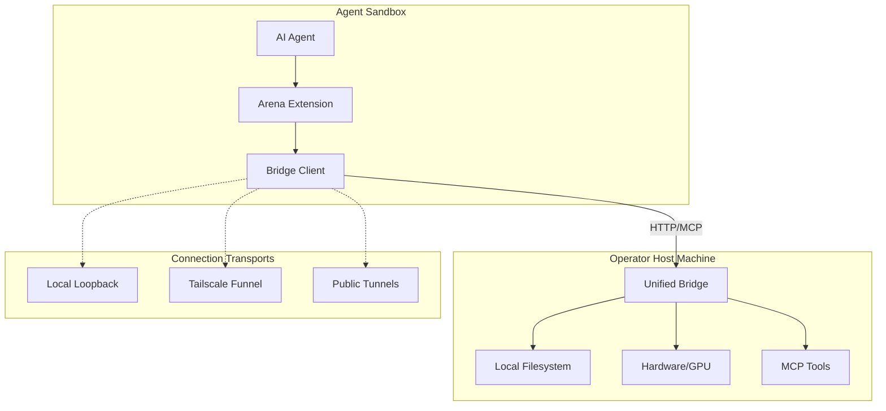
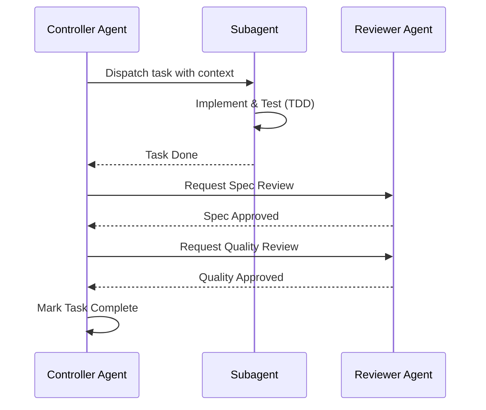

Relevant source files

The following files were used as context for generating this wiki page:

- [AGENTS.md](AGENTS.md)
- [README.md](README.md)
- [RELEASE.md](RELEASE.md)
- [CONTRIBUTING.md](CONTRIBUTING.md)
- [skills/arena-bridge/SKILL.md](skills/arena-bridge/SKILL.md)
- [skills/superpowers/skills/brainstorming/SKILL.md](skills/superpowers/skills/brainstorming/SKILL.md)
- [skills/superpowers/skills/subagent-driven-development/SKILL.md](skills/superpowers/skills/subagent-driven-development/SKILL.md)
- [chat_extension/popup.html](chat_extension/popup.html)

# Introduction to Arena Agent

Arena Agent is a modular local automation bridge and agentic framework. It connects AI agents to an operator's local machine, tools, and hardware, effectively bypassing the restrictive sandboxes of AI platforms like Arena.ai. The system enables agents to perform complex tasks such as game production in Godot, large-scale compute, and persistent file management through a standardized protocol.

Sources: [skills/arena-bridge/SKILL.md:6-14](skills/arena-bridge/SKILL.md#L6-L14), [AGENTS.md:5-9](AGENTS.md#L5-L9)

## Core Architecture and Components

The Arena Agent ecosystem uses a modular architecture. It separates the core runtime logic from thin compatibility entry points and user interfaces. Real logic resides within the `arena/` package, while `unified_bridge.py` serves as a thin CLI entry point.

### Primary Components

| Component | Description | Source |
| :--- | :--- | :--- |
| **Skainet Bridge** | The authenticated local-first bridge providing sandbox escape and host tool access. | [skills/arena-bridge/SKILL.md:6-14](skills/arena-bridge/SKILL.md#L6-L14) |
| **Arena Unified Bridge** | The core Python service (`unified_bridge.py`) that handles HTTP/REST and MCP requests. | [CONTRIBUTING.md:4-10](CONTRIBUTING.md#L4-L10) |
| **Chat Extension** | A browser extension that mounts toolbars on chat sites to capture and execute agent calls. | [chat_extension/popup.html](chat_extension/popup.html) |
| **Superpowers** | A library of vendored skills (brainstorming, TDD, planning) for agentic workflows. | [AGENTS.md:330-340](AGENTS.md#L330-L340) |
| **Subagents** | Specialized agents dispatched for isolated tasks within a larger implementation plan. | [skills/superpowers/skills/subagent-driven-development/SKILL.md:7-12](skills/superpowers/skills/subagent-driven-development/SKILL.md#L7-L12) |

### System Connectivity Flow

The bridge communicates between the agent sandbox and the operator host machine using various transports and the Model Context Protocol (MCP).

Sources: [skills/arena-bridge/SKILL.md:20-56](skills/arena-bridge/SKILL.md#L20-L56), [AGENTS.md:325-330](AGENTS.md#L325-L330)

## Sandbox Escape Protocol

The bridge solves strict sandbox limitations, such as the Arena.ai 128 MB snapshot cap. It streams persistent artifacts directly to the host machine.

- **Ephemeral Storage:** Agents use `/tmp` (1 GB tmpfs) for temporary session files.
- **Persistent Storage:** Large datasets, game binaries, and media assets are stored at `~/arena-bridge/` on the host PC.
- **Heavy Compute:** Tasks requiring real GPUs or large memory (e.g., Godot engine execution) are offloaded to the host via the bridge.

Sources: [skills/arena-bridge/SKILL.md:36-56](skills/arena-bridge/SKILL.md#L36-L56), [AGENTS.md:74-85](AGENTS.md#L74-L85)

## Development and Deployment Workflow

Arena Agent follows a strict "Spec-Kit" protocol for autonomous feature building and maintenance. Every task must be tracked and verified through a mandatory Definition of Done (DoD).

### Implementation Life Cycle

1. **Brainstorming:** Explore project context and propose approaches. A design must be approved before implementation.
2. **Implementation Planning:** Create a detailed plan with bite-sized tasks saved to `docs/superpowers/plans/`.
3. **Subagent Execution:** Dispatch a fresh subagent for each task to ensure isolation and prevent context pollution.
4. **Two-Stage Review:** Each task undergoes a spec compliance review followed by a code quality review.

Sources: [skills/superpowers/skills/brainstorming/SKILL.md:21-42](skills/superpowers/skills/brainstorming/SKILL.md#L21-L42), [skills/superpowers/skills/subagent-driven-development/SKILL.md:37-65](skills/superpowers/skills/subagent-driven-development/SKILL.md#L37-L65), [skills/superpowers/skills/writing-plans/SKILL.md:12-25](skills/superpowers/skills/writing-plans/SKILL.md#L12-L25)

## Security and Quality Control

Security is enforced through multiple automated gates. All changes must pass a security scan locally before commit, including `bandit`, `semgrep`, and `pip-audit`.

### Mandatory Security Gates
- **Bandit:** Requires 0 High and 0 Medium findings.
- **Semgrep:** Enforces 0 findings across 9 rule packs (OWASP Top 10, Secrets, etc.).
- **Pip-Audit:** Requires 0 CVEs in dependencies.
- **Path Validation:** File operations must use `safe_extract_zip()` and validated path checks to prevent Zip-slip and injection.

Sources: [CONTRIBUTING.md:65-95](CONTRIBUTING.md#L65-L95), [AGENTS.md:105-145](AGENTS.md#L105-L145), [RELEASE.md:20-25](RELEASE.md#L20-L25)

## Bridge Interface and Tools

The bridge exposes several authenticated endpoints for interaction:

| Endpoint | Method | Purpose |
| :--- | :--- | :--- |
| `/health` | GET | Verify connectivity and service version. |
| `/v1/self` | GET | Retrieve authenticated agent profile and active tools. |
| `/v1/tunnels/status` | GET | Check status of Tailscale, ngrok, or Cloudflare tunnels. |
| `/v1/exec/script` | POST | Execute scripts on the host with custom interpreters and timeouts. |

Sources: [skills/arena-bridge/SKILL.md:31-35](skills/arena-bridge/SKILL.md#L31-L35), [AGENTS.md:255-265](AGENTS.md#L255-L265)

Arena Agent provides a structured environment for AI agents to operate beyond sandbox limits while maintaining high code quality through subagent isolation and automated security enforcement.
