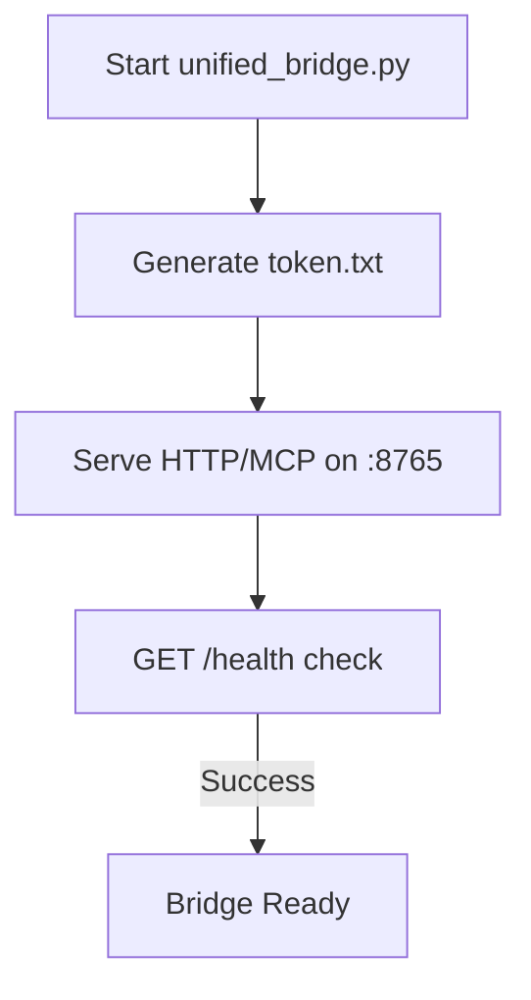
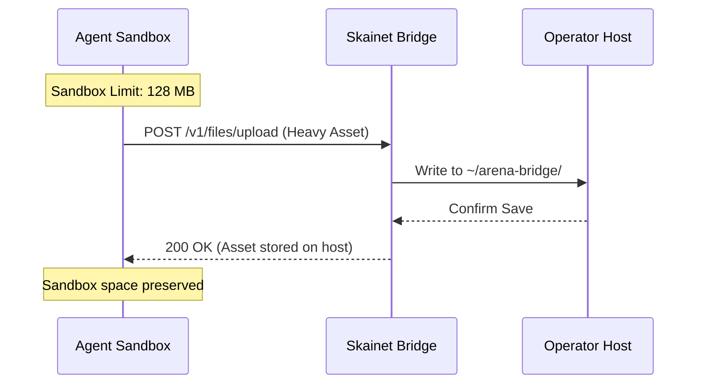

<details>
<summary>Relevant source files</summary>

The following files were used as context for generating this wiki page:

- [CONTRIBUTING.md](CONTRIBUTING.md)
- [AGENTS.md](AGENTS.md)
- [RELEASE.md](RELEASE.md)
- [skills/arena-bridge/SKILL.md](skills/arena-bridge/SKILL.md)
- [skills/superpowers/skills/brainstorming/SKILL.md](skills/superpowers/skills/brainstorming/SKILL.md)
- [skills/superpowers/skills/writing-plans/SKILL.md](skills/superpowers/skills/writing-plans/SKILL.md)
</details>

# Getting Started

The Arena Agent repository provides a modular, local-first bridge designed to connect AI agents to an operator's host machine. This system allows agents to bypass restrictive sandbox environments, such as the 128 MB snapshot cap in Arena.ai, by offloading heavy compute tasks and large file storage to the local host.

Developers and agents interact with the bridge through an authenticated REST API and the Model Context Protocol (MCP). The workflow emphasizes structured task execution, strict testing gates, and isolated workspace management to ensure reliability and security.

Sources: [skills/arena-bridge/SKILL.md](skills/arena-bridge/SKILL.md), [AGENTS.md:1-25](AGENTS.md#L1-L25)

## Initial Environment Setup

To begin development, you must clone the repository and install the necessary dependencies. The project requires Python and supports optional extras for full development and security scanning.

1.  **Clone the repository:**

```bash
    git clone https://github.com/IvanSkainet/arena-agent.git arena-bridge
    cd arena-bridge
    ```

2.  **Install dependencies:**

```bash
    python -m pip install -e ".[full,dev]"
    ```

3.  **Verify the bridge connectivity:**
  Agents can verify the handshake by running the check script:

```bash
    python scripts/check_bridge.py
    ```

Sources: [CONTRIBUTING.md:13-17](CONTRIBUTING.md#L13-L17), [skills/arena-bridge/SKILL.md:36-40](skills/arena-bridge/SKILL.md#L36-L40)

### Launching the Bridge

The bridge runs locally, typically on port 8765. Upon the first launch, it generates a `token.txt` file containing the master authentication token.



The startup process ensures the bridge is authenticated before accepting external requests.
Sources: [CONTRIBUTING.md:21-25](CONTRIBUTING.md#L21-L25), [skills/arena-bridge/SKILL.md:28-32](skills/arena-bridge/SKILL.md#L28-L32)

## Core Agent Workflow

The project enforces a specific protocol for AI maintainers and developers to ensure code quality and project modularity. This process starts with brainstorming and ends with a verified implementation plan.

### 1. Brainstorming and Design
Before writing any implementation code, you must explore the project context and propose a design. You must get user approval on the design before proceeding to the planning phase.
Sources: [skills/superpowers/skills/brainstorming/SKILL.md:10-25](skills/superpowers/skills/brainstorming/SKILL.md#L10-L25)

### 2. Implementation Planning
After design approval, invoke the `writing-plans` skill. This creates a bite-sized task list in `docs/superpowers/plans/`. Each task must include specific file paths, code snippets, and testing steps.
Sources: [skills/superpowers/skills/writing-plans/SKILL.md:9-25](skills/superpowers/skills/writing-plans/SKILL.md#L9-L25)

### 3. Execution Protocol
Agents follow the "Spec-Kit" protocol, where every action is tracked as a task (T0..Tn) in `docs/TASK_BOARD.md`. Implementation requires a strict Definition of Done (DoD), including:
*  **Root-cause fixes** (no silencing errors).
*  **Deterministic parity suites** (isolated unit tests).
*  **Zero mutation survivors** (verified with `mutmut`).

Sources: [AGENTS.md:27-40](AGENTS.md#L27-L40), [skills/arena-bridge/SKILL.md:75-85](skills/arena-bridge/SKILL.md#L75-L85)

## Security and Quality Gates

The repository uses "ratchets" to prevent the growth of legacy technical debt and enforces strict security scans. You must pass these gates locally before pushing changes.

### Security Gates
CI enforces three primary security tools. You can run them locally using a single command:
Sources: [CONTRIBUTING.md:70-80](CONTRIBUTING.md#L70-L80)

| Tool | Requirement | Purpose |
| :--- | :--- | :--- |
| **Bandit** | 0 HIGH, 0 MEDIUM findings | Scans for common security issues in Python code. |
| **Semgrep** | 0 findings (9 rule packs) | Audits code against OWASP Top 10 and other vulnerability patterns. |
| **Pip-audit** | 0 CVEs in dependencies | Checks for known vulnerabilities in runtime and development packages. |

Sources: [CONTRIBUTING.md:82-95](CONTRIBUTING.md#L82-L95), [RELEASE.md:20-25](RELEASE.md#L20-L25)

### Quality Ratchets
Lint and quality debt are tracked against baseline JSON files. If a change increases the violation count, the CI job fails.
*  **Lint Ratchet:** Compares `ruff` counts against `scripts/lint_baseline.json`.
*  **Quality Ratchet:** Blocks growth in dead code (`vulture`) and type errors (`pyrefly`).

Sources: [CONTRIBUTING.md:32-45](CONTRIBUTING.md#L32-L45), [AGENTS.md:145-160](AGENTS.md#L145-L160)

## Sandbox Escape Protocol

The bridge provides a mechanism to handle large files and heavy compute that would otherwise crash the agent's 128 MB sandbox.



This diagram illustrates the flow of data when an agent offloads assets to the host machine to avoid snapshot truncation.
Sources: [skills/arena-bridge/SKILL.md:46-60](skills/arena-bridge/SKILL.md#L46-L60), [AGENTS.md:76-90](AGENTS.md#L76-L90)

## Summary

Starting with the Arena Agent project requires establishing a local bridge connection to overcome sandbox limitations. Developers must adhere to the modular architecture rules, maintaining files under defined line limits (e.g., 600 lines for runtime modules). By following the structured brainstorming, planning, and TDD-based implementation workflow, agents can safely perform complex tasks like Godot game production or desktop automation while passing mandatory security and quality ratchets.
Sources: [AGENTS.md:6-15](AGENTS.md#L6-L15), [skills/arena-bridge/SKILL.md:65-72](skills/arena-bridge/SKILL.md#L65-L72)
