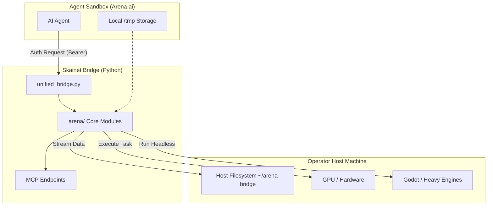
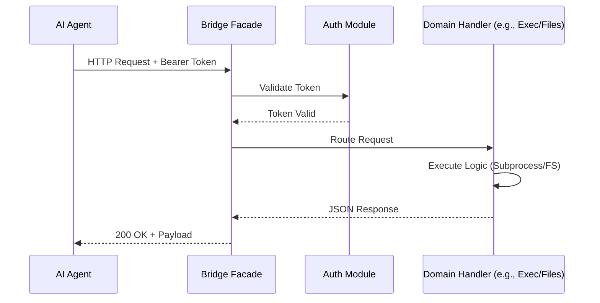
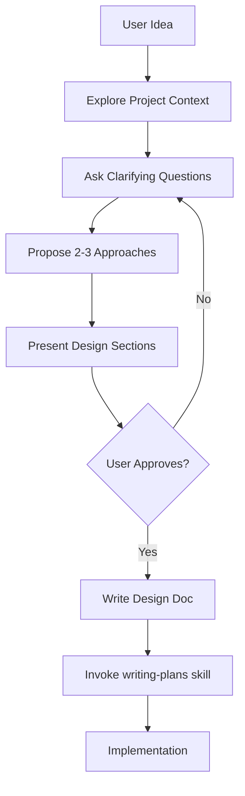

Relevant source files

The following files were used as context for generating this wiki page:

- [AGENTS.md](AGENTS.md)
- [CONTRIBUTING.md](CONTRIBUTING.md)
- [skills/arena-bridge/SKILL.md](skills/arena-bridge/SKILL.md)
- [dashboard/assets/04-overview.js](dashboard/assets/04-overview.js)
- [skills/superpowers/skills/brainstorming/SKILL.md](skills/superpowers/skills/brainstorming/SKILL.md)
- [skills/superpowers/skills/systematic-debugging/SKILL.md](skills/superpowers/skills/systematic-debugging/SKILL.md)

# System Architecture

The Arena Agent system architecture centers on a local-first automation bridge designed to connect AI agents to an operator's host machine. This architecture bypasses restrictive sandbox environments, such as the 128 MB snapshot cap in Arena.ai, by offloading heavy compute, large file storage, and hardware-dependent tasks to the host. The system utilizes a modular Python backend, a browser-based dashboard, and a set of "Superpower" skills to manage complex agentic workflows.

Sources: [skills/arena-bridge/SKILL.md:1-20](skills/arena-bridge/SKILL.md#L1-L20), [AGENTS.md:5-15](AGENTS.md#L5-L15)

## Modular Backend Structure

The backend follows a strict modular design to ensure maintainability and security. Logic resides primarily within the `arena/` package, while external interfaces are kept thin.

*  **Entrypoints:** `unified_bridge.py` acts as a thin CLI and compatibility entrypoint.
*  **Core Logic:** Located in `arena/`, specifically structured into sub-modules like `arena/admin/` for network providers and `arena/wiring/` for runtime composition.
*  **Modularity Limits:** The architecture enforces strict line limits (e.g., 600 lines for modules in `arena/`) to prevent the creation of catch-all files.
*  **Thin Wrappers:** Scripts in `scripts/` and `bin/` contain minimal logic, delegating actual work to the `arena/` modules.

Sources: [AGENTS.md:5-20](AGENTS.md#L5-L20), [CONTRIBUTING.md:110-150](CONTRIBUTING.md#L110-L150)

### Component Relationship Diagram
The following diagram illustrates the relationship between the agent sandbox, the bridge, and the operator host machine.

Sources: [skills/arena-bridge/SKILL.md:55-70](skills/arena-bridge/SKILL.md#L55-L70), [AGENTS.md:8-12](AGENTS.md#L8-L12)

## Network and Transport Layers

The bridge provides multiple transports to ensure connectivity regardless of the network environment. It uses a provider-agnostic tunnel facade that manages automatic failover between different services.

| Transport Type | Description | Endpoint Example |
| :--- | :--- | :--- |
| **Local Loopback** | Direct connection on the operator machine. | `http://127.0.0.1:8765` |
| **Tailscale Funnel** | Secure tunnel via Tailscale node name. | `https://node.ts.net` |
| **Public Tunnels** | External services for remote access. | `ngrok`, `Cloudflare`, `bore` |
| **ZeroTier** | Peer-to-peer virtual networking. | ZT Peer ID |

Sources: [skills/arena-bridge/SKILL.md:22-30](skills/arena-bridge/SKILL.md#L22-L30), [dashboard/assets/04-overview.js:53-80](dashboard/assets/04-overview.js#L53-L80), [CONTRIBUTING.md:40-45](CONTRIBUTING.md#L40-L45)

### Connection Flow
When a client connects, the bridge verifies the Bearer token before routing the request to internal handlers.

Sources: [skills/arena-bridge/SKILL.md:32-40](skills/arena-bridge/SKILL.md#L32-L40), [CONTRIBUTING.md:112-118](CONTRIBUTING.md#L112-L118)

## Security Architecture

Security is enforced through multiple layers of validation, including static gates, runtime path checks, and credential redaction.

*  **Static Gates:** The system requires passing `bandit`, `semgrep`, and `pip-audit` before any code is committed.
*  **Sandbox Safety:** Path checks in `arena/files/sandbox.py` ensure that sensitive files are blocked before existence checks are performed to prevent side-channel leaks.
*  **Redaction:** The `arena/observability/redact.py` module uses a centralized battery of regex patterns to scrub credentials from logs and outputs.
*  **Execution Safety:** The system forbids `os.system()` in favor of `subprocess.run()` with explicit argument arrays to prevent shell injection.

Sources: [CONTRIBUTING.md:65-90](CONTRIBUTING.md#L65-L90), [AGENTS.md:115-135](AGENTS.md#L115-L135)

## Skill-Driven Workflow

The architecture incorporates a "Superpower" skill system that defines standard operating procedures for agents. These skills are written in Markdown and follow a Test-Driven Development (TDD) cycle.

### Brainstorming and Planning Flow
Before implementation, agents follow a structured brainstorming process to ensure design alignment.

Sources: [skills/superpowers/skills/brainstorming/SKILL.md:43-70](skills/superpowers/skills/brainstorming/SKILL.md#L43-L70), [skills/superpowers/skills/writing-plans/SKILL.md:1-20](skills/superpowers/skills/writing-plans/SKILL.md#L1-L20)

### Systematic Debugging
The architecture mandates a four-phase debugging process to prevent "shotgun debugging" or symptom-only fixes.

1.  **Phase 1: Root Cause Investigation:** Read errors, reproduce consistently, and gather evidence.
2.  **Phase 2: Pattern Analysis:** Compare broken code against working examples.
3.  **Phase 3: Hypothesis:** Form a single, specific theory and test it minimally.
4.  **Phase 4: Implementation:** Create a failing test case before implementing the fix.

Sources: [skills/superpowers/skills/systematic-debugging/SKILL.md:20-80](skills/superpowers/skills/systematic-debugging/SKILL.md#L20-L80)

## Conclusion

The Arena Agent architecture provides a robust, modular, and secure framework for AI agents to operate on local hardware. By separating the agent's logic from heavy storage and compute through the Skainet Bridge, and by enforcing strict developmental disciplines like Spec-Kit and systematic debugging, the system ensures reliable and scalable automation.
