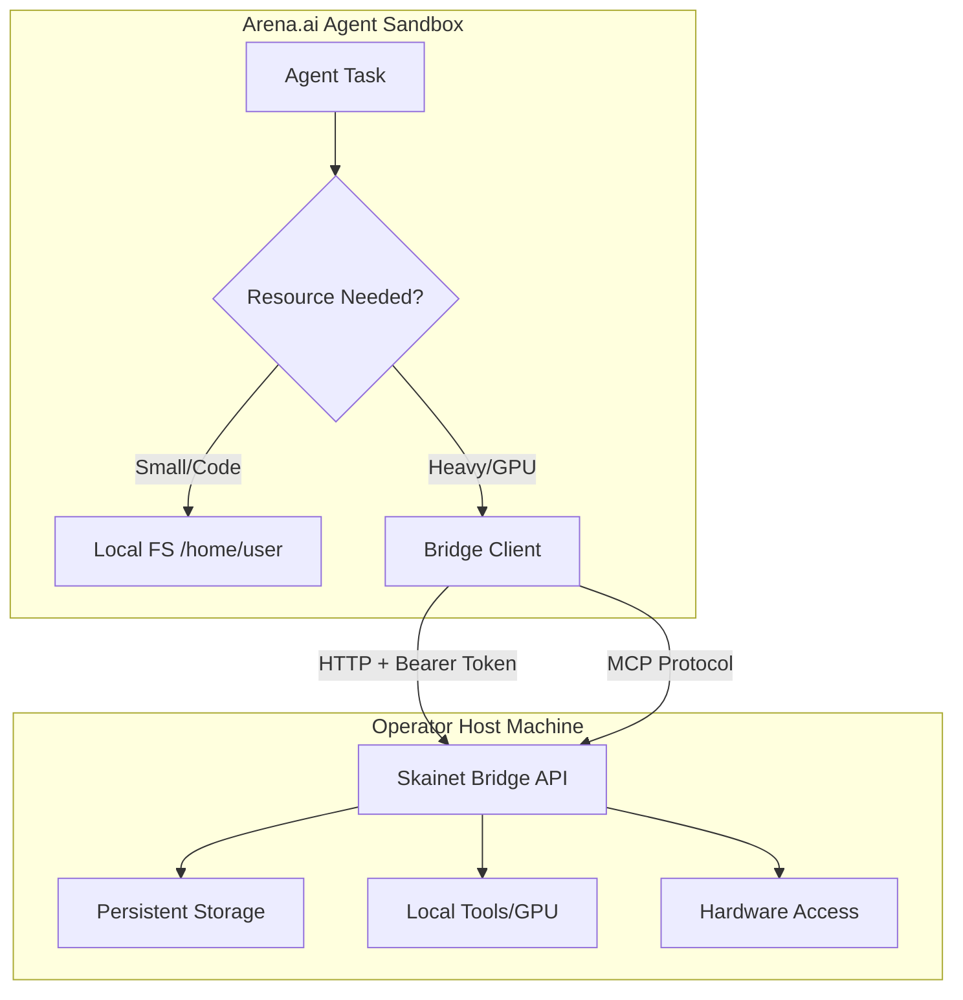
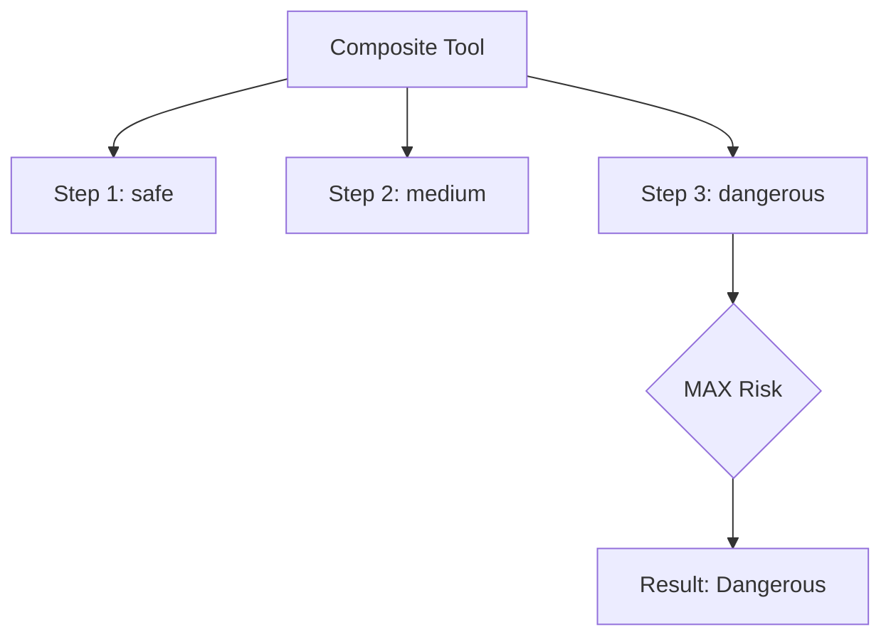

Relevant source files

The following files were used as context for generating this wiki page:

- [CONTRIBUTING.md](CONTRIBUTING.md)
- [AGENTS.md](AGENTS.md)
- [RELEASE.md](RELEASE.md)
- [skills/arena-bridge/SKILL.md](skills/arena-bridge/SKILL.md)
- [arena/mcp/custom_tools.py](arena/mcp/custom_tools.py)
- [arena/governance/security_env_inventory.py](arena/governance/security_env_inventory.py)

# Security & Sandboxing Model

The Security & Sandboxing Model defines the boundaries and protection mechanisms for AI agents interacting with local and remote environments. It utilizes **Skainet Bridge** to allow agents to exit restrictive sandboxes—such as the 128 MB snapshot cap in Arena.ai—while maintaining strict operational security through authenticated protocols and risk-based tool execution.

This model ensures that heavy compute tasks, persistent storage, and hardware access occur on the host machine under controlled conditions. It enforces a "Defense in Depth" strategy by requiring multi-gate security scans (Bandit, Semgrep, pip-audit) and runtime checks for all agent-driven actions.

Sources: [skills/arena-bridge/SKILL.md:5-15](skills/arena-bridge/SKILL.md#L5-L15), [CONTRIBUTING.md:73-80](CONTRIBUTING.md#L73-L80), [AGENTS.md:120-130](AGENTS.md#L120-L130)

## Sandbox Escape Protocol

AI agents operating within standard sandboxes face strict resource limitations, notably a **128 MB and 10,000 file** cap. The bridge protocol provides a structured mechanism for agents to offload storage and execution to a host machine.

### Storage and Resource Allocation

The bridge separates ephemeral session data from persistent artifacts to prevent session truncation.

| Location | Storage Type | Capacity / Limits | Usage |
| :--- | :--- | :--- | :--- |
| **Arena.ai Sandbox** | Ephemeral | 128 MB / 10k files | Agent logic and small configuration files. |
| **Sandbox /tmp** | Tmpfs | 1 GB | Tooling installation and temporary build artifacts. |
| **Operator Host** | Persistent | Host Disk Capacity | Large datasets, game binaries (Godot), and media assets. |

Sources: [skills/arena-bridge/SKILL.md:38-48](skills/arena-bridge/SKILL.md#L38-L48), [AGENTS.md:150-165](AGENTS.md#L150-L165)

### Bridge Architecture Flow

The following diagram illustrates how the agent interacts with the host through the authenticated bridge.

This flow shows the redirection of heavy workloads from the restricted sandbox to the host environment.
Sources: [skills/arena-bridge/SKILL.md:50-58](skills/arena-bridge/SKILL.md#L50-L58), [AGENTS.md:75-85](AGENTS.md#L75-L85)

## Security Gates and Validation

The project enforces mandatory security gates that every change must pass before deployment or merging. These gates apply to both the bridge source code and the agent's runtime environment.

### Static Analysis Gates

Three primary security tools are executed during local development and CI:

1.  **Bandit**: Scans for common security issues in Python code. It requires 0 HIGH and 0 MEDIUM findings.
2.  **Semgrep**: Executes 9 rule packs (e.g., OWASP Top Ten, command injection, secrets). It requires 0 findings.
3.  **pip-audit**: Checks dependencies for known CVEs. It requires 0 vulnerabilities in runtime and "full" extras.

Sources: [CONTRIBUTING.md:85-115](CONTRIBUTING.md#L85-L115), [RELEASE.md:270-285](RELEASE.md#L270-L285)

### Security-Sensitive Areas

Developers must apply extra scrutiny to specific modules identified as high-risk:
*  **Authentication (`arena/auth/*.py`)**: Handles Bearer-credentials and rate limits.
*  **Command Safety (`arena/exec/*.py`)**: Manages guarded command execution and injection blocklists.
*  **File Sandbox (`arena/files/sandbox.py`)**: Checks sensitivity before existence to close side-channel leaks.
*  **Archive Extraction (`arena/files/safe_extract.py`)**: Uses `safe_extract_zip()` to prevent Zip-Slip and Zip-Bombs.

Sources: [CONTRIBUTING.md:145-175](CONTRIBUTING.md#L145-L175), [AGENTS.md:135-145](AGENTS.md#L135-L145)

## Tool Risk and Composition Model

The bridge supports a dynamic, self-extending environment where agents can author new tools at runtime. This system uses a risk-based hierarchy to ensure nested tool calls remain safe.

### Custom Tool Safety

The bridge classifies tools based on their derived risk. A composite tool's risk is defined as the **MAX** risk of any tool in its reference tree.

This diagram shows how a single dangerous dependency upgrades the risk level of the entire composition.
Sources: [arena/mcp/custom_tools.py:15-30](arena/mcp/custom_tools.py#L15-L30), [arena/mcp/custom_tools.py:100-115](arena/mcp/custom_tools.py#L100-L115)

### Safety Constraints for Authorship

*  **Acyclic References**: Creation order and cycle checks ensure the reference graph remains a Directed Acyclic Graph (DAG).
*  **Recursion Depth**: The `MAX_CUSTOM_DEPTH` is set to **8** to prevent infinite loops in nested calls.
*  **Risk Policy Enforcement**: Every nested call recurses through the standard `call_tool` dispatcher, allowing the agent stop (HALT) to block execution at any level.

Sources: [arena/mcp/custom_tools.py:48-52](arena/mcp/custom_tools.py#L48-L52), [arena/mcp/custom_tools.py:385-395](arena/mcp/custom_tools.py#L385-L395)

## Environment Variable Governance

The system maintains a strict inventory of security-relevant environment variables. The `SecurityEnvInventory` mechanism verifies that every `ARENA_` variable referenced in the source code is documented in `SECURITY.md`.

### Inventory Classifications

Variables are classified into three categories to determine their governance requirements:

| Classification | Description |
| :--- | :--- |
| **security** | Variables handling credentials, keys, or auth logic. |
| **operational** | Variables affecting runtime behavior or service status. |
| **internal** | Variables used for inter-module communication or logic. |

Sources: [arena/governance/security_env_inventory.py:15-25](arena/governance/security_env_inventory.py#L15-L25), [arena/governance/security_env_inventory.py:55-75](arena/governance/security_env_inventory.py#L55-L75)

### Governance Enforcement Logic

The `verify_inventory` function performs a bi-directional check:
1.  It scans the codebase for `ARENA_*` string constants using Abstract Syntax Trees (AST).
2.  It parses the `SECURITY.md` table for documented inventory.
3.  It raises `SecurityEnvInventoryError` if undocumented source references or stale documented references are found.

Sources: [arena/governance/security_env_inventory.py:80-100](arena/governance/security_env_inventory.py#L80-L100)

## Release Provenance and Integrity

Releases utilize Sigstore for keyless signing and SPDX Software Bill of Materials (SBOM) for transparency.

*  **Attestation**: Every release artifact (ZIP, APK) is verified against build provenance and a pinned signer workflow.
*  **Source Digest**: Verification requires an exact `SOURCE_DIGEST` matching the master commit SHA to prevent injection of unauthorized bytes before signing.
*  **Immutable Releases**: Once published, GitHub assets are frozen. All signatures (Sigstore `.sig` and `.pem`) must be attached while the release is in a **DRAFT** state.

Sources: [RELEASE.md:120-150](RELEASE.md#L120-L150), [RELEASE.md:380-400](RELEASE.md#L380-L400)

The Security & Sandboxing Model ensures that AI agents remain productive by escaping resource-constrained environments while simultaneously applying rigid, multi-layered defenses to protect the host machine and the integrity of the automated workflows.
