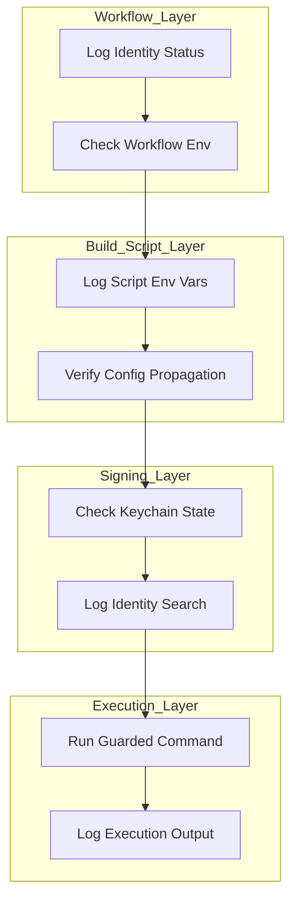
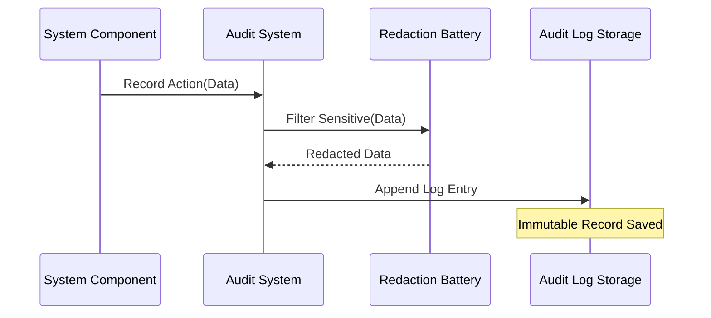

Relevant source files

The following files were used as context for generating this wiki page:

*  [arena/observability/audit.py](arena/observability/audit.py)
*  [arena/observability/redact.py](arena/observability/redact.py)
*  [arena/observability/request_log.py](arena/observability/request_log.py)
*  [CONTRIBUTING.md](CONTRIBUTING.md)
*  [dashboard/assets/04-overview.js](dashboard/assets/04-overview.js)
*  [skills/superpowers/skills/systematic-debugging/SKILL.md](skills/superpowers/skills/systematic-debugging/SKILL.md)

# Observability & Audit Logging

Observability and Audit Logging provide a comprehensive framework for monitoring the Arena Agent's internal state, tracking requests, and securing sensitive data through redaction. The system captures execution metrics and logs events to ensure technical accountability and facilitate [Systematic Debugging](#systematic-debugging).

The framework integrates security gates, redaction batteries, and request logs to maintain a high level of transparency across agent operations. It serves as the shared source of truth for audit sinks and request logs, ensuring that credentials and sensitive identifiers are never exposed in cleartext logs.

Sources: [arena/observability/redact.py](arena/observability/redact.py), [CONTRIBUTING.md:144-150](CONTRIBUTING.md#L144-L150), [skills/superpowers/skills/systematic-debugging/SKILL.md:41-47](skills/superpowers/skills/systematic-debugging/SKILL.md#L41-L47)

## Data Redaction and Security

The redaction system protects sensitive information by applying a regex battery to all log outputs and audit sinks. This battery serves as the centralized source of truth for identifying and masking credentials.

### Sensitive Information Protection

The system identifies and redacts various credential shapes, including bearer tokens, API keys, and environment variables. When a new credential shape is identified, it must be added to the shared regex battery to ensure consistent protection across the project.

Sources: [arena/observability/redact.py](arena/observability/redact.py), [CONTRIBUTING.md:144-150](CONTRIBUTING.md#L144-L150)

### Security Gates

CI enforces security gates including `bandit`, `semgrep`, and `pip-audit`. These tools verify that observability practices do not inadvertently create security vulnerabilities, such as logging cleartext credentials or exposing sensitive paths.

Sources: [CONTRIBUTING.md:73-95](CONTRIBUTING.md#L73-L95)

## Request Logging and Metrics

The Request Log tracks interactions with the bridge, providing visibility into traffic patterns and execution success rates.

### Dashboard Overview

The Overview dashboard displays real-time metrics retrieved from system endpoints. It tracks total requests, execution counts, and error rates to provide a high-level status of the agent's health.

Sources: [dashboard/assets/04-overview.js:1-15](dashboard/assets/04-overview.js#L1-L15), [dashboard/assets/04-overview.js:52-56](dashboard/assets/04-overview.js#L52-L56)

### Metric Components

| Metric | Source Endpoint | Description |
| :--- | :--- | :--- |
| **Total Requests** | `/v1/status` | Cumulative count of all bridge requests. |
| **Exec Count** | `/v1/status` | Number of command executions performed. |
| **Uptime** | `/health` | Seconds elapsed since the bridge started. |
| **Error Count** | Internal Logic | Tracked failures during operation cycles. |

Sources: [dashboard/assets/04-overview.js:6-26](dashboard/assets/04-overview.js#L6-L26), [dashboard/assets/04-overview.js:53-55](dashboard/assets/04-overview.js#L53-L55)

## Diagnostic Instrumentation

Systematic debugging requires multi-layer diagnostic instrumentation to identify failures in complex systems. Observability tools allow developers to log data entering and exiting specific component boundaries.

### Multi-Layer Observability Flow

The following diagram illustrates the observability flow across different system layers during a diagnostic run:

*This diagram shows how observability data is gathered at each layer to identify where a failure occurs in a multi-component system.*

Sources: [skills/superpowers/skills/systematic-debugging/SKILL.md:48-73](skills/superpowers/skills/systematic-debugging/SKILL.md#L48-L73)

## Audit Workflow

The audit system records significant actions to maintain an immutable record of agent behavior.

### Audit Event Pipeline

Audit events pass through the redaction layer before being written to persistent storage. This ensures that the audit trail remains secure.

*The sequence illustrates the mandatory redaction step before any data is committed to the audit log.*

Sources: [arena/observability/audit.py](arena/observability/audit.py), [arena/observability/redact.py](arena/observability/redact.py), [CONTRIBUTING.md:144-150](CONTRIBUTING.md#L144-L150)

## Systematic Debugging Integration

Observability data is the primary input for the Systematic Debugging process. Phase 1 of this process requires reading error messages, stack traces, and environment logs before proposing any fixes.

### Diagnostic Checklist

1.  **Read Error Messages:** Analyze the complete stack trace and note line numbers.
2.  **Gather Evidence:** Use instrumentation to log data at component boundaries.
3.  **Verify Environment:** Check state propagation across the system layers.
4.  **Trace Data Flow:** Identify where a bad value originates by tracing logs backward.

Sources: [skills/superpowers/skills/systematic-debugging/SKILL.md:27-78](skills/superpowers/skills/systematic-debugging/SKILL.md#L27-L78)

## Conclusion

Observability & Audit Logging in the Arena Agent project ensures that every action is traceable and every sensitive piece of data is protected. By combining real-time metric dashboards with multi-layer diagnostic logging and centralized redaction, the system provides the technical transparency required for both secure operation and efficient debugging.
