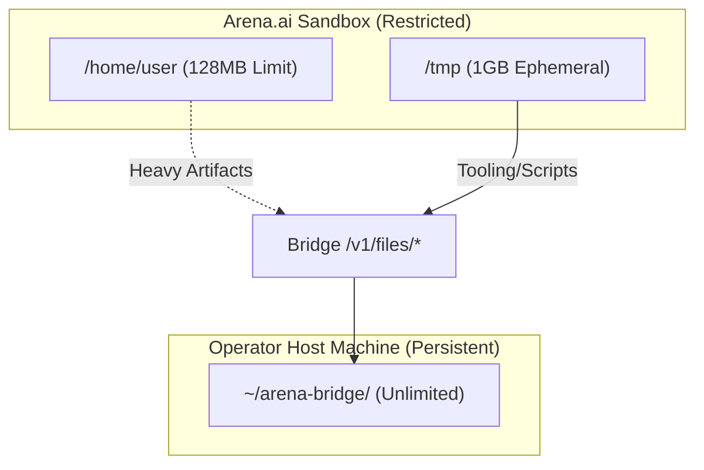

<details>
<summary>Relevant source files</summary>

The following files were used as context for generating this wiki page:

- [arena/files/sandbox.py](arena/files/sandbox.py)
- [arena/files/handlers.py](arena/files/handlers.py)
- [arena/files/safe_extract.py](arena/files/safe_extract.py)
- [AGENTS.md](AGENTS.md)
- [skills/arena-bridge/SKILL.md](skills/arena-bridge/SKILL.md)
- [CONTRIBUTING.md](CONTRIBUTING.md)
</details>

# File System & Sandbox Restrictions

Arena Agent operates within a restrictive environment designed to protect the host system and manage resource constraints. The system enforces strict snapshot budgets, file access policies, and security gates to prevent session failure and unauthorized access to sensitive data.

The core of this architecture is the **Skainet Bridge**, which enables a "sandbox escape" protocol. This protocol allows agents to offload heavy compute and large file storage to the operator's host machine, bypassing the technical limitations of the ephemeral sandbox.

## Sandbox Resource Limits

The agent sandbox imposes hard physical limits on storage and file counts. Exceeding these limits causes session truncation or catastrophic failure.

| Limit Type | Value | Consequence of Exceeding |
| :--- | :--- | :--- |
| Snapshot Root (`/home/user`) | 128 MB | Session truncation / platform error |
| File Count | 10,000 files | Session truncation |
| Ephemeral Storage (`/tmp`) | 1 GB (tmpfs) | Process failure / Disk full |

Sources: [AGENTS.md:104-106](AGENTS.md#L104-L106), [skills/arena-bridge/SKILL.md:46-48](skills/arena-bridge/SKILL.md#L46-L48)

### Workspace Hygiene Rules
To maintain operation within these limits, the system enforces specific hygiene practices:
- **External Tooling**: Install tools like `ruff` or `bandit` in `/tmp/tools` using `PYTHONUSERBASE` to avoid bloating the 128 MB snapshot.
- **Cache Management**: Delete `pip` caches (`~/.cache`) or use `--no-cache-dir`.
- **Repository Isolation**: Never copy the repository within the snapshot root; use `/tmp/` for background sweeps.
- **Git Maintenance**: Use `git gc --aggressive --prune=now` to reclaim space.

Sources: [AGENTS.md:108-118](AGENTS.md#L108-L118)

## Skainet Bridge Storage Protocol

The Skainet Bridge provides persistent storage on the host machine to bypass sandbox constraints. This allows the agent to handle large datasets, game binaries, and media assets that exceed the 128 MB limit.



The diagram shows how the agent routes heavy workloads and persistent artifacts to the host via the Bridge API.
Sources: [skills/arena-bridge/SKILL.md:46-56](skills/arena-bridge/SKILL.md#L46-L56)

## File Access Security

The system implements security patterns to prevent unauthorized file access and directory traversal. Access checks must run before existence checks to close timing-based side channels.

### Sensitive File Blocking
The sandbox environment maintains blocklists for sensitive files and directories. Any access to these paths is denied immediately.

- **SENSITIVE_FILE_BASENAMES**: Includes items like `token.txt`, `.env`, `id_rsa`, and `id_ed25519`.
- **SENSITIVE_DIR_PREFIXES**: Includes directories like `.ssh`, `.git`, `.aws`, and `backups`.

Sources: [CONTRIBUTING.md:155-161](CONTRIBUTING.md#L155-L161)

### Secure Archive Extraction
To prevent Zip-Slip vulnerabilities and zip-bombs, the system forbids the use of `ZipFile.extractall()`. All archive extractions must use the `safe_extract_zip()` utility.

```python
# PROHIBITED: Bare extractall()
# ZipFile.extractall()

# MANDATORY: Safe extraction utility
from arena.files.safe_extract import safe_extract_zip
safe_extract_zip(zip_file, target_path)
```

Sources: [arena/files/safe_extract.py:1-42](arena/files/safe_extract.py#L1-L42), [CONTRIBUTING.md:162-165](CONTRIBUTING.md#L162-L165)

## Mandatory Security Gates

Every file system change and codebase modification must pass three local security gates before being committed. These gates are enforced in CI but intended for local verification.

| Tool | Requirement | Purpose |
| :--- | :--- | :--- |
| **Bandit** | 0 HIGH, 0 MEDIUM findings | Static analysis for Python security vulnerabilities. |
| **Semgrep** | 0 findings across 9 packs | Pattern matching for insecure code (XSS, Injection, Secrets). |
| **Pip-audit** | 0 CVEs in dependencies | Scanning for known vulnerabilities in third-party packages. |

Sources: [CONTRIBUTING.md:100-117](CONTRIBUTING.md#L100-L117), [RELEASE.md:21-26](RELEASE.md#L21-L26)

## Conclusion

The File System & Sandbox Restrictions ensure that Arena Agent remains stable and secure. By utilizing the Skainet Bridge for persistent storage and adhering to strict workspace hygiene, agents can operate effectively despite the 128 MB snapshot constraint. Security gates and safe extraction utilities further protect the integrity of the host and agent environments.
