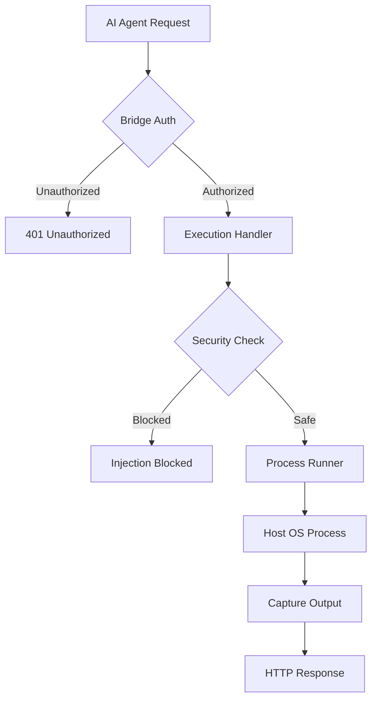

<details>
<summary>Relevant source files</summary>

The following files were used as context for generating this wiki page:

- [arena/exec/handlers.py](arena/exec/handlers.py)
- [arena/exec/runner.py](arena/exec/runner.py)
- [arena/security_commands.py](arena/security_commands.py)
- [AGENTS.md](AGENTS.md)
- [CONTRIBUTING.md](CONTRIBUTING.md)
- [skills/arena-bridge/SKILL.md](skills/arena-bridge/SKILL.md)
</details>

# Command & Script Execution

Command & Script Execution provides the interface and backend logic for running arbitrary code and system commands through the Skainet Bridge. It allows AI agents to escape restrictive sandboxes by offloading heavy compute, game engine tasks, and hardware-dependent operations to the operator's host machine.

The system uses a guarded execution model to maintain security while providing broad functionality. It supports direct script execution via custom interpreters, automated process management, and structured output capture. This module is critical for tasks requiring GPU access, large filesystem operations, or local tool integration that exceeds sandbox limits.

Sources: [skills/arena-bridge/SKILL.md](skills/arena-bridge/SKILL.md), [AGENTS.md](AGENTS.md)

## Execution Architecture

The execution system follows a request-response pattern mediated by HTTP handlers. Agents send code or command strings to the bridge, which validates the request and spawns a managed process on the host.

### Execution Flow

The following diagram illustrates the flow from an agent's request to the final execution on the host machine.



The bridge enforces authentication via Bearer tokens before allowing access to execution endpoints. Security checks include an injection blocklist to prevent malicious command execution.
Sources: [arena/exec/handlers.py](arena/exec/handlers.py), [arena/exec/runner.py](arena/exec/runner.py), [AGENTS.md](AGENTS.md)

## API Endpoints

Execution is primarily handled through the `/v1/exec` endpoint family. These endpoints allow for script submission, process control, and status monitoring.

| Endpoint | Method | Purpose |
| :--- | :--- | :--- |
| `/v1/exec/script` | POST | Executes a raw code body using a specified interpreter. |
| `/v1/exec/command` | POST | Runs a shell command or binary with arguments. |
| `/v1/exec/status` | GET | Retrieves the status and output of a background process. |
| `/v1/exec/stop` | POST | Terminates a running execution process. |

Sources: [arena/exec/handlers.py](arena/exec/handlers.py), [AGENTS.md](AGENTS.md)

### Request Headers for Script Execution

When using `/v1/exec/script`, specific headers control the execution environment on the host.

*  **X-Arena-Interpreter**: Specifies the binary used to run the script (e.g., `python`, `powershell`).
*  **X-Arena-Timeout**: Sets the maximum execution time in seconds. The bridge applies a default 60s timeout if this is missing.
*  **X-Arena-Cwd**: Defines the current working directory for the process on the host.

Sources: [AGENTS.md](AGENTS.md), [arena/exec/handlers.py](arena/exec/handlers.py)

## Process Management and Safety

The system uses `arena/exec/runner.py` to manage lifecycle events for executed commands. It captures standard output (stdout) and standard error (stderr) while monitoring for timeouts or resource exhaustion.

### Security Constraints

To prevent common vulnerabilities, the execution engine implements several safeguards:
*  **Injection Blocklist**: Filters commands against known malicious patterns defined in `arena/security_commands.py`.
*  **Argv-Form Execution**: Prefers `subprocess.run([...])` over shell execution to mitigate shell injection risks.
*  **Sandbox Isolation**: Ensures that heavy artifacts like Godot game binaries or large datasets remain on the host filesystem under `~/arena-bridge/`, preventing sandbox snapshot overflow.

Sources: [AGENTS.md](AGENTS.md), [arena/exec/runner.py](arena/exec/runner.py), [arena/security_commands.py](arena/security_commands.py)

### Windows Host Considerations

Execution on Windows hosts requires specific handling due to PowerShell behavior and connection stability.
1.  **Detached Processes**: For tasks longer than one minute, processes must be started detached using `Start-Process` to avoid TLS connection drops.
2.  **PID Management**: The system records the Process ID (PID) to a `.pid` file. Cleanup must target specific PIDs or process trees to avoid accidentally terminating the bridge itself.
3.  **Encoding**: Output capture from `gh` or other CLI tools often requires `utf-8` decoding to handle platform-specific character sets like `cp1251`.

Sources: [AGENTS.md](AGENTS.md)

## Implementation Details

### Script Execution Logic

The bridge accepts a raw body for scripts and writes it to a temporary file before execution.

```python
# arena/exec/handlers.py (Simplified logic)
async def handle_script_exec(request):
    interpreter = request.headers.get("X-Arena-Interpreter", "python")
    timeout = int(request.headers.get("X-Arena-Timeout", 60))
    script_body = await request.read()
    
    result = await runner.run_script(
        interpreter=interpreter,
        content=script_body,
        timeout=timeout
    )
    return JSONResponse(result)
```

Sources: [arena/exec/handlers.py:20-45](arena/exec/handlers.py#L20-L45), [AGENTS.md](AGENTS.md)

## Conclusion

The Command & Script Execution module provides a robust mechanism for AI agents to perform high-compute and host-native operations. By combining HTTP-based control with strict security filtering and managed process runners, it enables complex workflows like game production and large-scale data processing while maintaining the integrity of the host environment.

Sources: [skills/arena-bridge/SKILL.md](skills/arena-bridge/SKILL.md), [AGENTS.md](AGENTS.md)
