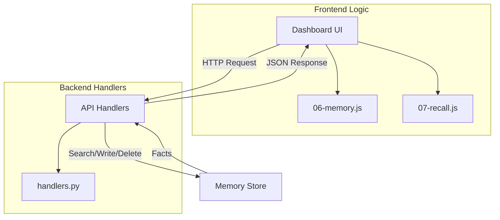
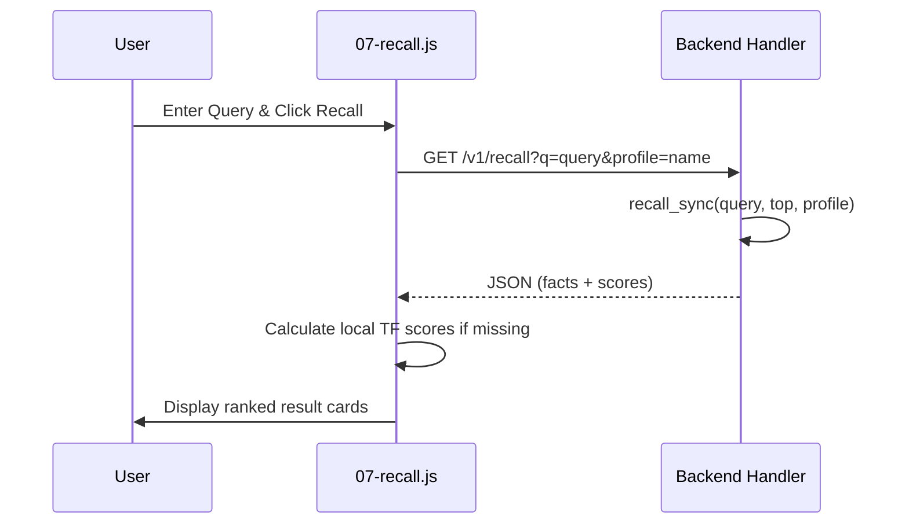

<details>
<summary>Relevant source files</summary>

The following files were used as context for generating this wiki page:

- [arena/memory/handlers.py](arena/memory/handlers.py)
- [dashboard/assets/06-memory.js](dashboard/assets/06-memory.js)
- [dashboard/assets/07-recall.js](dashboard/assets/07-recall.js)
- [dashboard/assets/body-03-memory.html](dashboard/assets/body-03-memory.html)
- [dashboard/assets/body-04-recall.html](dashboard/assets/body-04-recall.html)
</details>

# Memory & Fact Recall

Memory and Fact Recall provide a persistent storage and retrieval system for the Arena agent. This system allows the agent to store specific "facts" categorized by profiles and tags, which can later be retrieved via term frequency (TF) scoring or summarized into a text digest.

The system consists of a backend handler layer that manages memory operations and a frontend dashboard interface for user interaction. Users can search, add, delete, and analyze memories through a unified dashboard interface.

## System Architecture

The Memory and Recall system operates through a set of API handlers that interact with a underlying storage context. The frontend uses asynchronous JavaScript to communicate with these endpoints.



The diagram shows the data flow from the dashboard UI through the JavaScript logic to the Python backend handlers.
Sources: [arena/memory/handlers.py](arena/memory/handlers.py), [dashboard/assets/06-memory.js](dashboard/assets/06-memory.js), [dashboard/assets/07-recall.js](dashboard/assets/07-recall.js)

## Memory Operations

Memory operations allow for the creation, retrieval, and deletion of facts. Every fact is associated with a profile, a key, a value, and optional tags.

### Fact Data Structure
A memory entry consists of the following fields:

| Field | Description |
| :--- | :--- |
| `profile` | The category or owner of the memory (e.g., "default"). |
| `key` | A unique identifier or topic for the fact. |
| `value` | The actual information stored. |
| `tags` | An array of strings used for categorization. |
| `timestamp` | The UTC time when the fact was recorded. |

Sources: [arena/memory/handlers.py:88-94](arena/memory/handlers.py#L88-L94), [dashboard/assets/06-memory.js:41-55](dashboard/assets/06-memory.js#L41-L55)

### API Endpoints

The system exposes several RESTful endpoints for memory management:

*  **GET `/v1/memory`**: Retrieves facts based on a search query, profile, and pagination parameters (`offset`, `limit`).
*  **POST `/v1/memory`**: Adds a new fact to the specified profile.
*  **DELETE `/v1/memory`**: Removes a fact from a specific profile using its key.

Sources: [arena/memory/handlers.py:44-122](arena/memory/handlers.py#L44-L122), [dashboard/assets/body-03-memory.html:30-41](dashboard/assets/body-03-memory.html#L30-L41)

## Recall and Scoring

The recall system implements "Smart Search" using Term Frequency (TF) scoring to rank the relevance of facts against a search query.

### TF-Scoring Logic
The `tfScore` function calculates relevance by splitting the query and the text into terms. It determines the frequency of query terms within the text relative to the total number of terms.

```javascript
function tfScore(query, text) {
  if (!query || !text) return 0;
  const qTerms = query.toLowerCase().split(/\s+/).filter(Boolean);
  const tTerms = text.toLowerCase().split(/\s+/);
  if (!qTerms.length || !tTerms.length) return 0;
  let score = 0;
  qTerms.forEach(qt => {
    let tf = 0;
    tTerms.forEach(tt => { if (tt.includes(qt) || qt.includes(tt)) tf++; });
    score += tf / tTerms.length;
  });
  return score / qTerms.length;
}
```

Sources: [dashboard/assets/07-recall.js:2-15](dashboard/assets/07-recall.js#L2-L15)

### Memory Digest
The system can generate a "Memory Digest," which is a summarized text representation of all facts within a profile. This is accessed via the `/v1/recall/digest` endpoint. The backend handles retitling the digest based on the profile filter applied.

Sources: [arena/memory/handlers.py:143-155](arena/memory/handlers.py#L143-L155), [dashboard/assets/06-memory.js:109-125](dashboard/assets/06-memory.js#L109-L125)

## Sequence of Recall Interaction

The following diagram illustrates the process of performing a smart recall search from the dashboard.



The sequence shows the user initiation, the API call, and the subsequent rendering of scored result cards.
Sources: [dashboard/assets/07-recall.js:17-76](dashboard/assets/07-recall.js#L17-L76), [arena/memory/handlers.py:124-141](arena/memory/handlers.py#L124-L141)

## User Interface Components

The dashboard provides two primary tabs for interacting with memory:

### Memory Tab
Used for administrative management of facts. It includes:
*  **Add Fact Form**: Inputs for Profile, Key, Value, and Tags.
*  **Search Bar**: Filters existing facts by text.
*  **Fact Table**: Displays stored facts with actions to delete entries.

Sources: [dashboard/assets/body-03-memory.html:27-52](dashboard/assets/body-03-memory.html#L27-L52)

### Recall Tab
Used for analytical retrieval. It includes:
*  **Smart Search**: An input for queries that returns TF-scored result cards.
*  **Result Cards**: Display the fact key, value, tags, and a color-coded score badge (e.g., "ok" for > 30%, "warn" for > 10%).

Sources: [dashboard/assets/body-04-recall.html:20-27](dashboard/assets/body-04-recall.html#L20-L27), [dashboard/assets/07-recall.js:46-55](dashboard/assets/07-recall.js#L46-L55)

## Conclusion

The Memory & Fact Recall module enables the Arena agent to maintain a searchable knowledge base. By combining standard CRUD operations with TF-based relevance scoring and automated digests, the system provides both precise fact retrieval and high-level memory summarization.
