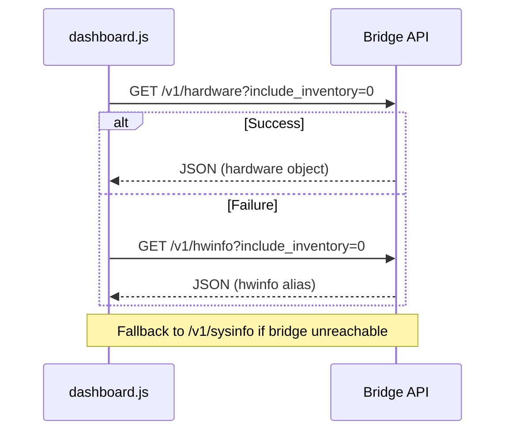

<details>
<summary>Relevant source files</summary>

The following files were used as context for generating this wiki page:

- [arena/system/hwinfo_linux.py](arena/system/hwinfo_linux.py)
- [dashboard/assets/21b-hwinfo-overview-extensions.js](dashboard/assets/21b-hwinfo-overview-extensions.js)
- [dashboard/assets/22b-full-inventory-format.js](dashboard/assets/22b-full-inventory-format.js)
- [dashboard/assets/04-overview.js](dashboard/assets/04-overview.js)
- [dashboard/assets/body-01-overview.html](dashboard/assets/body-01-overview.html)
- [dashboard/assets/body-12-doctor.html](dashboard/assets/body-12-doctor.html)
</details>

# Hardware & System Inventory

## Introduction
Hardware & System Inventory is a diagnostic and monitoring subsystem that collects, processes, and displays technical specifications of the host machine. It provides the Arena agent and the operator with real-time data regarding CPU utilization, memory allocation, disk health (SMART), and GPU status. This system bridges the gap between the isolated agent environment and the physical hardware to ensure heavy compute tasks are properly allocated.

The inventory system operates across two primary layers: a Python-based backend that probes OS-level statistics (primarily via `/proc` on Linux) and a JavaScript-based dashboard that renders this data through a specialized [Dashboard UI](#system-dashboard-integration).

Sources: `[arena-bridge/SKILL.md](arena-bridge/SKILL.md)`, `[arena/system/hwinfo_linux.py](arena/system/hwinfo_linux.py)`, `[dashboard/assets/body-01-overview.html](dashboard/assets/body-01-overview.html)`

## Architecture and Data Flow
The system follows a request-response cycle where the frontend dashboard queries specific API endpoints to retrieve hardware metadata. The backend implements platform-specific collectors to gather data from the operating system.

```mermaid
flowchart TD
    Dashboard[Dashboard UI] --> API_Call{API Endpoint}
    API_Call --> HW_API[/v1/hardware]
    API_Call --> SYS_API[/v1/sysinfo]
    
    HW_API --> Linux_Probe[hwinfo_linux.py]
    SYS_API --> Sys_Stats[System Probes]
    
    Linux_Probe --> ProcFiles[(/proc/cpuinfo, /proc/meminfo)]
    Linux_Probe --> CLI_Tools[dmidecode, lspci, df]
    
    Sys_Stats --> Dashboard
    Linux_Probe --> Dashboard
```

The diagram shows the data flow from low-level OS files and CLI tools through the Bridge API to the Dashboard interface.
Sources: `[dashboard/assets/21b-hwinfo-overview-extensions.js:6-35](dashboard/assets/21b-hwinfo-overview-extensions.js#L6-L35)`, `[arena/system/hwinfo_linux.py:9-70](arena/system/hwinfo_linux.py#L9-L70)`

## Backend Collection (Linux)
The Linux implementation gathers hardware details by reading virtual files and executing standard system utilities.

### CPU and Memory Probing
The system parses `/proc/cpuinfo` to identify the model name, physical core count, and logical thread count. Memory statistics are derived from `/proc/meminfo`, specifically targeting `MemTotal` and `MemAvailable` to calculate used gigabytes.
Sources: `[arena/system/hwinfo_linux.py:9-36](arena/system/hwinfo_linux.py#L9-L36)`

### Hardware Identification Utilities
The collector executes external commands to retrieve device-specific metadata:
*  **Motherboard**: Uses `dmidecode -t baseboard` to extract the manufacturer and product name.
*  **GPU**: Uses `lspci` to find VGA-compatible controllers.
*  **Storage**: Uses `df -B1` to calculate total capacity, free space, and usage percentages for devices mounted to the root or other system paths.

Sources: `[arena/system/hwinfo_linux.py:42-70](arena/system/hwinfo_linux.py#L42-L70)`

## System Dashboard Integration
The dashboard provides several views for hardware data, ranging from high-level progress bars to detailed raw JSON reports.

### Overview Components
The Overview tab displays critical resource metrics using interactive progress bars.

| Component | UI Element | Data Point |
| :--- | :--- | :--- |
| **CPU** | `cpuBar` | `cpu_percent` |
| **RAM** | `ramBar` | `mem_total_mb`, `mem_avail_mb` |
| **Disk** | `diskBar` | `disk_total_gb`, `disk_free_gb` |
| **Load Avg** | `loadAvgText` | `load_average` (1, 5, 15 min) |

Sources: `[dashboard/assets/04-overview.js:107-133](dashboard/assets/04-overview.js#L107-L133)`, `[dashboard/assets/body-01-overview.html:150-156](dashboard/assets/body-01-overview.html#L150-L156)`

### Inventory Formatting
The system generates a "Full System Inventory" that formats data into human-readable sections or raw JSON for AI consumption. Key sections include:
*  **Identity**: Reports user, hostname, and shell environment.
*  **GPU/NVIDIA**: Lists VRAM, temperature, and utilization.
*  **Disk SMART**: Reports health status (PASS/FAIL) and temperature.
*  **Top Processes**: Lists the top 5 processes by CPU and RAM usage.

Sources: `[dashboard/assets/22b-full-inventory-format.js:10-150](dashboard/assets/22b-full-inventory-format.js#L10-L150)`

## API Endpoints and Data Structures
The frontend attempts to use the unified hardware API before falling back to legacy system info endpoints.

### API Consumption Logic



The sequence shows the fallback mechanism used to ensure hardware data is displayed even on older bridge versions.
Sources: `[dashboard/assets/21b-hwinfo-overview-extensions.js:12-35](dashboard/assets/21b-hwinfo-overview-extensions.js#L12-L35)`

### Core Data Object (`hw`)
The inventory data is structured into a common `hw` object used by both the UI and diagnostic tools.

| Field | Description | Source |
| :--- | :--- | :--- |
| `os` | System, release, machine, and kernel info | `/v1/hardware` |
| `motherboard` | Manufacturer and product version | `dmidecode` |
| `cpu` | Name, cores, threads, and max GHz | `/proc/cpuinfo` |
| `ram_modules` | Size, speed, and manufacturer per slot | `/v1/hardware` |
| `disks` | Device path, free/total GB, and filesystem | `df` |

Sources: `[dashboard/assets/21b-hwinfo-overview-extensions.js:46-95](dashboard/assets/21b-hwinfo-overview-extensions.js#L46-L95)`, `[dashboard/assets/22b-full-inventory-format.js:40-100](dashboard/assets/22b-full-inventory-format.js#L40-L100)`

## Diagnostic "Doctor" View
The "Doctor" tab provides an interface for running hardware-specific diagnostics and refreshing the inventory. It allows the operator to trigger `doctorLoadHardware()`, which populates the `hwCards` container and the `hwRawJson` pre-block for AI debugging.
Sources: `[dashboard/assets/body-12-doctor.html:30-49](dashboard/assets/body-12-doctor.html#L30-L49)`

## Summary
The Hardware & System Inventory module provides essential visibility into the host machine's resources. By utilizing platform-specific probes on the backend and multi-layered displays on the dashboard, it ensures that both users and agents can monitor system health and resource availability effectively. This visibility is critical for maintaining performance during high-compute operations like Godot game production or large-scale data processing.
