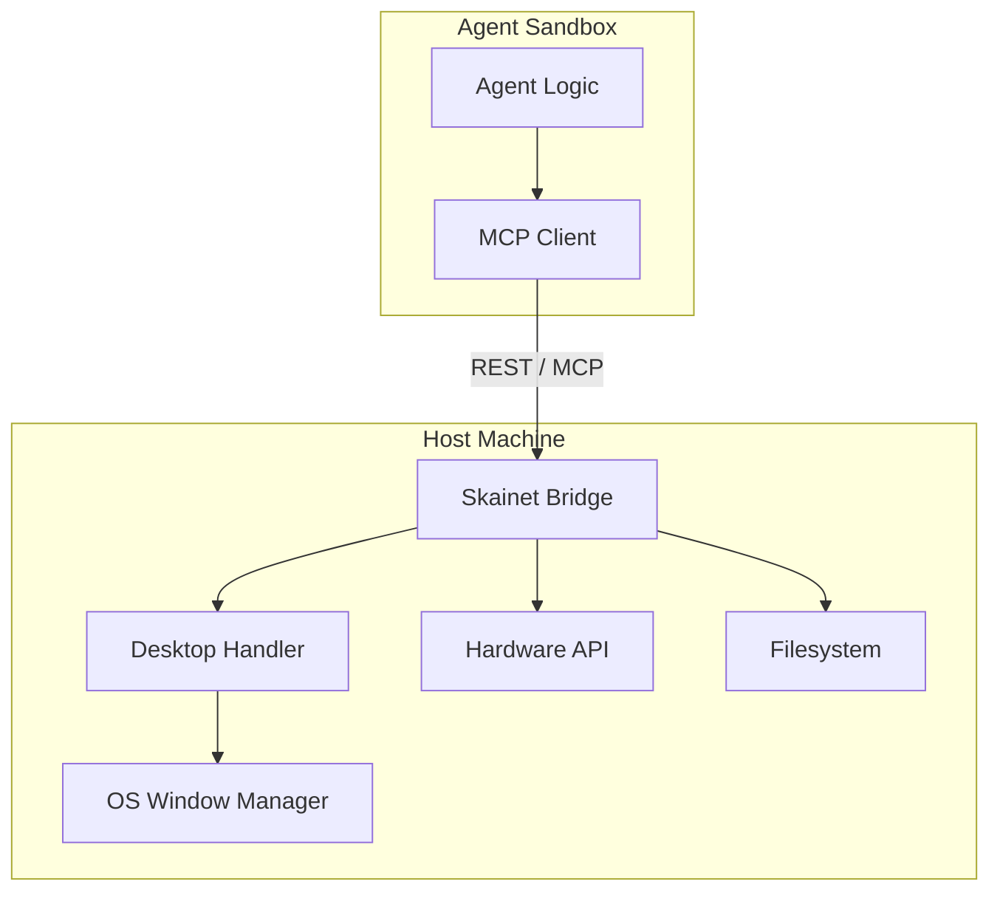
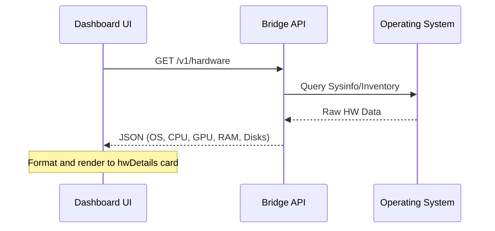

<details>
<summary>Relevant source files</summary>

The following files were used as context for generating this wiki page:

- [arena/mcp/tool_desktop_app.py](arena/mcp/tool_desktop_app.py)
- [arena/mcp/tool_registry.py](arena/mcp/tool_registry.py)
- [skills/arena-bridge/SKILL.md](skills/arena-bridge/SKILL.md)
- [CONTRIBUTING.md](CONTRIBUTING.md)
- [dashboard/assets/21b-hwinfo-overview-extensions.js](dashboard/assets/21b-hwinfo-overview-extensions.js)
</details>

# Desktop & OS Automation

Desktop & OS Automation provides the infrastructure for AI agents to interact directly with the operator's local machine, bypassing sandbox restrictions. It connects agents to the local file system, hardware, and graphical user interface (GUI) via an authenticated local-first bridge. Sources: [skills/arena-bridge/SKILL.md:10-18](skills/arena-bridge/SKILL.md#L10-L18)

This system enables high-level operations such as window manipulation, screen capture, and automated input. It resolves coordinate-fragile GUI scenarios by targeting specific windows before converting relative coordinates to absolute desktop coordinates. Sources: [arena/mcp/tool_desktop_app.py:3-10](arena/mcp/tool_desktop_app.py#L3-L10)

## Architecture and Components

The automation architecture relies on the Skainet Bridge to facilitate communication between the agent (often running in a restricted sandbox) and the host operating system. The bridge exposes a REST API and Model Context Protocol (MCP) endpoints to handle requests for system information, file access, and desktop control. Sources: [skills/arena-bridge/SKILL.md:20-23](skills/arena-bridge/SKILL.md#L20-L23)



The diagram shows the communication flow from the agent sandbox to the host machine's various subsystems through the Skainet Bridge. Sources: [skills/arena-bridge/SKILL.md:52-58](skills/arena-bridge/SKILL.md#L52-L58), [arena/mcp/tool_desktop_app.py:6-10](arena/mcp/tool_desktop_app.py#L6-L10)

## Desktop App Management

The `tool_desktop_app.py` module provides window-relative helpers that resolve target windows before performing actions. This approach ensures that clicks, typing, and screenshots remain accurate even if windows move on the desktop. Sources: [arena/mcp/tool_desktop_app.py:6-10](arena/mcp/tool_desktop_app.py#L6-L10)

### Window Resolution Logic
The system resolves windows using filters like `title`, `class`, `pid`, or `internal_id`. If a window is minimized, the bridge parking coordinates (e.g., -32000, -32000) are refreshed after focusing the window to obtain valid geometry for relative clicks. Sources: [arena/mcp/tool_desktop_app.py:84-95](arena/mcp/tool_desktop_app.py#L84-L95), [arena/mcp/tool_desktop_app.py:102-110](arena/mcp/tool_desktop_app.py#L102-L110)

### Key Desktop Automation Tools

| Tool Name | Purpose | Key Parameters |
| :--- | :--- | :--- |
| `desktop_app.find` | Locates a window and returns geometry. | `title`, `class`, `pid` |
| `desktop_app.focus` | Focuses a specific window. | `id`, `timeout_ms` |
| `desktop_app.click_window_relative` | Clicks inside a window using relative coordinates. | `x`, `y`, `button`, `focus` |
| `desktop_app.screenshot_window` | Captures a base64 image of a specific window. | `quality`, `scale`, `max_width` |
| `desktop_app.type_window` | Types text into a focused window. | `text`, `delay`, `clear` |

Sources: [arena/mcp/tool_desktop_app.py:186-220](arena/mcp/tool_desktop_app.py#L186-L220), [arena/mcp/tool_registry.py:86-103](arena/mcp/tool_registry.py#L86-L103)

## System and Hardware Information

The automation suite includes tools for monitoring host health and hardware specifications. The bridge provides endpoints to query CPU, RAM, GPU, and disk information, which is visualized in the dashboard workspace. Sources: [dashboard/assets/21b-hwinfo-overview-extensions.js:9-30](dashboard/assets/21b-hwinfo-overview-extensions.js#L9-L30)

### Hardware Data Flow



The sequence shows how the dashboard UI retrieves and displays host hardware information via the bridge. Sources: [dashboard/assets/21b-hwinfo-overview-extensions.js:12-45](dashboard/assets/21b-hwinfo-overview-extensions.js#L12-L45)

The bridge supports multiple endpoints for system data:
*  `/v1/hardware`: Comprehensive hardware inventory.
*  `/v1/hwinfo`: Legacy alias for hardware info.
*  `/v1/sysinfo`: Fallback for basic CPU and disk statistics.
Sources: [dashboard/assets/21b-hwinfo-overview-extensions.js:12-30](dashboard/assets/21b-hwinfo-overview-extensions.js#L12-L30)

## Security and Authentication

Access to Desktop & OS automation is restricted via a Bearer token. Every request to the bridge must include an `Authorization: Bearer <TOKEN>` header. Sources: [skills/arena-bridge/SKILL.md:29-33](skills/arena-bridge/SKILL.md#L29-L33)

The system implements specific safety gates for automation:
*  **Command Guarding:** Execution via `/v1/exec` is monitored against an injection blocklist. Sources: [CONTRIBUTING.md:139-141](CONTRIBUTING.md#L139-L141)
*  **Path Validation:** File operations in `arena/files/sandbox.py` check for sensitive files (e.g., `token.txt`, keys) before execution to prevent side-channel leaks. Sources: [CONTRIBUTING.md:142-147](CONTRIBUTING.md#L142-L147)
*  **Desktop Controls:** The bridge provides pause, resume, and revoke controls for desktop automation sessions. Sources: [CONTRIBUTING.md:155-156](CONTRIBUTING.md#L155-L156)

## Implementation Example: Relative Click

The following code illustrates how the bridge resolves a window and calculates absolute coordinates for a relative click operation.

```python
# From arena/mcp/tool_desktop_app.py:126-136
geom = _geom(target)
rel_x = int(args["x"])
rel_y = int(args["y"])

# Convert relative coordinates to absolute desktop coordinates
abs_x = geom["x"] + rel_x
abs_y = geom["y"] + rel_y

click_args: dict[str, Any] = {
    "x": abs_x,
    "y": abs_y,
    "button": args.get("button", "left"),
}
```

Sources: [arena/mcp/tool_desktop_app.py:126-140](arena/mcp/tool_desktop_app.py#L126-L140)

## Summary

Desktop & OS Automation enables seamless interaction between AI agents and local host environments by providing authenticated, window-aware tools. By abstracting raw desktop coordinates into window-relative actions and providing deep hardware/system visibility, the system allows agents to perform complex tasks like game testing, asset management, and system administration securely on the operator's machine.
