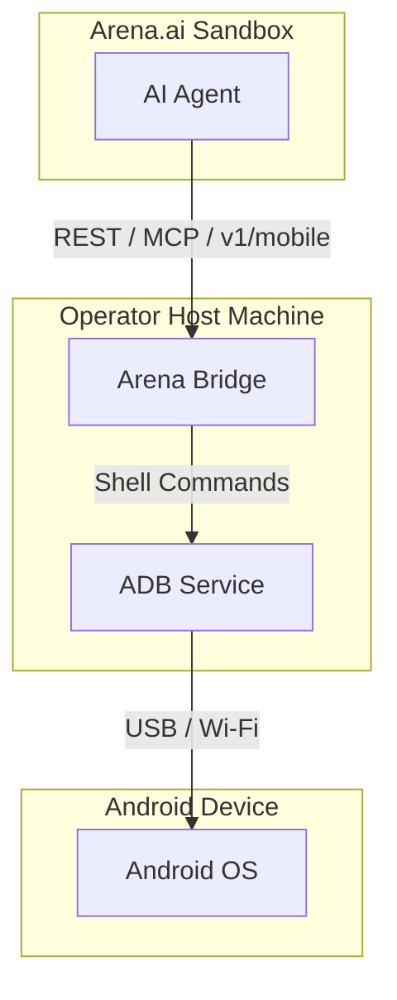
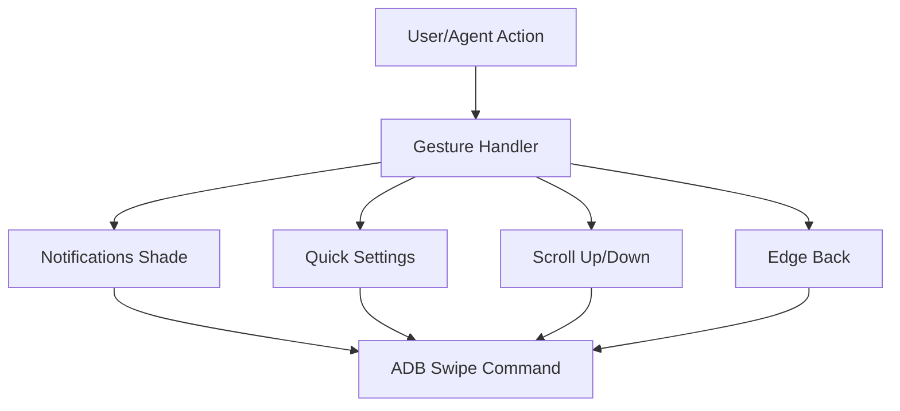
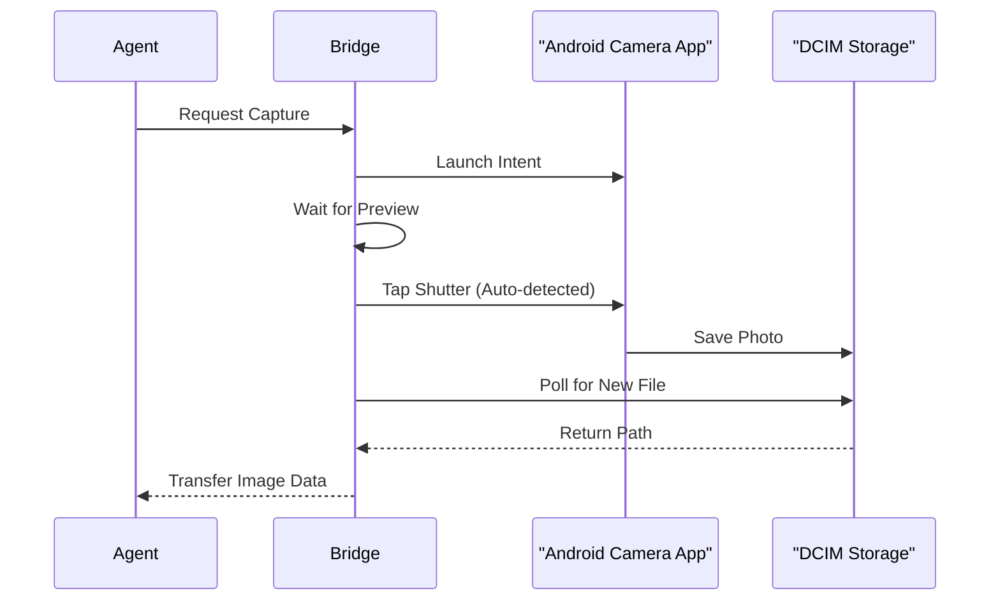

Relevant source files

The following files were used as context for generating this wiki page:

- [arena/mobile/handlers.py](arena/mobile/handlers.py)
- [arena/mobile/adb.py](arena/mobile/adb.py)
- [arena/mobile/mirror.py](arena/mobile/mirror.py)
- [arena/mobile/ui.py](arena/mobile/ui.py)
- [dashboard/assets/body-16-mobile.html](dashboard/assets/body-16-mobile.html)
- [skills/arena-bridge/SKILL.md](skills/arena-bridge/SKILL.md)

# Mobile & Android Automation

Mobile & Android Automation provides a local-first interface for AI agents to interact with physical or emulated Android devices. It bypasses sandbox limitations by connecting to the operator's host machine via the Arena Bridge. This system enables agents to perform file operations, capture screenshots, execute shell commands, and automate UI interactions through Android Debug Bridge (ADB).

Sources: [skills/arena-bridge/SKILL.md:4-14](skills/arena-bridge/SKILL.md#L4-L14), [dashboard/assets/body-16-mobile.html:36-40](dashboard/assets/body-16-mobile.html#L36-L40)

## Architecture and Connectivity

The system uses a bridge architecture to link an ephemeral agent sandbox to an operator's host machine. The host machine runs the actual ADB binaries and maintains connections to mobile devices via USB or Wireless ADB.

### Connection Workflow

The following diagram illustrates how the Arena Bridge facilitates communication between the AI agent and the Android device.

The diagram shows the multi-layered communication path from the agent in the sandbox to the target Android OS.
Sources: [skills/arena-bridge/SKILL.md:32-42](skills/arena-bridge/SKILL.md#L32-L42), [dashboard/assets/body-16-mobile.html:36-45](dashboard/assets/body-16-mobile.html#L36-L45)

### Wireless ADB Protocol
Wireless ADB allows device connection without physical cables. The process involves two distinct ports:
1.  **Pairing Port:** Used with a 6-digit pairing code to authorize the host.
2.  **Connect Port:** Used for the actual ADB connection once pairing is successful.

Sources: [dashboard/assets/body-16-mobile.html:56-61](dashboard/assets/body-16-mobile.html#L56-L61)

## User Interface and Interaction

The Mobile dashboard provides tools for manual and automated device control, including navigation, gestures, and UI inspection.

### Interaction Components

| Component | Description |
| :--- | :--- |
| **Navigation** | Buttons for Home, Back, Recents, Wake, Sleep, and Volume control. |
| **Gestures** | Semantic swipes for notifications, quick settings, and scrolling. |
| **Diagnostic Shell** | Restricted terminal for commands like `getprop`, `dumpsys`, and `ls`. |
| **UI Inspector** | Overlays bounding boxes on interactive elements for node-based tapping. |
| **Live Mirror** | Experimental H.264 stream for real-time screen monitoring. |

Sources: [dashboard/assets/body-16-mobile.html:105-230](dashboard/assets/body-16-mobile.html#L105-L230)

### Gesture Mapping
The system maps high-level semantic gestures to specific ADB input commands to avoid complex pixel calculations.

The diagram outlines the translation of semantic gesture requests into ADB swipe commands.
Sources: [dashboard/assets/body-16-mobile.html:120-135](dashboard/assets/body-16-mobile.html#L120-L135)

## Advanced Automation Capabilities

Beyond basic input, the system supports complex workflows including camera capture, APK installation, and non-ASCII text input.

### Large File and APK Management
Because sandboxes have strict storage limits (e.g., 128 MB), heavy assets like APKs or large photos are streamed directly to the host machine.
*  **APK Staging:** Files are uploaded to `/tmp/arena-apk-staging/` on the bridge host.
*  **Safety Checks:** The system computes SHA-256 hashes and requires a consent token before `pm install`.
*  **Storage Path:** Persistent artifacts live under `~/arena-bridge/` on the operator's host.

Sources: [skills/arena-bridge/SKILL.md:50-55](skills/arena-bridge/SKILL.md#L50-L55), [dashboard/assets/body-16-mobile.html:360-375](dashboard/assets/body-16-mobile.html#L360-L375)

### Text Input and ADBKeyboard
Standard Android `input text` commands often crash when handling non-ASCII characters (e.g., emojis or Cyrillic). The system solves this by:
1.  Installing the **ADBKeyboard helper APK**.
2.  Activating it as the current Input Method Editor (IME).
3.  Broadcasting base64-encoded UTF-8 strings to the IME.

Sources: [dashboard/assets/body-16-mobile.html:345-358](dashboard/assets/body-16-mobile.html#L345-L358)

### Camera and Media Capture
The camera module automates photography by launching the default intent (`android.media.action.STILL_IMAGE_CAMERA`).

This sequence shows the automated flow from capture request to file retrieval.
Sources: [dashboard/assets/body-16-mobile.html:385-400](dashboard/assets/body-16-mobile.html#L385-L400)

## Security and Restrictions

The system implements several safety measures to protect the host and device:
*  **FLAG_SECURE:** The screenshot API returns a black frame for sensitive screens (banking, password entry) to prevent data leakage.
*  **Authored Tools:** New mobile capabilities are composed using `custom.create` and inherit the risk policy of the underlying primitives.
*  **Path Validation:** File operations are restricted to specific staging directories to prevent arbitrary host access.

Sources: [dashboard/assets/body-16-mobile.html:310-318](dashboard/assets/body-16-mobile.html#L310-L318), [dashboard/assets/body-16-mobile.html:365-368](dashboard/assets/body-16-mobile.html#L365-L368), [skills/core/build-capability/SKILL.md:25-30](skills/core/build-capability/SKILL.md#L25-L30)

Mobile & Android Automation enables agents to perform complex, hardware-dependent tasks by bridging local ADB primitives into the agent's workspace. By managing large files on the host and providing high-level gesture and UI abstractions, it allows for reliable and scalable mobile device management.
