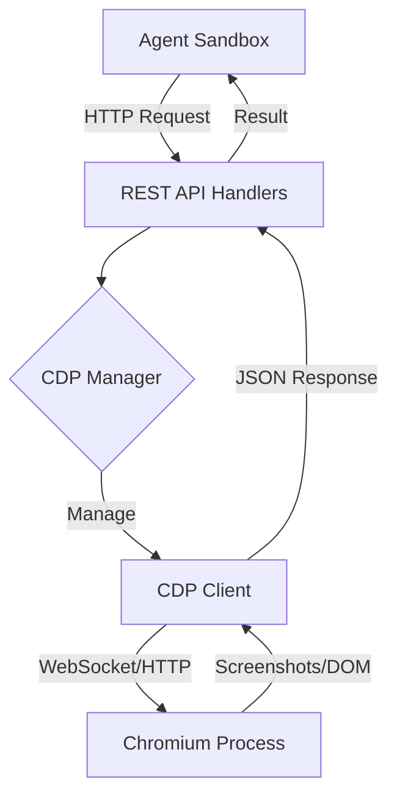
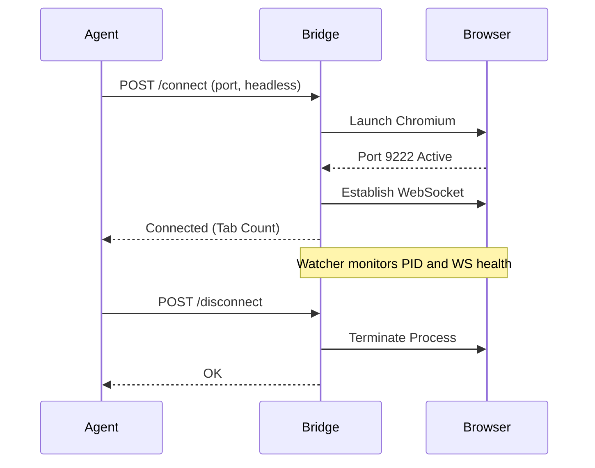
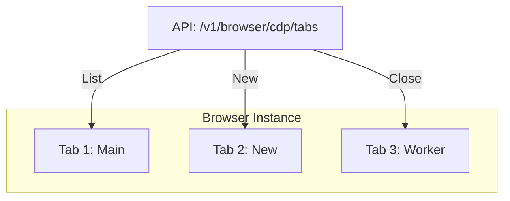

<details>
<summary>Relevant source files</summary>

The following files were used as context for generating this wiki page:

- [arena/browser/handlers.py](arena/browser/handlers.py)
- [arena/browser/cdp\_client/browser.py](arena/browser/cdp_client/browser.py)
- [arena/browser/navigation\_policy.py](arena/browser/navigation_policy.py)
- [scripts/browser\_report.js](scripts/browser_report.js)
- [dev/stress-test-v3.sh](dev/stress-test-v3.sh)
- [AGENTS.md](AGENTS.md)
</details>

# Browser Automation (CDP)

Browser Automation in Skainet Bridge provides a remote-control interface for Chromium-based browsers via the Chrome DevTools Protocol (CDP). This system allows agents to bypass restrictive sandboxes by offloading heavy visual tasks, web scraping, and browser interactions to the host machine.

The automation suite includes a low-level CDP client for direct browser manipulation, high-level REST API handlers for remote execution, and specialized scripts for generating detailed browser reports. It manages browser lifecycles, tab navigation, DOM extraction, and visual verification through screenshots.

## Architecture and Components

The system operates as a bridge between the agent sandbox and a real browser instance on the operator's host. It uses an asynchronous lifecycle to manage browser processes and WebSocket connections.



The diagram shows the communication flow from the agent sandbox through the Bridge API to the controlled browser process. Sources: [AGENTS.md](AGENTS.md), [dev/stress-test-v3.sh](dev/stress-test-v3.sh)

### Key Components

| Component | File Path | Description |
| :--- | :--- | :--- |
| **API Handlers** | `arena/browser/handlers.py` | Defines endpoints for navigation, screenshots, and status checks. |
| **CDP Client** | `arena/browser/cdp_client/browser.py` | Manages low-level WebSocket communication and browser state. |
| **Navigation Policy** | `arena/browser/navigation_policy.py` | Enforces safety rules for URL navigation. |
| **Reporting Script** | `scripts/browser_report.js` | Uses Playwright to generate snapshots and metadata reports. |

Sources: [arena/browser/handlers.py](arena/browser/handlers.py), [arena/browser/cdp_client/browser.py](arena/browser/cdp_client/browser.py), [scripts/browser_report.js](scripts/browser_report.js)

## Connection Management

The Bridge manages browser connections via the `/v1/browser/cdp/connect` endpoint. It supports launching browsers in headless modes and monitors connection health through a dedicated watcher.

### Lifecycle Flow



The sequence describes the lifecycle from initial connection request to browser termination. Sources: [dev/stress-test-v3.sh:150-320](dev/stress-test-v3.sh#L150-L320), [arena/browser/cdp_client/browser.py](arena/browser/cdp_client/browser.py)

### Health and Diagnostics
The system provides several diagnostic endpoints to verify environment readiness:
*  **Status (`/v1/browser/cdp/status`)**: Returns connection state, module availability, and reconnect counts.
*  **Diag (`/v1/browser/cdp/diag`)**: Inspects host environment variables like `DBUS_SESSION_BUS_ADDRESS` and `XDG_RUNTIME_DIR`.
*  **Test Launch**: Validates if Chromium can start with current environment settings.

Sources: [dev/stress-test-v3.sh:88-148](dev/stress-test-v3.sh#L88-L148), [arena/browser/handlers.py](arena/browser/handlers.py)

## Browser Operations

Once connected, the agent performs various actions through structured REST API calls.

### Navigation and Extraction
Navigation follows safety policies defined in `navigation_policy.py`. Agents can extract the full DOM or use specialized "Stealth" modes for scraping.

```python
# Example navigation call from stress test
# POST /v1/browser/cdp/navigate
{
    "url": "https://example.com",
    "wait": true
}
```

Sources: [dev/stress-test-v3.sh:322-330](dev/stress-test-v3.sh#L322-L330), [arena/browser/navigation_policy.py](arena/browser/navigation_policy.py)

### Visual Verification
Visual frames are captured using the `/v1/browser/cdp/screenshot` endpoint. This allows agents to verify UI states or capture evidence of successful actions. The `browser_report.js` script enhances this by generating a multi-format report:
1.  **PNG**: Full-page screenshot.
2.  **JSON**: Metadata including navigator properties, links, and meta tags.
3.  **Markdown**: A readable preview of the page text and structure.

Sources: [scripts/browser_report.js:20-40](scripts/browser_report.js#L20-L40), [arena/browser/handlers.py](arena/browser/handlers.py)

### Script Execution and DOM Interaction
Agents interact with page content using:
*  **Eval JS**: Executes arbitrary JavaScript via `/v1/browser/cdp/eval`.
*  **DOM Dump**: Retrieves the current HTML content via `/v1/browser/cdp/dom`.
*  **Cookie Management**: Gets or sets browser cookies via `/v1/browser/cdp/cookies`.

Sources: [dev/stress-test-v3.sh:343-375](dev/stress-test-v3.sh#L343-L375), [arena/browser/handlers.py](arena/browser/handlers.py)

## Multi-Tab Management

The CDP client supports managing multiple browser tabs (targets) simultaneously. Agents can create new tabs, list active tabs, and switch between them to perform parallel tasks.



Sources: [dev/stress-test-v3.sh:388-420](dev/stress-test-v3.sh#L388-L420), [arena/browser/cdp_client/browser.py](arena/browser/cdp_client/browser.py)

## Security and Sandbox Escape

The CDP system is a primary mechanism for "Sandbox Escape." Agents are typically restricted to a 128 MB workspace in Arena.ai. By offloading browser tasks:
*  **Memory Efficiency**: Large page loads and heavy JavaScript execution happen on the host, not the agent.
*  **Persistent Storage**: Downloads and assets live in `~/arena-bridge/` on the operator's PC.
*  **Resource Access**: The agent gains access to the host's real GPU and hardware for rendering tasks.

Sources: [AGENTS.md](AGENTS.md), [arena-bridge/SKILL.md](arena-bridge/SKILL.md)

## Conclusion

Browser Automation via CDP provides a robust framework for agents to interact with the web and local visual environments. By abstracting the complexities of process management and WebSocket communication into a RESTful API, it enables autonomous agents to perform sophisticated web tasks while remaining within their operational constraints.
