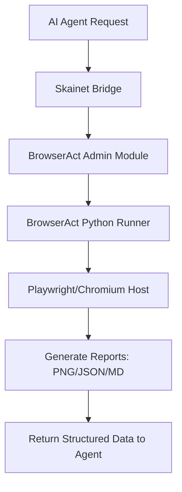

<details>
<summary>Relevant source files</summary>

The following files were used as context for generating this wiki page:

- [skills/browseract/SKILL.md](skills/browseract/SKILL.md)
- [skills/browseract/run.py](skills/browseract/run.py)
- [arena/admin/browseract.py](arena/admin/browseract.py)
- [AGENTS.md](AGENTS.md)
- [CONTRIBUTING.md](CONTRIBUTING.md)
- [scripts/browser_report.js](scripts/browser_report.js)
- [scripts/readability_report.js](scripts/readability_report.js)
</details>

# Stealth Browsing with BrowserAct

BrowserAct provides a cross-platform interface for AI agents to perform stealth browsing and web automation within the Arena ecosystem. It acts as a wrapper around the `browser-act-cli`, enabling agents to interact with web content while bypassing sandbox restrictions through the [Skainet Bridge](#arena-bridge-skill).

The system allows agents to capture screenshots, extract structured page data, and convert web content into readable Markdown. By offloading browser execution to the host machine, it provides access to real GPU resources and display environments that are typically unavailable in restricted agent sandboxes.

Sources: [AGENTS.md:120-125](AGENTS.md#L120-L125), [AGENTS.md:387-390](AGENTS.md#L387-L390), [skills/browseract/SKILL.md](skills/browseract/SKILL.md)

## Architecture and Components

The BrowserAct module integrates with the Arena admin subsystem to manage browser status and execution across different platforms. It utilizes a combination of Python wrappers and Node.js scripts to perform browser automation tasks.

### Core Modules
*  **`arena/admin/browseract.py`**: Provides the primary interface for checking BrowserAct status and managing the CLI environment.
*  **`skills/browseract/run.py`**: A cross-platform Python script that executes the stealth browsing logic.
*  **`scripts/browser_report.js`**: Uses Playwright to launch Chromium, navigate to URLs, and generate JSON/Markdown reports including screenshots.
*  **`scripts/readability_report.js`**: Leverages Mozilla Readability and Turndown to extract clean text and convert HTML to Markdown.

Sources: [arena/admin/browseract.py:1-10](arena/admin/browseract.py#L1-L10), [skills/browseract/run.py:1-5](skills/browseract/run.py#L1-L5), [scripts/browser_report.js:1-10](scripts/browser_report.js#L1-L10), [scripts/readability_report.js:1-10](scripts/readability_report.js#L1-L10)

### Execution Flow
The following diagram illustrates how a browsing request moves from the agent through the bridge to the host browser.



The system ensures that heavy browser workloads are routed to the host machine to avoid bloating the 128 MB agent workspace.
Sources: [AGENTS.md:36-40](AGENTS.md#L36-L40), [AGENTS.md:387-390](AGENTS.md#L387-L390), [scripts/browser_report.js:35-40](scripts/browser_report.js#L35-L40)

## Stealth and Data Extraction

BrowserAct focuses on high-fidelity data extraction and stealthy execution to ensure automated tasks remain undetected by target websites.

### Reporting Capabilities
The `browser_report.js` script captures extensive metadata during a browsing session:
*  **Navigator Data**: User agent, platform, languages, and hardware concurrency.
*  **Screen Metrics**: Viewport dimensions and device pixel ratio (DPR).
*  **Structured Content**: Titles, final URLs, and up to 200 links/meta tags.
*  **Visual Evidence**: Full-page screenshots saved as PNG files.

Sources: [scripts/browser_report.js:18-30](scripts/browser_report.js#L18-L30)

### Content Processing
For cleaner information retrieval, the system uses a readability-focused pipeline to strip boilerplate from web pages.

| Component | Technology | Output Format | Purpose |
| :--- | :--- | :--- | :--- |
| **Readability** | @mozilla/readability | Cleaned HTML | Removes ads and navigation menus |
| **Turndown** | TurndownService | Markdown | Converts web content for AI ingestion |
| **Browser Report** | Playwright Core | JSON/PNG | Provides raw data and visual state |

Sources: [scripts/readability_report.js:20-32](scripts/readability_report.js#L20-L32), [scripts/browser_report.js:35-40](scripts/browser_report.js#L35-L40)

## Platform Integration

The BrowserAct implementation maintains strict cross-platform compatibility, a core requirement for the Arena admin modules.

### Status and Environment Checks
The `browseract.py` module includes logic to detect the operational status of the CLI tool across different operating systems. It avoids using `sudo` directly and utilizes `platform.system()` branches to manage environment-specific paths.

```python
# Example of cross-platform status check logic in arena/admin/browseract.py
import platform

def get_browseract_status():
    system = platform.system()
    # Platform-aware detection logic
    # Avoids Linux-only assumptions
    pass
```

Sources: [arena/admin/browseract.py:1-15](arena/admin/browseract.py#L1-L15), [AGENTS.md:20-25](AGENTS.md#L20-L25)

### Security and Sandbox Safety
To prevent session truncation and resource exhaustion, BrowserAct follows the "Sandbox Escape via Bridge" protocol. All reports and browser artifacts are stored in the host's `reports/` directory rather than the ephemeral agent workspace.

Sources: [AGENTS.md:36-40](AGENTS.md#L36-L40), [scripts/browser_report.js:7-10](scripts/browser_report.js#L7-L10)

## Configuration and Usage

Agents interact with BrowserAct through the bridge API or command-line wrappers.

### API Parameters for Reports
The underlying Node.js scripts accept several environment variables and arguments to control the browser behavior.

| Parameter | Type | Default | Description |
| :--- | :--- | :--- | :--- |
| `url` | Argument | `https://example.com` | The target URL to browse |
| `CHROMIUM_PATH` | Env Var | `/usr/bin/chromium` | Path to the browser executable |
| `HEADLESS` | Env Var | `1` | Controls whether the browser runs in headless mode |
| `VIEWPORT_W` | Env Var | `1365` | Width of the browser viewport |
| `VIEWPORT_H` | Env Var | `768` | Height of the browser viewport |

Sources: [scripts/browser_report.js:11-15](scripts/browser_report.js#L11-L15), [scripts/readability_report.js:12-15](scripts/readability_report.js#L12-L15)

### Summary
Stealth Browsing with BrowserAct enables reliable, high-fidelity web interaction for AI agents. By offloading execution to the host and utilizing specialized reporting scripts, the system provides a robust mechanism for web research and automation while strictly adhering to the project's modularity and security standards.

Sources: [AGENTS.md:15-20](AGENTS.md#L15-L20), [CONTRIBUTING.md:45-50](CONTRIBUTING.md#L45-L50)
