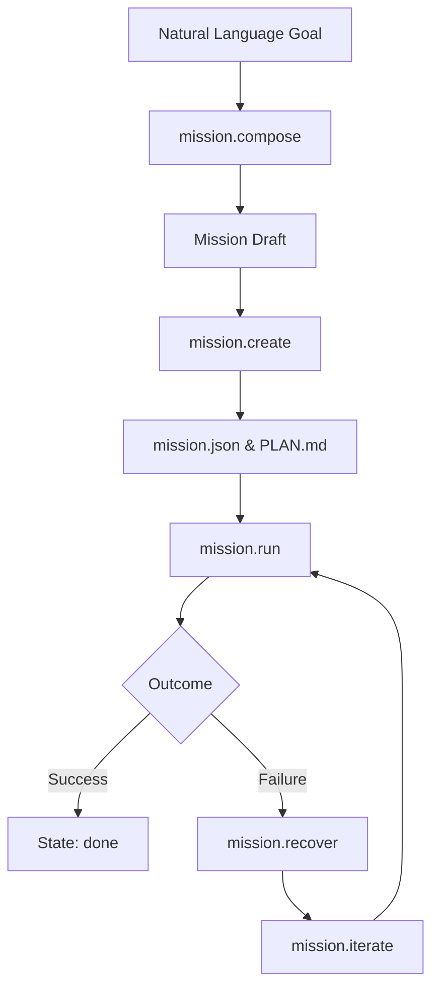
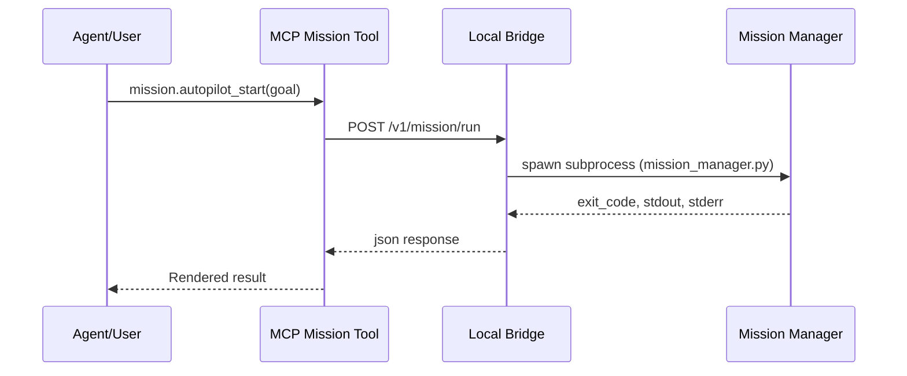

Relevant source files

The following files were used as context for generating this wiki page:

- [arena/resources/missions_manage.py](arena/resources/missions_manage.py)
- [arena/resources/mission_catalog.py](arena/resources/mission_catalog.py)
- [arena/mcp/tool_registry_mission.py](arena/mcp/tool_registry_mission.py)
- [arena/resources/handlers.py](arena/resources/handlers.py)
- [arena/mcp/tool_mission.py](arena/mcp/tool_mission.py)
- [tests/test_mission_management.py](tests/test_mission_management.py)

# Autonomy & Missions

Autonomy & Missions defines a structured framework for managing bounded, agentic tasks within the Arena environment. It provides mechanisms for mission composition, persistence, execution, and scheduling, allowing agents to operate with high-level goals and constraints rather than just individual commands.

The system utilizes a mission lifecycle that includes drafting from templates, running autopilot loops, managing lineage between parent and child missions, and recovering from failures through iterations.

## Mission Lifecycle and Architecture

The mission architecture centers on the transition from a natural language goal to a structured, executable plan. The lifecycle begins with **Mission Composition**, where a goal is mapped to a mission template and a set of planner steps.

### Mission Lifecycle Flow

The following diagram illustrates the path from initial goal to execution and recovery.

The system organizes missions in a dedicated directory where each mission has its own folder containing a `mission.json` state file, a `PLAN.md` human-readable plan, and associated `logs` and `artifacts`.
Sources: [arena/resources/missions_manage.py:79-99](arena/resources/missions_manage.py#L79-L99), [arena/resources/mission_catalog.py:90-116](arena/resources/mission_catalog.py#L90-L116)

## Mission Composition and Templates

The system uses templates to provide structure for common tasks. The function `infer_mission_template` matches keywords in goals or contexts to specific template IDs.

### Key Mission Templates

| Template ID | Purpose | Keywords |
| :--- | :--- | :--- |
| `code-tdd` | Test-driven development tasks | code, repo, test, bug, refactor |
| `browser-real-user` | Browser-based workflows | site, page, form, web |
| `mcp-integration` | MCP tool integrations | mcp, tool, integration |
| `lan-service` | Local network operations | lan, port, service, scan |
| `cli-agent-core` | Default fallback | - |

Sources: [arena/resources/missions_manage.py:16-36](arena/resources/missions_manage.py#L16-L36)

### Drafting and Persistence
A mission draft is composed using `compose_mission_draft`, which combines a goal, context, constraints, and planner steps into a `spec_version: 1` object. Persistence via `create_mission_from_draft` generates a unique mission ID based on the timestamp, a slug of the title, and a random suffix.
Sources: [arena/resources/missions_manage.py:46-76](arena/resources/missions_manage.py#L46-L76), [arena/resources/missions_manage.py:79-84](arena/resources/missions_manage.py#L79-L84)

## Mission Execution and Autopilot

Missions are executed via the `mission_manager.py` script. The execution can be fully autonomous (Autopilot) or managed step-by-step.

### Autopilot Operations
The Mission Autopilot allows for bounded runs that execute explicit steps, persist progress, and generate flight records.

Sources: [arena/mcp/tool_registry_mission.py:6-34](arena/mcp/tool_registry_mission.py#L6-L34), [arena/mcp/tool_mission.py:33-55](arena/mcp/tool_mission.py#L33-L55)

### Execution Control Tools
The system provides several MCP tools for fine-grained control over execution:
*  **mission.run**: Executes a persisted mission by ID.
*  **mission.rerun**: Retries a mission, optionally only the last failed step.
*  **mission.autopilot_step**: Appends or executes a single tool step inside an existing run.
*  **mission.autopilot_cancel**: Interrupts a running or paused autopilot sequence.
Sources: [arena/mcp/tool_registry_mission.py:36-41](arena/mcp/tool_registry_mission.py#L36-L41), [arena/mcp/tool_mission.py:101-115](arena/mcp/tool_mission.py#L101-L115)

## Mission Lineage and Families

The system tracks relationships between missions to maintain context across long-running or complex operations.

*  **Lineage**: Tracks `parent_mission_id`, `root_mission_id`, and `ancestor_ids`. It calculates `lineage_depth` to show how far a mission is from its origin.
*  **Origin**: Defines how a mission was created (e.g., `manual`, `linked`, or `iterate`).
*  **Family**: Represents the full tree of missions rooted at a single origin, including all descendants and branch summaries.

Sources: [arena/resources/mission_catalog.py:100-110](arena/resources/mission_catalog.py#L100-L110), [arena/resources/mission_catalog.py:133-145](arena/resources/mission_catalog.py#L133-L145)

## Recovery and Iteration

When a mission fails, the system provides structured recovery paths.

1.  **Recovery Bundle**: Created via `mission.recover`, it analyzes the state and suggests actions such as "rerun failed step" or "compose follow-up".
2.  **Iteration Loop**: Combining recovery and follow-up creation, `mission.iterate` allows an agent to reflect on failures, adjust the plan, and launch a new mission to address remaining goals.

Sources: [arena/mcp/tool_registry_mission.py:42-45](arena/mcp/tool_registry_mission.py#L42-L45), [tests/test_mission_management.py:151-177](tests/test_mission_management.py#L151-L177)

## Scheduling

Missions can be scheduled for recurring execution. The schedule system tracks "due" states and allows for automated iteration or reruns.

### Schedule API Parameters

| Parameter | Type | Description |
| :--- | :--- | :--- |
| `schedule_id` | string | Unique identifier for the schedule |
| `mission_id` | string | The mission to be executed |
| `action` | enum | `run`, `rerun_failed`, or `iterate` |
| `every_minutes`| integer| Frequency of execution (default: 60) |
| `enabled` | boolean | Whether the schedule is active |

Sources: [arena/mcp/tool_registry_mission.py:48-52](arena/mcp/tool_registry_mission.py#L48-L52)

### Management Tools
*  **mission.schedules**: Lists saved schedules and due-state summaries.
*  **mission.schedule_tick**: Manually triggers due mission schedules.
*  **mission.schedule_delete**: Removes a recurring schedule.
Sources: [arena/mcp/tool_registry_mission.py:47-53](arena/mcp/tool_registry_mission.py#L47-L53)

## Summary

The Autonomy & Missions system enables structured agentic behavior by moving beyond isolated tool calls into persistent, goal-oriented "missions." By utilizing templates, tracking lineage, and providing robust recovery and scheduling tools, the framework allows agents to handle complex, multi-step tasks with built-in persistence and observability through the Local Bridge.
Sources: [arena/resources/handlers.py:27-52](arena/resources/handlers.py#L27-L52), [arena/mcp/tool_mission.py:7-27](arena/mcp/tool_mission.py#L7-L27)
