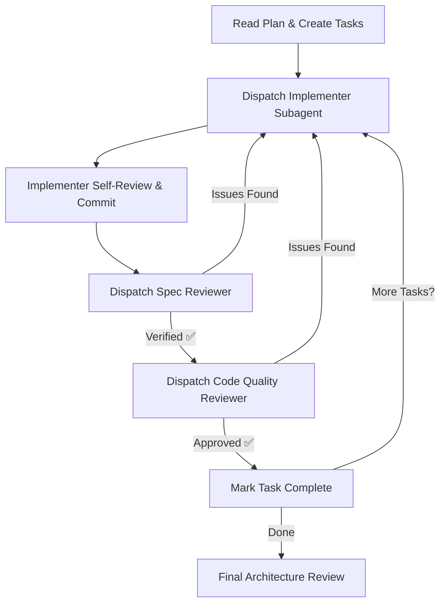
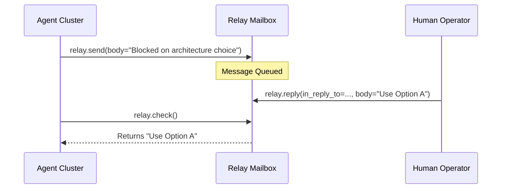

Relevant source files

The following files were used as context for generating this wiki page:

- [AGENTS.md](AGENTS.md)
- [skills/superpowers/skills/subagent-driven-development/SKILL.md](skills/superpowers/skills/subagent-driven-development/SKILL.md)
- [skills/superpowers/skills/requesting-code-review/SKILL.md](skills/superpowers/skills/requesting-code-review/SKILL.md)
- [skills/superpowers/skills/using-superpowers/references/codex-tools.md](skills/superpowers/skills/using-superpowers/references/codex-tools.md)
- [skills/arena-bridge/SKILL.md](skills/arena-bridge/SKILL.md)
- [skills/superpowers/skills/requesting-code-review/code-reviewer.md](skills/superpowers/skills/requesting-code-review/code-reviewer.md)

# Multi-Agent & Clustering

Multi-Agent systems in the Arena Agent codebase coordinate specialized autonomous workers to execute complex implementation plans. The system uses a hierarchical structure where a controller agent dispatches subagents with isolated contexts to perform specific tasks, such as coding, testing, and reviewing. This approach prevents context pollution and allows for parallel-safe development within a clustered or sandboxed environment.

## Multi-Agent Architecture

The architecture relies on a specialized division of labor between different agent roles. A controller agent manages the overall implementation plan, while subagents execute individual tasks.

### Agent Roles and Coordination
The system defines specific roles for agents to ensure high-quality output and separation of concerns:

| Role | Responsibility |
| :--- | :--- |
| **Controller** | Manages the task board, extracts tasks from plans, and dispatches subagents. |
| **Implementer** | Executes mechanical coding tasks, writes tests, and performs self-reviews. |
| **Spec Reviewer** | Verifies that the implementation matches the original requirements/specifications. |
| **Code Quality Reviewer** | Evaluates code for architecture, maintainability, and clean separation of concerns. |
| **Diagnostic Reviewer** | Independent agent that identifies issues and provides reproduction evidence. |

Sources: [skills/superpowers/skills/subagent-driven-development/SKILL.md:43-69](skills/superpowers/skills/subagent-driven-development/SKILL.md#L43-L69), [AGENTS.md:38-46](AGENTS.md#L38-L46), [skills/superpowers/skills/requesting-code-review/code-reviewer.md:5-20](skills/superpowers/skills/requesting-code-review/code-reviewer.md#L5-L20)

### Coordination Flow
The controller follows a "two-stage review" process for every task executed by a subagent. It dispatches a Spec Reviewer first, and only after compliance is verified does it dispatch a Code Quality Reviewer.

The flow ensures that every piece of code is vetted for both functional accuracy and technical debt before proceeding.
Sources: [skills/superpowers/skills/subagent-driven-development/SKILL.md:43-69](skills/superpowers/skills/subagent-driven-development/SKILL.md#L43-L69)

## Clustering and Sandbox Management

Clustering in this project refers to the management of agent instances across sandboxed environments and local host machines. Because sandboxes often have strict resource limits, the system uses a bridge protocol to offload heavy compute tasks.

### Sandbox Escape Protocol
Agents operating in sandboxed environments (like Arena.ai Agent Mode) face a 128 MB snapshot cap. To bypass this, agents use the **Skainet Bridge** to interact with the operator's host machine.

*  **Workspace Isolation:** Temporary files reside in `/tmp` (1 GB tmpfs) to avoid bloating snapshots.
*  **Persistent Storage:** Heavy assets, datasets, and binaries are streamed to the host under `~/arena-bridge/`.
*  **Offloading:** GPU tasks, game engine executions (Godot), and long-running background processes run on the host while the agent maintains control from the sandbox.

Sources: [skills/arena-bridge/SKILL.md:44-60](skills/arena-bridge/SKILL.md#L44-L60), [AGENTS.md:67-88](AGENTS.md#L67-L88)

### Multi-Agent Tooling (Codex)
When running in a clustered or multi-agent configuration on the Codex platform, specific tools manage subagent lifecycles:

| Skill Tool Reference | Codex Tool Equivalent | Description |
| :--- | :--- | :--- |
| `Task` | `spawn_agent` | Dispatches a fresh subagent instance. |
| Parallel `Task` | Multiple `spawn_agent` | Executes multiple agents concurrently. |
| Task Result | `wait_agent` | Blocks until the subagent returns a status. |
| Task Completion | `close_agent` | Frees the agent slot in the cluster. |

Sources: [skills/superpowers/skills/using-superpowers/references/codex-tools.md:5-15](skills/superpowers/skills/using-superpowers/references/codex-tools.md#L5-L15)

## Communication and State Persistence

Agents maintain continuity through structured shared state and messaging systems, ensuring that context is not lost during session truncations or handoffs.

### Task Board & Serena Continuity
The `docs/TASK_BOARD.md` serves as the single source of truth for the cluster. Every agent must read this board at the start of a session. To prevent context loss across session boundaries, agents use **Serena Session Memory** via MCP or the `agentctl_memory.py` utility.
Sources: [AGENTS.md:21-32](AGENTS.md#L21-L32), [skills/arena-bridge/SKILL.md:83-91](skills/arena-bridge/SKILL.md#L83-L91)

### Operator Mailbox (Relay)
A mailbox system allows asynchronous communication between the agent cluster and the human operator.
*  **Non-blocking checks:** `relay.check` allows agents to look for new instructions without stalling.
*  **Queued responses:** `relay.send` allows agents to ask for clarification when a task is blocked, rather than guessing.

Sources: [AGENTS.md:135-155](AGENTS.md#L135-L155)

## Agent Workspace Hygiene

In clustered environments, resource management is critical to prevent session truncation. Agents must manage their local footprint:
1.  **Tooling:** Install tools like `ruff` or `bandit` in `/tmp/tools` instead of `~/.local`.
2.  **Garbage Collection:** Run `git gc --aggressive --prune=now` to reclaim space.
3.  **Cache Management:** Use `pip install --no-cache-dir` to avoid accumulating hidden data.

Sources: [AGENTS.md:67-106](AGENTS.md#L67-L106)

Multi-Agent & Clustering enables the Arena Agent system to scale complex tasks by distributing work across specialized, sandboxed subagents while offloading resource-heavy operations to a persistent host machine through the Skainet Bridge.
