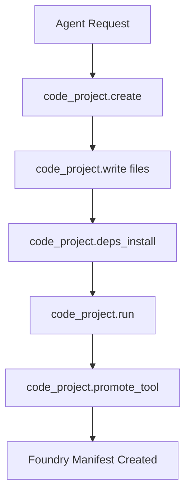
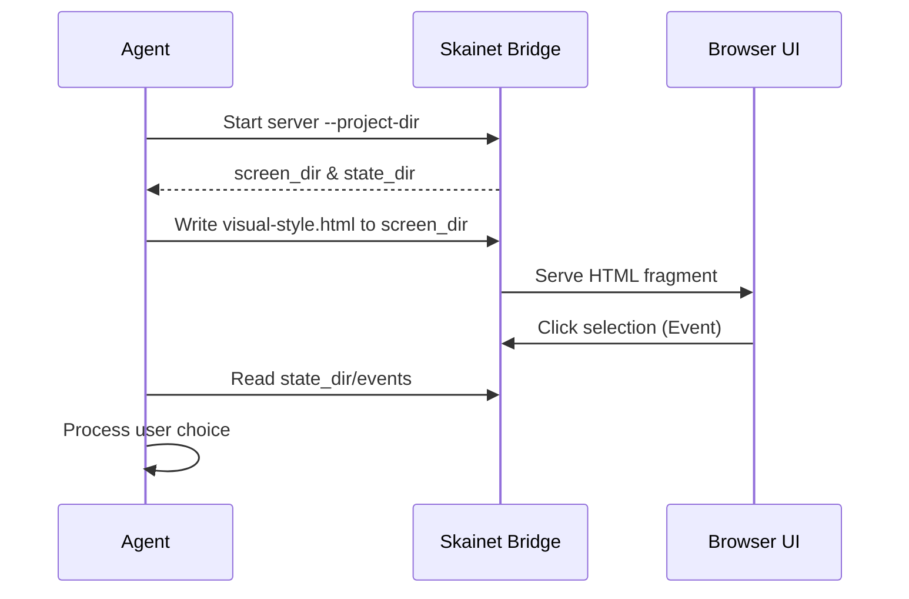

<details>
<summary>Relevant source files</summary>

The following files were used as context for generating this wiki page:

- [arena/mcp/tool_code_project.py](arena/mcp/tool_code_project.py)
- [dashboard/assets/body-01b-workspace.html](dashboard/assets/body-01b-workspace.html)
- [AGENTS.md](AGENTS.md)
- [skills/arena-bridge/SKILL.md](skills/arena-bridge/SKILL.md)
- [skills/superpowers/skills/brainstorming/visual-companion.md](skills/superpowers/skills/brainstorming/visual-companion.md)
</details>

# Code Workbench & Projects

The Code Workbench provides a persistent environment for AI agents to manage projects, dependencies, and code execution. It bypasses restrictive sandbox limits by offloading heavy computational tasks and large storage requirements to the operator's host machine. This system ensures that persistent artifacts, such as large datasets or game binaries, remain accessible across session boundaries.

Agents interact with the Workbench through a suite of Model Context Protocol (MCP) tools and a specialized dashboard interface. The Workbench serves as the primary mechanism for [Sandbox Escape](#sandbox-escape-protocol), allowing agents to utilize unlimited disk space and real hardware resources on the host while maintaining a structured project lifecycle.

Sources: [skills/arena-bridge/SKILL.md:5-15](skills/arena-bridge/SKILL.md#L5-L15), [arena/mcp/tool_code_project.py:5-10](arena/mcp/tool_code_project.py#L5-L10)

## Project Management and Lifecycle

The Workbench manages projects as persistent entities stored under the `ARENA_AGENT_HOME/code-projects` directory on the host. Agents use specific tools to create, read, write, and remove these projects, ensuring that development work survives session resets.

### Project Lifecycle Flow



This diagram illustrates the standard progression from project creation to promotion into a reusable Foundry tool.
Sources: [arena/mcp/tool_code_project.py:10-75](arena/mcp/tool_code_project.py#L10-L75), [arena/mcp/tool_code_project.py:80-95](arena/mcp/tool_code_project.py#L80-L95)

### Core Project Tools

| Tool Name | Description | Key Arguments |
|-----------|-------------|---------------|
| `code_project.create` | Creates a persistent project directory. | `name`, `files`, `overwrite` |
| `code_project.write` | Writes content to a specific path within a project. | `name`, `path`, `content`, `encoding` |
| `code_project.read` | Retrieves file content from a project. | `name`, `path`, `max_bytes` |
| `code_project.run` | Executes project code within an operator-owned fence. | `name`, `entry`, `argv`, `deps`, `lock_mode` |
| `code_project.remove` | Deletes a persistent project and its files. | `name` |

Sources: [arena/mcp/tool_code_project.py:80-95](arena/mcp/tool_code_project.py#L80-L95)

## Dependency Management and Locking

The Workbench provides a sophisticated dependency management system to ensure reproducible execution environments. It utilizes a local cache named `.arena-deps` and enforces version consistency through `.arena-lock.json` lockfiles.

### Lockfile Operations
Agents use the `code_project.lock` tool to capture or refresh dependency lockfiles. The `code_project.lock_verify` tool checks the current dependency cache against the lockfile using different modes: `warn`, `verify`, or `strict`. When running code, the `lock_mode` parameter determines how the system reacts to lockfile discrepancies.

Sources: [arena/mcp/tool_code_project.py:33-45](arena/mcp/tool_code_project.py#L33-L45), [arena/mcp/tool_code_project.py:88-90](arena/mcp/tool_code_project.py#L88-L90)

### Dependency Installation
The `code_project.deps_install` tool installs project-level dependencies. By default, it writes a lockfile and requires an operator posture where `network=open`. This tool supports multiple languages, defaulting to `python3`.

Sources: [arena/mcp/tool_code_project.py:25-32](arena/mcp/tool_code_project.py#L25-L32), [arena/mcp/tool_code_project.py:87](arena/mcp/tool_code_project.py#L87)

## Sandbox Escape Protocol

The Workbench is the fundamental tool for bypassing Arena.ai sandbox limitations. While the agent's internal sandbox is capped at 128 MB and 10,000 files, the host-side storage under `~/arena-bridge/` is effectively unlimited.

```mermaid
graph LR
    subgraph Sandbox [Arena.ai Sandbox]
        A[Agent Context]
        B[/tmp 1GB tmpfs]
    end
    subgraph Host [Operator Host Machine]
        C[Code Workbench Projects]
        D[GPU / Real Hardware]
        E[Unlimited Disk Storage]
    end
    A -- MCP Commands --> C
    A -- Bridge API --> D
```

The diagram shows how the agent bridges from the ephemeral sandbox to persistent host resources.
Sources: [skills/arena-bridge/SKILL.md:38-50](skills/arena-bridge/SKILL.md#L38-L50), [AGENTS.md:75-85](AGENTS.md#L75-L85)

## Workspace Companion Surface

The Workspace Companion is a dashboard-based interface that provides visual oversight of the agentic loop. It includes cards for planning, mission studio management, and file watchers.

### Interface Components
- **Planner:** Configures goals, constraints, and max steps for implementation plans.
- **Agentic Loop:** Facilitates "React" and "Reflect" cycles, allowing for iteration and outcome logging.
- **Mission Loop Studio:** Manages mission lineages, schedules, and recent mission activity.
- **File Watchers:** Monitors specific project paths and patterns (e.g., `*.py`, `*.md`) for changes.

Sources: [dashboard/assets/body-01b-workspace.html:30-85](dashboard/assets/body-01b-workspace.html#L30-L85)

## Visual Brainstorming Integration

The Code Workbench integrates with a browser-based visual companion for design work. This companion allows agents to serve HTML fragments to the user for visual verification of mockups, architecture diagrams, and UI layouts.

### Visual Loop Sequence



Sources: [skills/superpowers/skills/brainstorming/visual-companion.md:45-70](skills/superpowers/skills/brainstorming/visual-companion.md#L45-L70), [skills/superpowers/skills/brainstorming/visual-companion.md:120-135](skills/superpowers/skills/brainstorming/visual-companion.md#L120-L135)

The Visual Companion uses a `screen_dir` to host temporary HTML files and a `state_dir` to record user interactions (clicks and selections) as JSON lines. This allows for rapid prototyping within the project context before final code implementation.

Sources: [skills/superpowers/skills/brainstorming/visual-companion.md:75-85](skills/superpowers/skills/brainstorming/visual-companion.md#L75-L85), [skills/superpowers/skills/brainstorming/visual-companion.md:140-150](skills/superpowers/skills/brainstorming/visual-companion.md#L140-L150)
