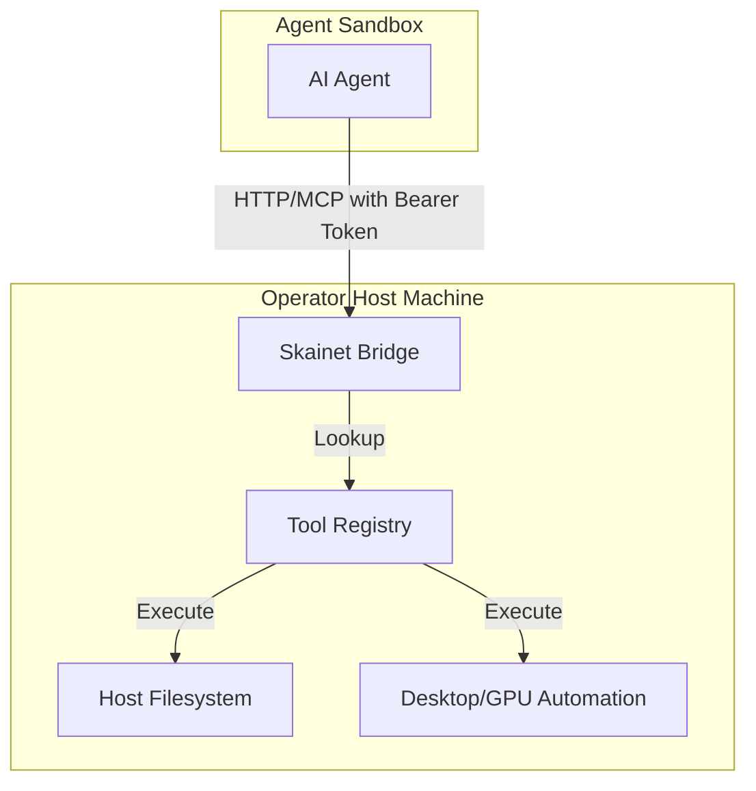
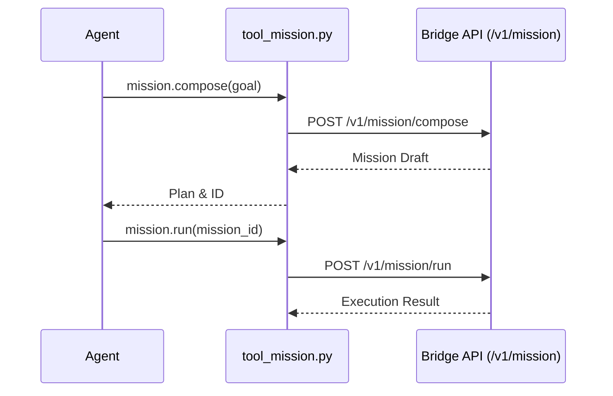

<details>
<summary>Relevant source files</summary>

The following files were used as context for generating this wiki page:

- [arena/mcp/tool_registry.py](arena/mcp/tool_registry.py)
- [arena/mcp/tool_registry_mission.py](arena/mcp/tool_registry_mission.py)
- [arena/mcp/tool_mission.py](arena/mcp/tool_mission.py)
- [arena/mcp_marketplace/registry.py](arena/mcp_marketplace/registry.py)
- [skills/arena-bridge/SKILL.md](skills/arena-bridge/SKILL.md)
- [tests/test_mission_management.py](tests/test_mission_management.py)
</details>

# Model Context Protocol (MCP)

The Model Context Protocol (MCP) provides a standardized interface for AI agents to interact with local tools, file systems, and hardware. Within this project, MCP enables agents to escape restrictive sandboxes by connecting to an authenticated, local-first bridge that resides on the operator's host machine. This architecture allows agents to offload heavy compute tasks, manage large files, and execute complex workflows through a suite of namespaced tools.

Sources: [skills/arena-bridge/SKILL.md:1-24](skills/arena-bridge/SKILL.md#L1-L24), [arena/mcp/tool_registry.py:1-40](arena/mcp/tool_registry.py#L1-L40)

## Architecture and Integration

The MCP implementation functions as an authenticated bridge between the agent sandbox and the host environment. It exposes tools via a registry system and communicates through an HTTP/REST API or direct MCP endpoints.



The diagram shows the flow of requests from the agent sandbox to the host via the bridge, which validates authentication before executing registry-defined tools.
Sources: [skills/arena-bridge/SKILL.md:26-55](skills/arena-bridge/SKILL.md#L26-L55), [arena/mcp/tool_registry.py:42-50](arena/mcp/tool_registry.py#L42-L50)

## Core Tool Registry

The `MCP_TOOLS` registry defines the capabilities available to the agent. These tools are organized into namespaces to handle specific system domains.

### Filesystem (fs) Namespace
These tools allow agents to bypass sandbox storage limits (typically 128MB) by interacting directly with the host filesystem.

| Tool Name | Description | Key Parameters |
| :--- | :--- | :--- |
| `fs.read` | Reads file contents as UTF-8. | `path`, `max_bytes` |
| `fs.write` | Writes content to a file; creates directories. | `path`, `content` |
| `fs.list` | Lists entries in a directory. | `path` |
| `fs.edit` | Performs find-and-replace using unique strings. | `path`, `old_text`, `new_text` |
| `fs.tree` | Displays directory structure. | `path`, `max_depth` |

Sources: [arena/mcp/tool_registry.py:51-105](arena/mcp/tool_registry.py#L51-L105), [skills/arena-bridge/SKILL.md:57-73](skills/arena-bridge/SKILL.md#L57-L73)

### Desktop and System Namespace
Agents use these tools for GUI automation, multi-monitor geometry awareness, and system notifications.

| Tool Name | Description | Purpose |
| :--- | :--- | :--- |
| `desktop.windows` | Lists open windows with filters. | UI Discovery |
| `desktop.focus` | Focuses a window by ID or OCR text. | GUI Interaction |
| `desktop.ocr` | Performs OCR on the desktop. | Visual Sensing |
| `sys.notify` | Sends visual/sound alerts to host. | Operator Feedback |

Sources: [arena/mcp/tool_registry.py:121-166](arena/mcp/tool_registry.py#L121-L166), [arena/mcp/tool_registry.py:202-208](arena/mcp/tool_registry.py#L202-L208)

## Mission Management System

The `mission` namespace handles structured task execution, autopilot runs, and persistent progress tracking. These tools route calls to the local bridge endpoints to manage long-running agentic loops.



The sequence diagram illustrates how MCP mission tools act as wrappers for the Bridge's internal mission orchestration endpoints.
Sources: [arena/mcp/tool_mission.py:65-125](arena/mcp/tool_mission.py#L65-L125), [tests/test_mission_management.py:53-125](tests/test_mission_management.py#L53-L125)

### Mission Tool Capabilities
*  **Autopilot:** Tools like `mission.autopilot_start` execute explicit steps with persisted progress.
*  **Orchestration:** `mission.compose` and `mission.create` handle the lifecycle of agent plans.
*  **Analysis:** `mission.history` and `mission.lineage` allow agents to inspect parent/child relationships and past failures for recovery.

Sources: [arena/mcp/tool_registry_mission.py:1-35](arena/mcp/tool_registry_mission.py#L1-L35), [arena/mcp/tool_mission.py:67-90](arena/mcp/tool_mission.py#L67-L90)

## External and Marketplace Registry

The bridge supports extending its capabilities through the `mcp_marketplace`. The registry defines both official servers and community-contributed tools that can be installed on the host.

| Registry ID | Command / Source | Description |
| :--- | :--- | :--- |
| `fetch` | `uvx mcp-server-fetch` | Server-side HTTP fetch tool. |
| `sqlite` | `uvx mcp-server-sqlite` | Local database query tool. |
| `puppeteer` | `npx @modelcontextprotocol/server-puppeteer` | Browser automation via Chromium. |
| `screenpilot` | `https://github.com/Mtehabsim/ScreenPilot.git%60 | AI screen control (git-venv). |

Sources: [arena/mcp_marketplace/registry.py:12-63](arena/mcp_marketplace/registry.py#L12-L63), [arena/mcp/tool_registry.py:246-260](arena/mcp/tool_registry.py#L246-L260)

## Implementation Example: Bridge Call
The `handle_mission_tool` function processes MCP requests by mapping them to specific bridge HTTP endpoints, ensuring all calls include the required Bearer token for authentication.

```python
def _bridge_call(ctx, path: str, payload: dict[str, Any] | None = None, *, method: str = "POST") -> dict[str, Any]:
    cfg = ctx.app_config() or {}
    port = int(cfg.get("port", 8765) or 8765)
    token = cfg.get("token", "")
    data = None if payload is None else json.dumps(payload).encode("utf-8")
    req = urllib.request.Request(
        f"http://127.0.0.1:{port}{path}", 
        data=data, 
        headers={"Authorization": f"Bearer {token}", "Content-Type": "application/json"}, 
        method=method
    )
    # ... handles response and error parsing ...
```

Sources: [arena/mcp/tool_mission.py:18-45](arena/mcp/tool_mission.py#L18-L45)

The MCP system facilitates a robust "sandbox escape" mechanism, allowing agents to maintain high-performance capabilities and persistent memory despite environment restrictions. Through Namespaced tools and the Mission Management system, the bridge ensures that agents operate within a structured, authenticated, and observable framework on the host machine.
