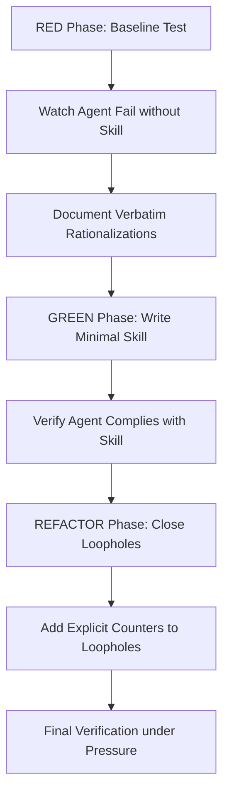
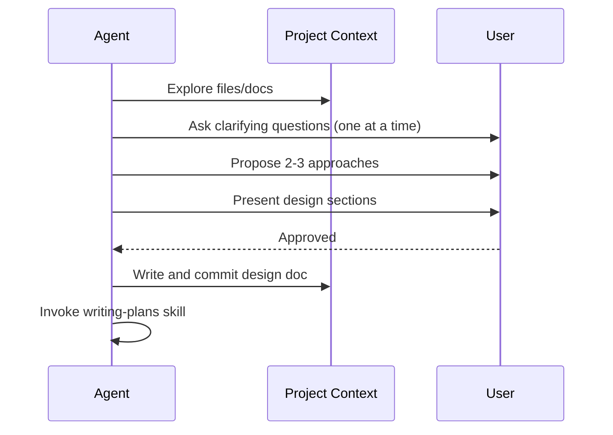

<details>
<summary>Relevant source files</summary>

The following files were used as context for generating this wiki page:

- [skills/superpowers/skills/using-superpowers/SKILL.md](skills/superpowers/skills/using-superpowers/SKILL.md)
- [skills/superpowers/skills/writing-skills/SKILL.md](skills/superpowers/skills/writing-skills/SKILL.md)
- [skills/superpowers/skills/brainstorming/SKILL.md](skills/superpowers/skills/brainstorming/SKILL.md)
- [skills/superpowers/skills/writing-plans/SKILL.md](skills/superpowers/skills/writing-plans/SKILL.md)
- [skills/superpowers/skills/writing-skills/testing-skills-with-subagents.md](skills/superpowers/skills/writing-skills/testing-skills-with-subagents.md)
- [AGENTS.md](AGENTS.md)
- [dashboard/assets/12-skills.js](dashboard/assets/12-skills.js)
</details>

# Skills & Superpowers Catalog

The Skills & Superpowers Catalog defines a standardized library of battle-tested techniques, patterns, and tools used by AI agents within the Arena ecosystem. These skills provide a reference guide for proven engineering disciplines, such as Test-Driven Development (TDD) and systematic debugging, ensuring agents avoid common pitfalls and maintain high software quality across different environments.

Skills function as modular extensions that agents invoke to establish context-specific workflows. By using the `Skill` tool (or platform equivalents like `activate_skill`), agents load documentation and executable tools that override default system behaviors in favor of structured, project-approved processes.

Sources: [skills/superpowers/skills/using-superpowers/SKILL.md:46-55](skills/superpowers/skills/using-superpowers/SKILL.md#L46-L55), [AGENTS.md:37-45](AGENTS.md#L37-L45)

## Skill Architecture and Core Principles

The catalog operates on a strict invocation hierarchy where user instructions in files like `CLAUDE.md` or `AGENTS.md` take highest priority, followed by Superpowers skills, and finally the default system prompt. Skills are categorized as either **Rigid** (e.g., TDD, debugging), which must be followed exactly, or **Flexible** (e.g., design patterns), which allow for context-aware adaptation.

### The Skill Lifecycle

Every skill must be developed using a specialized version of Test-Driven Development (TDD) applied to documentation. This process, termed "RED-GREEN-REFACTOR for Skills," ensures that a skill is only created or modified if it successfully addresses a documented agent failure.



*The flowchart illustrates the mandatory TDD cycle for creating or editing skills.*

Sources: [skills/superpowers/skills/writing-skills/SKILL.md:20-30](skills/superpowers/skills/writing-skills/SKILL.md#L20-L30), [skills/superpowers/skills/using-superpowers/SKILL.md:24-35](skills/superpowers/skills/using-superpowers/SKILL.md#L24-L35), [skills/superpowers/skills/writing-skills/testing-skills-with-subagents.md:14-25](skills/superpowers/skills/writing-skills/testing-skills-with-subagents.md#L14-L25)

### Core Components of a Skill
| Component | Description | Requirement |
| :--- | :--- | :--- |
| **YAML Frontmatter** | Contains `name` and `description` fields. | Mandatory (Max 1024 chars) |
| **Description** | Triggering conditions starting with "Use when...". | No workflow summaries |
| **Overview** | Core principle in 1-2 sentences. | Mandatory |
| **Checklist** | Discrete steps to be tracked via `TodoWrite`. | Recommended |
| **Rationalization Table** | Lists common excuses and their factual rebuttals. | For discipline-enforcing skills |

Sources: [skills/superpowers/skills/writing-skills/SKILL.md:104-125](skills/superpowers/skills/writing-skills/SKILL.md#L104-L125), [skills/superpowers/skills/writing-skills/SKILL.md:328-335](skills/superpowers/skills/writing-skills/SKILL.md#L328-L335)

## Catalog of Fundamental Skills

### Brainstorming and Design
The `brainstorming` skill enforces a mandatory design phase before any implementation occurs. It uses a "Hard Gate" to prevent code writing until a design document is approved by the user and committed to `docs/superpowers/specs/`.



*This sequence shows the mandatory transition from design validation to plan creation.*

Sources: [skills/superpowers/skills/brainstorming/SKILL.md:13-35](skills/superpowers/skills/brainstorming/SKILL.md#L13-L35)

### Implementation Planning
The `writing-plans` skill decomposes approved designs into bite-sized, executable tasks. Each task must follow the TDD pattern (failing test -> implementation -> pass -> commit) and avoid all placeholders like "TBD" or "TODO".

- **Granularity:** Each step should represent 2-5 minutes of work.
- **Handoff:** The agent must offer the user a choice between "Subagent-Driven" or "Inline" execution.
- **Storage:** Plans are saved to `docs/superpowers/plans/YYYY-MM-DD-<feature-name>.md`.

Sources: [skills/superpowers/skills/writing-plans/SKILL.md:34-45](skills/superpowers/skills/writing-plans/SKILL.md#L34-L45), [skills/superpowers/skills/writing-plans/SKILL.md:105-115](skills/superpowers/skills/writing-plans/SKILL.md#L105-L115)

## Skill Discovery and Management

### Agent Discovery Workflow
Agents decide which skills to load based on the `description` field in the skill's YAML frontmatter. To optimize discovery, descriptions must focus on **triggering conditions** and symptoms rather than the skill's internal workflow.

```yaml
name: writing-skills
description: Use when creating new skills, editing existing skills, or verifying skills work before deployment
```

Sources: [skills/superpowers/skills/writing-skills/SKILL.md:5-15](skills/superpowers/skills/writing-skills/SKILL.md#L5-L15), [skills/superpowers/skills/writing-skills/SKILL.md:139-150](skills/superpowers/skills/writing-skills/SKILL.md#L139-L150)

### Technical Management Interface
The `arena-agent` dashboard provides a GUI and API for managing the skills catalog.

| API Endpoint | Method | Purpose |
| :--- | :--- | :--- |
| `/v1/skills` | GET | Lists all available skills (Core and Plugin). |
| `/v1/skills/install` | POST | Installs a third-party skill via Git or ZIP URL. |
| `/v1/skills/uninstall` | POST | Removes a third-party skill from the registry. |
| `/v1/skills/run` | POST | Executes a specific skill with provided arguments. |

Sources: [dashboard/assets/12-skills.js:4-65](dashboard/assets/12-skills.js#L4-L65)

## Systematic Debugging and Verification
The catalog includes rigid frameworks for investigation and verification to resist time pressure.

- **Systematic Debugging:** Mandates finding the root cause before implementing any fix. It forbids "shotgun debugging" or symptom-only fixes.
- **Verification before Completion:** Requires agents to sabotaging their own fixes (Bilateral Sabotage) to ensure tests fail when the fix is removed.
- **Code Review:** Utilizes templates to review work against original plans, categorizing issues by severity (Critical, Important, Minor).

Sources: [skills/superpowers/skills/systematic-debugging/CREATION-LOG.md:15-30](skills/superpowers/skills/systematic-debugging/CREATION-LOG.md#L15-L30), [AGENTS.md:40-45](AGENTS.md#L40-L45), [skills/superpowers/skills/requesting-code-review/code-reviewer.md:20-60](skills/superpowers/skills/requesting-code-review/code-reviewer.md#L20-L60)

## Summary
The Skills & Superpowers Catalog serves as the operational backbone for Arena agents, transforming abstract capabilities into disciplined, repeatable engineering processes. By enforcing TDD for documentation and mandatory design-before-code gates, the system ensures that autonomous agents produce high-quality, testable, and maintainable software while operating across local and sandboxed environments.
