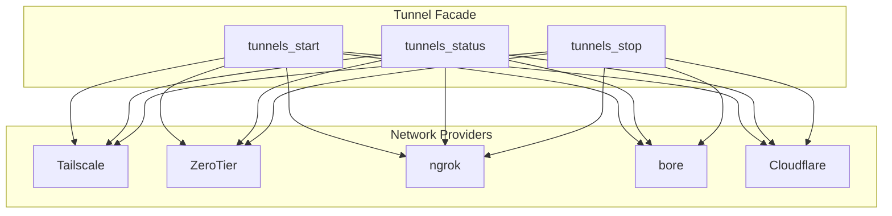
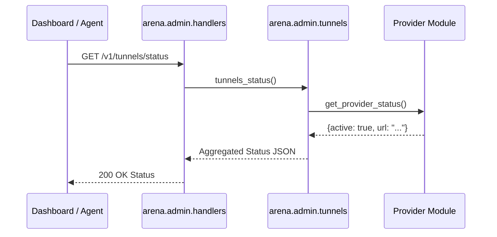

Relevant source files

The following files were used as context for generating this wiki page:

- [arena/admin/tunnels.py](arena/admin/tunnels.py)
- [arena/admin/tailscale.py](arena/admin/tailscale.py)
- [arena/admin/zerotier.py](arena/admin/zerotier.py)
- [arena/admin/ngrok.py](arena/admin/ngrok.py)
- [arena/admin/bore.py](arena/admin/bore.py)
- [arena/admin/handlers.py](arena/admin/handlers.py)
- [dashboard/assets/04-overview.js](dashboard/assets/04-overview.js)

# Network Tunnels

Network Tunnels enable AI agents in sandboxed environments to connect directly to an operator's host machine, local tools, and hardware. The system provides an authenticated, local-first bridge that bypasses standard sandbox restrictions like storage caps and lack of GPU access.

The project implements a unified multi-provider facade that manages various transport mechanisms, including Tailscale Funnel, ZeroTier, ngrok, bore, and Cloudflare. This facade coordinates starting, stopping, and status reporting across all providers to ensure at least one reachable external URL is available for the agent.

Sources: [skills/arena-bridge/SKILL.md](skills/arena-bridge/SKILL.md), [AGENTS.md](AGENTS.md), [arena/admin/tunnels.py](arena/admin/tunnels.py)

## Unified Tunnel Architecture

The system uses a provider-agnostic facade to manage network connectivity. The core logic resides in `arena/admin/tunnels.py`, which provides high-level functions like `tunnels_status`, `tunnels_active`, `tunnels_start`, and `tunnels_stop`.

### Provider Management Flow

The following diagram illustrates how the Tunnel Facade interacts with individual providers to establish connectivity:

The Tunnel Facade coordinates multiple network providers to provide reliable external access to the local bridge.
Sources: [arena/admin/tunnels.py:1-40](arena/admin/tunnels.py#L1-L40), [AGENTS.md](AGENTS.md)

### Connectivity Transports
The bridge supports several connection transports to ensure reachability across different network environments:

| Transport | Description | Implementation File |
| :--- | :--- | :--- |
| **Tailscale Funnel** | Uses Tailscale nodes to create a public URL (`https://<node-name>.ts.net`). | `arena/admin/tailscale.py` |
| **ZeroTier** | Creates a virtual managed network for peer-to-peer connectivity. | `arena/admin/zerotier.py` |
| **ngrok** | Provides public URLs (`https://<id>.ngrok-free.dev`) via secure tunnels. | `arena/admin/ngrok.py` |
| **bore** | A modern CLI tool for exposing local ports to the internet. | `arena/admin/bore.py` |
| **Cloudflare** | Uses Cloudflare Quick Tunnels for external access. | `arena/admin/cloudflared.py` |

Sources: [skills/arena-bridge/SKILL.md](skills/arena-bridge/SKILL.md), [arena/admin/tunnels.py](arena/admin/tunnels.py), [AGENTS.md](AGENTS.md)

## Provider Implementation Details

Each provider module follows a consistent pattern, implementing platform detection and graceful degradation if the provider's binary is absent on the host.

### Tailscale Funnel
The Tailscale module manages public funnels. It checks for the `tailscale` binary and uses sub-processes to query status or toggle the funnel. The implementation includes logic to parse the public URL from the Tailscale CLI output.
Sources: [arena/admin/tailscale.py](arena/admin/tailscale.py)

### ZeroTier
The ZeroTier module handles node status and network joins. It attempts to communicate via the ZeroTier local HTTP API first and falls back to CLI commands if the service is unreachable. It reports the ZeroTier `node_id` and connection state.
Sources: [arena/admin/zerotier.py](arena/admin/zerotier.py)

### ngrok and bore
These modules manage short-lived or persistent tunnels by executing the respective CLI tools. They provide the facade with reachable public URLs and handle process lifecycle management.
Sources: [arena/admin/ngrok.py](arena/admin/ngrok.py), [arena/admin/bore.py](arena/admin/bore.py)

## API and Handlers

The system exposes network tunnel management through an authenticated HTTP/REST API. Handlers in `arena/admin/handlers.py` route requests to the unified tunnel facade.

### Network Status Sequence

The dashboard and agents use the `/v1/tunnels/status` endpoint to determine which providers are active.

This sequence shows how a status request is aggregated from multiple providers into a single response.
Sources: [arena/admin/handlers.py](arena/admin/handlers.py), [dashboard/assets/04-overview.js:52-110](dashboard/assets/04-overview.js#L52-L110)

### Key API Endpoints

| Endpoint | Method | Description |
| :--- | :--- | :--- |
| `/v1/tunnels/status` | GET | Returns the status of all providers and the primary active URL. |
| `/v1/tunnels/start` | POST | Initiates the startup sequence for all configured tunnel providers. |
| `/v1/tunnels/stop` | POST | Stops all active tunnel processes and funnels. |
| `/v1/sys/svc` | GET | Returns service-level status including Tailscale, Cloudflared, and ZeroTier connectivity. |

Sources: [arena/admin/handlers.py](arena/admin/handlers.py), [dashboard/assets/04-overview.js:52-110](dashboard/assets/04-overview.js#L52-L110), [arena/admin/tunnels.py](arena/admin/tunnels.py)

## Dashboard Integration

The Overview and Transports tabs in the dashboard provide visual indicators for network health. The dashboard logic in `04-overview.js` polls the `/v1/tunnels/status` endpoint and updates the UI with:
- The active provider name (e.g., "tailscale").
- A list of all reachable URLs with "Copy" buttons.
- Connectivity badges (OK, FAIL, DOWN, or Not Installed).
- Circuit breaker indicators for network stability.

Sources: [dashboard/assets/04-overview.js:52-110](dashboard/assets/04-overview.js#L52-L110), [dashboard/assets/body-15-settings.html](dashboard/assets/body-15-settings.html)

## Implementation Constraints

When modifying network tunnel logic, you must adhere to the following architectural rules:
- **Platform Neutrality:** Modules must use `platform.system()` to handle Windows and POSIX differences.
- **Privilege Limits:** Implementations must never invoke `sudo` directly.
- **Modularity:** Tunnel logic must remain within `arena/admin/` and not be imported by thin entrypoints like `unified_bridge.py`.
- **Auth:** All tunnel management endpoints require the master token in the `Authorization: Bearer <TOKEN>` header.

Sources: [AGENTS.md](AGENTS.md), [skills/arena-bridge/SKILL.md](skills/arena-bridge/SKILL.md)

Network Tunnels serve as the primary bridge between restricted AI sandboxes and the operator machine. By abstracting multiple providers behind a unified facade, the system ensures persistent, authenticated access to host resources regardless of specific provider availability.
