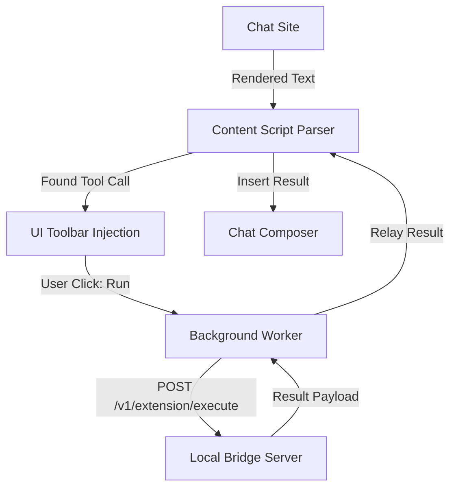

<details>
<summary>Relevant source files</summary>

The following files were used as context for generating this wiki page:

- [chat_extension/README.md](chat_extension/README.md)
- [chat_extension/manifest.json](chat_extension/manifest.json)
- [chat_extension/sidepanel.html](chat_extension/sidepanel.html)
- [chat_extension/popup.html](chat_extension/popup.html)
- [CONTRIBUTING.md](CONTRIBUTING.md)
- [RELEASE.md](RELEASE.md)
</details>

# Chat Bridge Extension

The Chat Bridge Extension is a browser-based component of the Arena Unified Bridge system. It enables AI agents to interact with the local machine by detecting tool calls within chat interfaces (such as ChatGPT, Claude, and Gemini) and relaying them to a local bridge server for execution. The extension provides a user interface for manual approval, execution monitoring, and result insertion back into the chat composer.

The extension operates as a Manifest V3 (MV3) browser extension, utilizing content scripts to scan chat pages and a background service worker to manage bridge connectivity and state relay. It integrates with the local bridge API at `http://127.0.0.1:8765` to execute operations like filesystem access, shell commands, and desktop automation.
Sources: [chat_extension/README.md:1-8](chat_extension/README.md#L1-L8), [chat_extension/README.md:71-88](chat_extension/README.md#L71-L88), [CONTRIBUTING.md:4-9](CONTRIBUTING.md#L4-L9)

## Extension Architecture

The extension follows a modular architecture composed of content scripts, a background service worker, and UI components (popup and side panel).

### Component Overview

| Component | Responsibility |
| :--- | :--- |
| **Manifest (MV3)** | Defines permissions, content script injection rules, and extension metadata. |
| **Background Worker** | Manages bridge health checks, state relay, tab resolution, and authentication tokens. |
| **Content Scripts** | Handles page scanning, tool call parsing, UI toolbar injection, and result insertion. |
| **UI Interfaces** | Provides a Side Panel and Popup for configuration, status monitoring, and tool management. |

Sources: [chat_extension/README.md:71-88](chat_extension/README.md#L71-L88), [chat_extension/manifest.json:1-10](chat_extension/manifest.json#L1-L10)

### Extension Data Flow

The following diagram illustrates the flow of a tool call from discovery in a chat interface to execution on the local host via the Bridge.



The content script parser identifies tool calls in various formats (fenced, bare-envelope, JSONL) and mounts interactive controls.
Sources: [chat_extension/README.md:7-14](chat_extension/README.md#L7-L14), [chat_extension/README.md:87-88](chat_extension/README.md#L87-L88)

## Core Components and Logic

### Tool Call Parsing and Detection
The parser identifies tool calls using a unified grammar. It accepts the canonical `{"bridge":"arena","calls":[...]}` envelope, as well as single-call and MCP JSONL formats. It includes false-positive guards to distinguish between actual tool calls and documentation or instruction examples.
Sources: [chat_extension/README.md:7-14](chat_extension/README.md#L7-L14)

### Background Service Worker (`background.js`)
The service worker acts as the central hub for the extension's non-UI logic:
*  **Health Checks:** Monitors the local bridge at `http://127.0.0.1:8765/health`.
*  **Token Management:** Persists the bridge authentication token as a device-local secret in `chrome.storage.local`.
*  **Execution Relay:** Routes tool execution requests to the `/v1/extension/execute` endpoint.
*  **Auto-Injection:** Handles the injection of content scripts into newly opened or refreshed chat tabs.

Sources: [chat_extension/README.md:81-86](chat_extension/README.md#L81-L86), [chat_extension/README.md:92-94](chat_extension/README.md#L92-L94)

### Content Script Layers
Content scripts are executed in a specific order to ensure proper initialization:
1.  `adapter_sites.js`: Site-specific configurations.
2.  `parser.js`: Tool call identification logic.
3.  `adapters.js`: Integration logic for different chat platforms.
4.  `insert_strategies.js`: Logic for placing tool results into chat inputs.
5.  `shadow_toolbar.js`: Renders the floating UI controls over detected tool blocks.

Sources: [chat_extension/README.md:75-80](chat_extension/README.md#L75-L80), [CONTRIBUTING.md:120-123](CONTRIBUTING.md#L120-L123)

## User Interface and Configuration

### Side Panel UI
The side panel provides five primary tabs for detailed management:
*  **Status:** Displays connectivity to the bridge and allows manual page scanning.
*  **Tools:** Shows the catalog of available tools (safe, medium, dangerous).
*  **Instructions:** Provides system prompt templates for AI agents.
*  **History:** Lists recent tool detections and execution results.
*  **Settings:** Configures Bridge URL, tokens, and automation modes.

Sources: [chat_extension/sidepanel.html:16-22](chat_extension/sidepanel.html#L16-L22), [chat_extension/sidepanel.html:43-58](chat_extension/sidepanel.html#L43-L58)

### Execution Modes and Strategies
Users can configure how the extension reacts to detected tool calls through the Settings tab or Popup UI.

| Mode | Description |
| :--- | :--- |
| **Auto-Preview** | Automatically shows the preview of detected blocks. |
| **Auto-Execute Safe** | Executes `safe`-risk calls without requiring a manual "Run" click. |
| **Auto-Insert** | Automatically places the tool result back into the chat composer. |
| **Auto-Submit** | Automatically clicks "Send" after inserting the result. |

Sources: [chat_extension/sidepanel.html:101-105](chat_extension/sidepanel.html#L101-L105), [chat_extension/popup.html:20-24](chat_extension/popup.html#L20-L24)

## Development and Deployment

### Testing Procedures
Development involves targeted checks for insertion behavior across multiple platforms (ChatGPT, Claude, Gemini, Google AI Studio).

```bash
# Targeted syntax and flow tests
pytest -q tests/test_chat_extension_assets.py tests/test_chat_extension_adapter_flow.py
# Node.js syntax smoke tests for extension files
for f in background content parser adapters insert_strategies insert_history adapter_sites popup settings sidepanel; do
  node --check "chat_extension/$f.js"
done
```

Sources: [CONTRIBUTING.md:120-128](CONTRIBUTING.md#L120-L128), [CONTRIBUTING.md:143-146](CONTRIBUTING.md#L143-L146)

### Versioning
The extension maintains its own versioning independent of the bridge server. The version is defined in `chat_extension/manifest.json`. When content scripts change, developers must also update `ARENA_CONTENT_SCRIPT_VERSION` in `content.js` and the return value of `arenaInsertScriptVersion()` in `insert_strategies.js`.
Sources: [CONTRIBUTING.md:167-176](CONTRIBUTING.md#L167-L176), [RELEASE.md:204-215](RELEASE.md#L204-L215)

### Release Packaging
The extension is bundled within the main project release. The `scripts/make_release_zip.py` utility includes the `chat_extension/` directory while excluding runtime state such as logs or local credentials.
Sources: [RELEASE.md:142-154](RELEASE.md#L142-L154), [RELEASE.md:166-173](RELEASE.md#L166-L173)

The Chat Bridge Extension serves as the primary visual interface and automated detection layer for Arena Unified Bridge, enabling seamless tool execution within standard web-based AI chat environments.
Sources: [chat_extension/README.md:1-5](chat_extension/README.md#L1-L5), [CONTRIBUTING.md:4-9](CONTRIBUTING.md#L4-L9)
