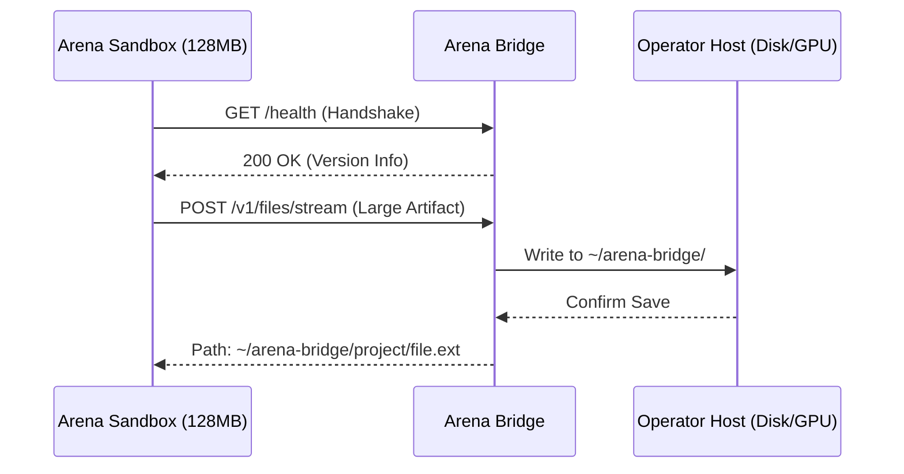
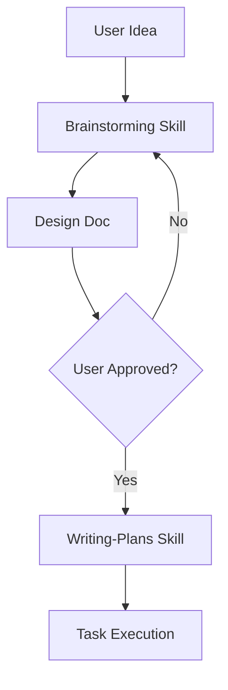

<details>
<summary>Relevant source files</summary>

The following files were used as context for generating this wiki page:

- [skills/arena-bridge/SKILL.md](skills/arena-bridge/SKILL.md)
- [skills/superpowers/skills/brainstorming/SKILL.md](skills/superpowers/skills/brainstorming/SKILL.md)
- [skills/superpowers/skills/writing-plans/SKILL.md](skills/superpowers/skills/writing-plans/SKILL.md)
- [skills/superpowers/skills/systematic-debugging/SKILL.md](skills/superpowers/skills/systematic-debugging/SKILL.md)
- [CONTRIBUTING.md](CONTRIBUTING.md)
- [dashboard/assets/12-skills.js](dashboard/assets/12-skills.js)

</details>

# The Book of Eternity Integration

The Book of Eternity Integration refers to the implementation and management of "Skills" within the Arena Unified Bridge ecosystem. These skills function as a persistent repository of battle-tested techniques, patterns, and protocols that AI agents use to bypass environment restrictions and maintain development discipline. The system connects sandboxed agents to host-level tools and hardware while enforcing strict architectural standards like Test-Driven Development (TDD) and systematic debugging.

This integration manages the lifecycle of skills from discovery and installation to execution and session recall. It facilitates "sandbox escape" by offloading heavy compute and large storage requirements to the host machine via the Arena Bridge protocol. Agents utilize these skills to ensure deterministic outcomes in complex tasks, such as game production or system-level debugging, across different session boundaries.

Sources: [skills/arena-bridge/SKILL.md:1-15](skills/arena-bridge/SKILL.md#L1-L15), [skills/superpowers/skills/writing-skills/SKILL.md:14-25](skills/superpowers/skills/writing-skills/SKILL.md#L14-L25), [dashboard/assets/12-skills.js:1-10](dashboard/assets/12-skills.js#L1-L10)

## Skill Architecture and Management

Skills in the Arena ecosystem are categorized into Core skills (built-in) and Plugins (third-party). They are managed via a REST API that handles installation, uninstallation, and execution. Each skill consists of a reference guide (SKILL.md) and optional supporting scripts or tools.

### Skill Lifecycle Management
The dashboard interface interacts with the `/v1/skills` API endpoints to display and control skill states.

```mermaid
flowchart TD
    UI[Dashboard UI] --> API_GET[/v1/skills]
    UI --> API_INS[/v1/skills/install]
    UI --> API_UN[/v1/skills/uninstall]
    UI --> API_RUN[/v1/skills/run]
    
    API_GET --> DB[(Skill Registry)]
    API_INS --> DB
    API_UN --> DB
    API_RUN --> EXEC[Skill Execution Engine]
```

The diagram above shows the interaction between the management dashboard and the backend skill API.
Sources: [dashboard/assets/12-skills.js:2-101](dashboard/assets/12-skills.js#L2-L101), [skills/superpowers/skills/writing-skills/SKILL.md:88-92](skills/superpowers/skills/writing-skills/SKILL.md#L88-L92)

### API Endpoint Reference
| Endpoint | Method | Description |
| :--- | :--- | :--- |
| `/v1/skills` | GET | Returns a list of all available Core and Plugin skills. |
| `/v1/skills/install` | POST | Installs a new third-party skill using a name and source URL. |
| `/v1/skills/uninstall` | POST | Removes an installed third-party skill from the registry. |
| `/v1/skills/run` | POST | Executes a specific skill with provided arguments. |

Sources: [dashboard/assets/12-skills.js:4-88](dashboard/assets/12-skills.js#L4-L88)

## Arena Bridge Connectivity

The integration relies on the **Skainet Bridge** to connect sandboxed agents to the host machine. This connection bypasses the 128 MB snapshot cap imposed by environments like Arena.ai Agent Mode.

### Connection Transports and Auth
Agents connect to the bridge using various transports, secured by a master token requirement in the Authorization header.

*  **Localhost:** `http://127.0.0.1:8765`
*  **Tailscale Funnel:** `https://<node-name>.ts.net`
*  **Public Tunnels:** Support for ngrok, Cloudflare Quick Tunnels, and bore.

Every request must include `Authorization: Bearer <TOKEN>`. The token is typically stored in a `token.txt` file on the host.
Sources: [skills/arena-bridge/SKILL.md:17-31](skills/arena-bridge/SKILL.md#L17-L31), [CONTRIBUTING.md:13-18](CONTRIBUTING.md#L13-L18)

### Sandbox Escape Protocol
When a sandbox limit is reached, the bridge facilitates storage and compute offloading.



The sequence diagram illustrates how an agent streams large files to the host machine to avoid sandbox storage exhaustion.
Sources: [skills/arena-bridge/SKILL.md:43-57](skills/arena-bridge/SKILL.md#L43-L57)

## Development Workflow Skills

The integration mandates specific technical disciplines through rigid skills that agents must follow during implementation and debugging.

### Systematic Debugging Process
The `systematic-debugging` skill enforces a four-phase approach to resolve issues, prioritizing root-cause identification over symptom fixing.

1.  **Investigation:** Read error messages, reproduce the issue, and trace data flow.
2.  **Pattern Analysis:** Compare broken code against working examples and references.
3.  **Hypothesis:** Form a single specific theory and perform minimal testing.
4.  **Implementation:** Create a failing test case before implementing the single fix.

If three or more fixes fail, the agent must stop and question the fundamental architecture rather than attempting further patches.
Sources: [skills/superpowers/skills/systematic-debugging/SKILL.md:20-135](skills/superpowers/skills/systematic-debugging/SKILL.md#L20-L135)

### Brainstorming and Planning
Before implementation, agents must use the `brainstorming` and `writing-plans` skills.

*  **Brainstorming:** Explores intent and requirements through a collaborative dialogue before any code is written. It results in a design doc stored in `docs/superpowers/specs/`.
*  **Planning:** Decomposes the approved design into bite-sized tasks. Each task includes specific file paths, code snippets for TDD, and commit commands.



The flowchart depicts the mandatory pre-implementation workflow required by the integration.
Sources: [skills/superpowers/skills/brainstorming/SKILL.md:15-70](skills/superpowers/skills/brainstorming/SKILL.md#L15-L70), [skills/superpowers/skills/writing-plans/SKILL.md:10-45](skills/superpowers/skills/writing-plans/SKILL.md#L10-L45)

## Persistent Memory and Session Recall

The integration utilizes **Serena Session Memory** and **MCP (Model Context Protocol)** to maintain context across session boundaries. This allows agents to recall architectural decisions, task boards, and lessons learned in previous turns.

*  **Task Board:** Agents track work from `T0` to `Tn` in `docs/TASK_BOARD.md`.
*  **Session Recall:** Tools like `agentctl_memory.py` or Serena MCP persist context.
*  **Mission Loop:** The dashboard provides a "Mission Loop Studio" to manage lineage, families, and schedules of agentic tasks.

Sources: [skills/arena-bridge/SKILL.md:86-97](skills/arena-bridge/SKILL.md#L86-L97), [dashboard/assets/body-01b-workspace.html:45-78](dashboard/assets/body-01b-workspace.html#L45-L78)

The Book of Eternity Integration serves as the operational backbone for AI agents, ensuring they operate with host-level capabilities while adhering to strict, test-driven software engineering standards. By bridging the gap between restricted environments and real hardware through a library of enforced skills, the system maintains high-quality code output and persistent project context.
