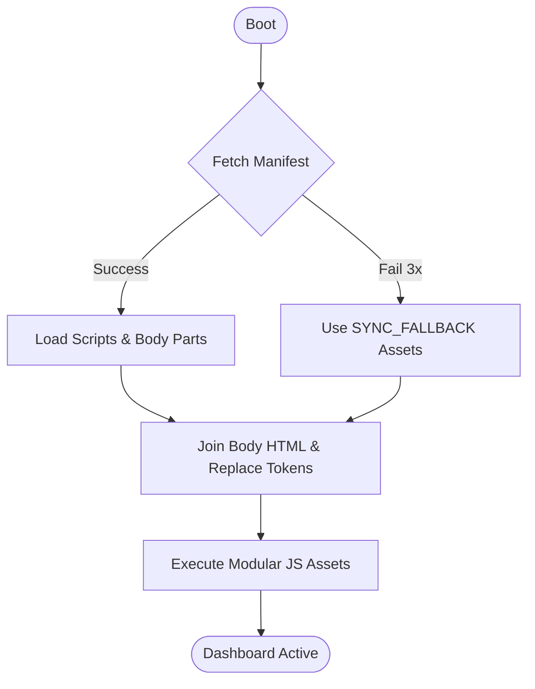
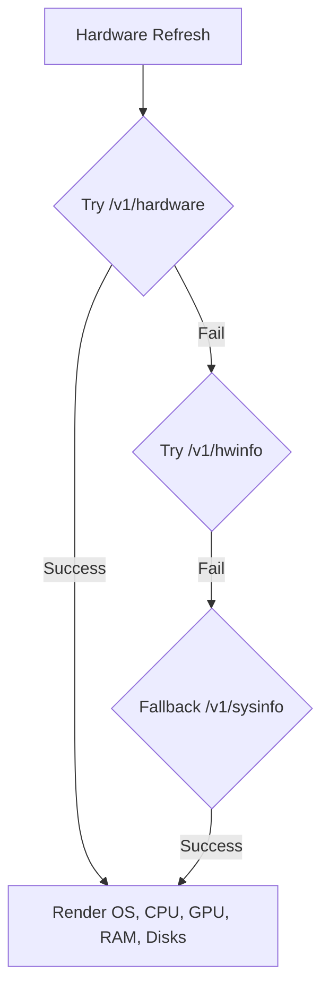
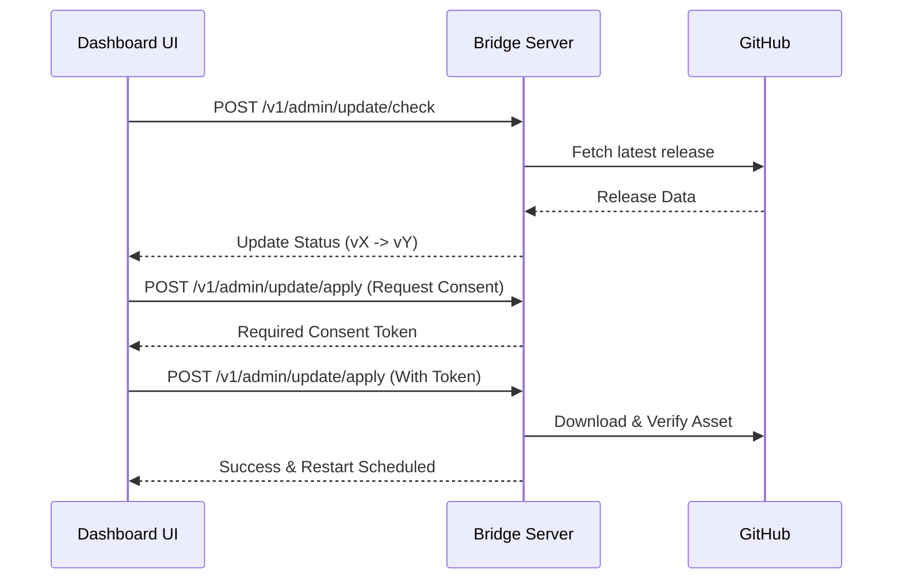

Relevant source files

The following files were used as context for generating this wiki page:

- [dashboard/index.html](dashboard/index.html)
- [dashboard/assets/04-overview.js](dashboard/assets/04-overview.js)
- [dashboard/assets/body-01b-workspace.html](dashboard/assets/body-01b-workspace.html)
- [dashboard/assets/39-admin-update.js](dashboard/assets/39-admin-update.js)
- [dashboard/assets/03-helpers.js](dashboard/assets/03-helpers.js)
- [arena/gui/dashboard_v2_js.py](arena/gui/dashboard_v2_js.py)
- [arena/gui/dashboard_v2_css.py](arena/gui/dashboard_v2_css.py)
- [dashboard/assets/21b-hwinfo-overview-extensions.js](dashboard/assets/21b-hwinfo-overview-extensions.js)

# Web Dashboard

The Web Dashboard serves as the central management and monitoring interface for the Arena Unified Bridge. It provides real-time visibility into agent activities, system health, and hardware metrics, while allowing operators to manage implementation plans, missions, and administrative updates. Sources: [dashboard/index.html](dashboard/index.html), [dashboard/assets/04-overview.js](dashboard/assets/04-overview.js)

## Architecture and Boot Process

The dashboard uses a modular, manifest-driven architecture. Upon initialization, the system attempts to fetch an asset manifest to determine which scripts and HTML body parts to load. If the manifest is unreachable, the dashboard initiates a "last-resort" fallback mode to render a minimal functional shell. Sources: [dashboard/index.html:19-58](dashboard/index.html#L19-L58)

The boot process includes a 3-retry mechanism with exponential backoff (250ms/500ms) to handle transient connection failures during asset retrieval. Sources: [dashboard/index.html:36-54](dashboard/index.html#L36-L54)

### Core Components
| Component | Function |
| :--- | :--- |
| **Shell Root** | The `arena-dashboard-root` div where the dynamic UI is injected. |
| **Manifest** | A JSON file at `/gui/assets/manifest.json` listing all required modules. |
| **Asset Registry** | Manages modular scripts (`00-core.js`, etc.) and body parts (`body-00-shell.html`). |
| **Token System** | Replaces placeholders like `{{TOKEN}}` and `{{VERSION}}` globally at runtime. |

Sources: [dashboard/index.html:15-100](dashboard/index.html#L15-L100)

## Monitoring and System Status

The Dashboard continuously polls multiple backend endpoints to visualize the state of the bridge and the underlying host.

### Overview Metrics
The `refreshOverview` function aggregates data from several internal APIs to update the UI status indicators. Sources: [dashboard/assets/04-overview.js:2-10](dashboard/assets/04-overview.js#L2-L10)

*  **Connectivity**: A "ping dot" indicates the connection state (Connected, Offline, or Reconnecting).
*  **System Resource Usage**: Visualizes CPU threads, RAM availability, and disk space using progress bars.
*  **Active Workload**: Displays the count of running missions, memory items, and active tasks.
*  **Tunnels/Network**: Reports active provider status for Tailscale, Cloudflared, or ZeroTier.

Sources: [dashboard/assets/04-overview.js:12-90](dashboard/assets/04-overview.js#L12-L90), [arena/gui/dashboard_v2_js.py:53-75](arena/gui/dashboard_v2_js.py#L53-L75)

### Hardware Information Extension
The hardware info module probes specific hardware endpoints to provide granular details about the host machine. Sources: [dashboard/assets/21b-hwinfo-overview-extensions.js:1-18](dashboard/assets/21b-hwinfo-overview-extensions.js#L1-L18)

Sources: [dashboard/assets/21b-hwinfo-overview-extensions.js:10-38](dashboard/assets/21b-hwinfo-overview-extensions.js#L10-L38)

## Workspace and Agentic Loop Studio

The Workspace tab provides a "Companion Surface" for interacting with agent logic and planning. Sources: [dashboard/assets/body-01b-workspace.html:23](dashboard/assets/body-01b-workspace.html#L23)

### Planning and Reaction
*  **Planner**: Allows users to input goals, context, and constraints to generate implementation plans.
*  **Agentic Loop**: Facilitates the "React" and "Reflect" cycle, allowing manual overrides for browser URLs and iteration limits.
*  **Mission Loop Studio**: Provides tools to manage mission lineages, families, and schedules. It includes controls for iterating or following up on specific mission IDs.

Sources: [dashboard/assets/body-01b-workspace.html:34-80](dashboard/assets/body-01b-workspace.html#L34-L80)

### Memory and Lessons
The dashboard allows persistence of "Important Lessons" that future agents should remember, as well as profile-specific notes for the active memory profile. Sources: [dashboard/assets/body-01b-workspace.html:95-108](dashboard/assets/body-01b-workspace.html#L95-L108)

## Administrative Operations

The administrative interface handles bridge updates and service management through a dedicated set of endpoints. Sources: [dashboard/assets/39-admin-update.js:1-12](dashboard/assets/39-admin-update.js#L1-L12)

### Auto-Update Workflow
The update system uses a two-stage consent pattern for safety. Sources: [dashboard/assets/39-admin-update.js:130-150](dashboard/assets/39-admin-update.js#L130-L150)

1.  **Check**: The dashboard queries GitHub for the latest release.
2.  **Consent**: The user requests a consent token from the server.
3.  **Apply**: The user echoes the token back to trigger the download, SHA-256 verification, and atomic source swap.

Sources: [dashboard/assets/39-admin-update.js:155-200](dashboard/assets/39-admin-update.js#L155-L200)

Sources: [dashboard/assets/39-admin-update.js:125-230](dashboard/assets/39-admin-update.js#L125-L230)

### Security and Escaping
To prevent XSS (Cross-Site Scripting) from server-returned error messages, the dashboard uses a unified escaping helper. All error strings concatenated into `innerHTML` are passed through the `esc()` function, which sanitizes characters including `&`, `<`, `>`, `"`, and `'`. Sources: [dashboard/assets/03-helpers.js:13-21](dashboard/assets/03-helpers.js#L13-L21), [tests/test_error_meta_escaping_v4_169_33.py:10-25](tests/test_error_meta_escaping_v4_169_33.py#L10-L25)

## UI Components and Styling
The dashboard uses a dark-themed CSS architecture defined in `dashboard_v2_css.py`, featuring a grid-based layout for "cards" and "stats". Sources: [arena/gui/dashboard_v2_css.py:1-35](arena/gui/dashboard_v2_css.py#L1-L35)

*  **Responsive Design**: Utilizes `grid-template-columns: repeat(auto-fit, minmax(300px, 1fr))` for cross-device compatibility.
*  **Status Indicators**: Uses semantic color variables (`--green`, `--red`, `--yellow`, `--accent`) for bars and values.
*  **Markdown Support**: A client-side `renderMarkdown` function provides a minimal subset of Markdown for rendering mission descriptions and update logs.

Sources: [arena/gui/dashboard_v2_css.py:20-30](arena/gui/dashboard_v2_css.py#L20-L30), [dashboard/assets/03-helpers.js:68-100](dashboard/assets/03-helpers.js#L68-L100)

The Web Dashboard integrates monitoring, agent orchestration, and administrative control into a unified browser-based interface, ensuring the Arena Unified Bridge remains operational and observable. Sources: [dashboard/index.html](dashboard/index.html), [dashboard/assets/04-overview.js](dashboard/assets/04-overview.js)
