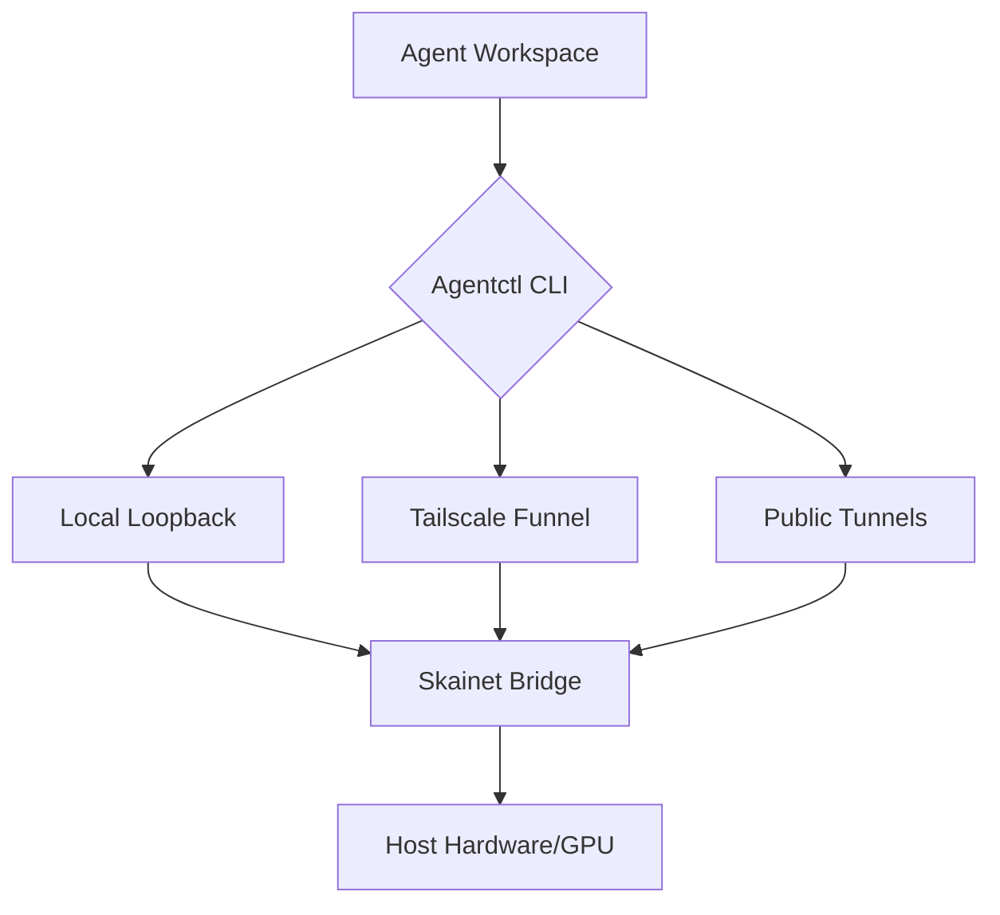
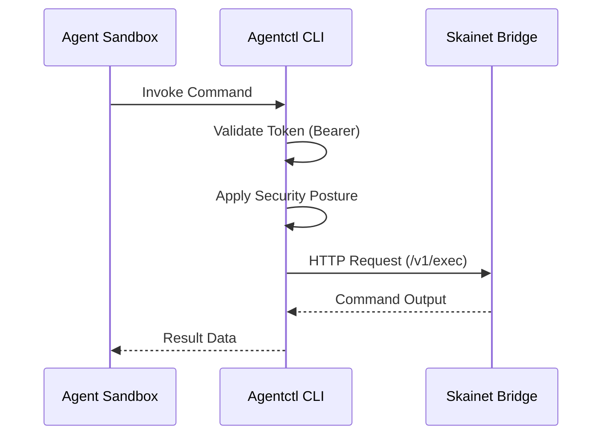

Relevant source files

The following files were used as context for generating this wiki page:

- [arena/agentctl_cli/agentctl_main.py](arena/agentctl_cli/agentctl_main.py)
- [arena/agentctl_cli/agentctl_common.py](arena/agentctl_cli/agentctl_common.py)
- [AGENTS.md](AGENTS.md)
- [CONTRIBUTING.md](CONTRIBUTING.md)
- [skills/arena-bridge/SKILL.md](skills/arena-bridge/SKILL.md)

# Agentctl CLI

Agentctl CLI provides a command-line interface for managing and interacting with the Skainet Bridge. It manages communication between AI agents and the operator's host machine, handling tasks such as session recall, diagnostics, and secure connectivity.

## Overview

Agentctl CLI operates as a modular package within the `arena/` directory. It facilitates "sandbox escapes" by allowing agents in restricted environments (like Arena.ai Agent Mode) to offload heavy compute tasks and access persistent storage on the host. The CLI enforces security via strict TLS verification and certificate pinning.

Sources: [AGENTS.md:5-20](AGENTS.md#L5-L20), [skills/arena-bridge/SKILL.md:1-20](skills/arena-bridge/SKILL.md#L1-L20), [CONTRIBUTING.md:150-160](CONTRIBUTING.md#L150-L160)

## Security and Connectivity

The CLI implements strict security protocols for all remote communications. It utilizes a centralized SSL context builder to ensure consistent verification across all call sites.

### TLS and Pinning
Every new call site must route through the project's internal security modules. Direct construction of `ssl.SSLContext` is prohibited to maintain strict verification defaults.

| Security Component | File Path | Description |
| :--- | :--- | :--- |
| SSL Context Builder | `arena/agentctl_cli/tls.py` | Constructs secure contexts for HTTPS requests. |
| Certificate Pinning | `arena/agentctl_cli/pinning.py` | Implements strict-verify and pinning for connections. |
| URL Cache Security | `arena/agentctl_cli/url_cache.py` | Ensures file-mode discipline (`0o600`) for cached data. |

Sources: [CONTRIBUTING.md:158-163](CONTRIBUTING.md#L158-L163), [AGENTS.md:200-205](AGENTS.md#L200-L205)

### Connection Flow
Agentctl CLI communicates with the Skainet Bridge via various transports, including local loopback and public tunnels.

The diagram shows how Agentctl CLI routes agent requests from sandboxed environments to the host machine through various transport layers.
Sources: [skills/arena-bridge/SKILL.md:25-35](skills/arena-bridge/SKILL.md#L25-L35)

## Session and Memory Management

Agentctl CLI provides tools for session recall and architectural continuity. This prevents context loss when agent sessions are truncated or reset.

### Serena Memory
The CLI interacts with Serena memory to persist decisions across session boundaries. This is critical for maintaining the "Task Board Discipline" required for autonomous maintenance.

*  **Session Recall:** Utilizes `arena/agentctl_cli/agentctl_memory.py` to retrieve previous context.
*  **Diagnostics:** Agents run `python scripts/check_bridge.py` via the CLI to verify connectivity and version compatibility.

Sources: [skills/arena-bridge/SKILL.md:65-75](skills/arena-bridge/SKILL.md#L65-L75), [AGENTS.md:40-45](AGENTS.md#L40-L45)

## Core Logic and Components

The logic for Agentctl is distributed across several modules to maintain project modularity limits (currently 600 lines for runtime modules).

### Component Responsibilities

| Module | Responsibility |
| :--- | :--- |
| `agentctl_main.py` | Entry point for CLI commands and argument parsing. |
| `agentctl_common.py` | Shared utilities and common data structures. |
| `agentctl_memory.py` | Logic for persisting and recalling agent context. |
| `url_cache.py` | Securely stores and retrieves remote assets. |

Sources: [arena/agentctl_cli/agentctl_main.py](arena/agentctl_cli/agentctl_main.py), [arena/agentctl_cli/agentctl_common.py](arena/agentctl_cli/agentctl_common.py), [AGENTS.md:25-35](AGENTS.md#L25-L35)

### Execution Protocol
When an agent executes a command through Agentctl, the following sequence occurs:

The sequence illustrates the authenticated request flow from the agent sandbox to the bridge via the CLI.
Sources: [skills/arena-bridge/SKILL.md:40-50](skills/arena-bridge/SKILL.md#L40-L50), [CONTRIBUTING.md:140-145](CONTRIBUTING.md#L140-L145)

## Operational Guidelines

AI maintainers must follow specific rules when modifying Agentctl CLI:
1.  **Modularity:** Do not add new runtime logic to thin compatibility entrypoints.
2.  **Cross-Platform:** Every new module (especially network providers) must use `platform.system()` branches.
3.  **No Sudo:** Never invoke `sudo` directly within CLI modules.
4.  **Security Scans:** Every change must pass `make security-scan` (bandit, semgrep, pip-audit) before commit.

Sources: [AGENTS.md:25-30](AGENTS.md#L25-L30), [AGENTS.md:120-130](AGENTS.md#L120-L130), [CONTRIBUTING.md:90-100](CONTRIBUTING.md#L90-L100)

Agentctl CLI serves as the secure gateway between ephemeral AI agent sessions and persistent host-level resources, ensuring architecture continuity and resource-heavy task execution.
