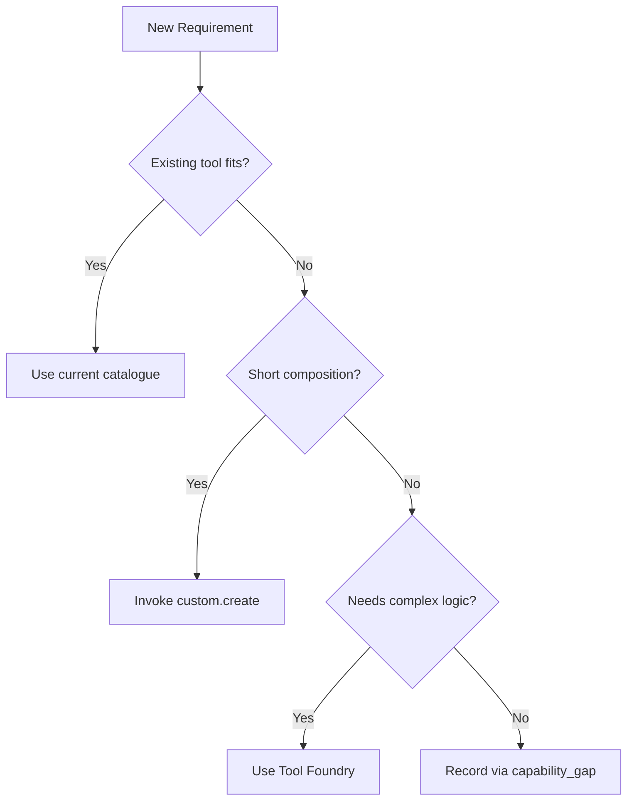

<details>
<summary>Relevant source files</summary>

The following files were used as context for generating this wiki page:

- [skills/core/build-capability/SKILL.md](skills/core/build-capability/SKILL.md)
- [AGENTS.md](AGENTS.md)
- [skills/superpowers/skills/brainstorming/SKILL.md](skills/superpowers/skills/brainstorming/SKILL.md)
- [skills/superpowers/skills/writing-skills/SKILL.md](skills/superpowers/skills/writing-skills/SKILL.md)
- [skills/superpowers/skills/writing-plans/SKILL.md](skills/superpowers/skills/writing-plans/SKILL.md)
- [dashboard/assets/12-skills.js](dashboard/assets/12-skills.js)

</details>

# Developing Custom Capabilities

Developing custom capabilities allows agents to extend the Skainet Bridge functionality by composing general primitives into specific, named tools. This system emphasizes building from reusable components—such as filesystem access, process management, and code execution—rather than requesting bespoke, hard-coded tools for every new requirement.

The development process follows a strict hierarchy of reuse. You should first search for existing tools in the catalogue, then attempt short compositions via `custom.create`, and only resort to the **Tool Foundry** for complex logic requiring state or parsing. Capabilities developed here inherit the risk policies of their underlying primitives and can be managed through the Bridge API or dashboard interface.

Sources: [skills/core/build-capability/SKILL.md:1-12](skills/core/build-capability/SKILL.md#L1-L12), [dashboard/assets/12-skills.js](dashboard/assets/12-skills.js)

## Capability Development Hierarchy

Before creating a new capability, you must evaluate the project's existing resources. The bridge provides 237 tools across namespaces like `fs`, `exec`, `net`, and `proc`. 

The following flowchart illustrates the decision process for adding functionality:



*This diagram shows the prioritized workflow for expanding agent abilities from existing tools to new logic.*

Sources: [skills/core/build-capability/SKILL.md:14-25](skills/core/build-capability/SKILL.md#L14-L25)

## Composing Tools with `custom.create`

The `custom.create` tool allows you to author a new named tool at runtime by aliasing or chaining existing primitives. Data flows between steps using placeholders in the format `{steps.<id>}` or `{steps.<id>.<field>}`.

### Composition Logic
- **Risk Inheritance:** A composite tool inherits the maximum risk level of all primitives it touches.
- **Error Handling:** Steps are "continue-on-error" by design. A failing step does not abort the entire run; therefore, you must verify the state after mutating operations.
- **Verification:** Always place a verifying read step after a write step to ensure side effects are correct.

Sources: [skills/core/build-capability/SKILL.md:27-57](skills/core/build-capability/SKILL.md#L27-L57)

### Placeholder Resolution Table

| Placeholder Type | Data Source | Resolution Behavior |
|:---|:---|:---|
| `{field_name}` | Input Schema | Resolves from the arguments passed by the caller. |
| `{steps.id}` | Step Output | Resolves to the full output of the referenced step ID. |
| `{steps.id.field}` | JSON Field | Resolves ONLY if the step returned a JSON object with that field. |

Sources: [skills/core/build-capability/SKILL.md:40-48](skills/core/build-capability/SKILL.md#L40-L48)

## Tool Foundry and Code Projects

When a capability requires parsing, state management, or protocol handling, you must use the **Tool Foundry**. This involves creating a Code Workbench project and publishing it as a custom tool.

### Publishing Workflow
1. **Create Project:** Use `code_project.create` with a script and a `.arena-tool.json` manifest.
2. **Validate:** Use `tool_foundry.validate` to check the manifest and run declared tests.
3. **Publish:** Use `tool_foundry.publish` to add the tool to the catalogue as `custom.<name>`.

Sources: [skills/core/build-capability/SKILL.md:63-74](skills/core/build-capability/SKILL.md#L63-L74)

### Sandboxing and Fencing
Project code executes within a platform-specific sandbox fence. On POSIX systems, this is a `systemd` fence that restricts network, memory, and filesystem access. On Windows, the execution reports `sandbox_action: "off"` and runs directly. You should always read the `sandbox_action` field in the result to understand environment constraints.

Sources: [skills/core/build-capability/SKILL.md:79-88](skills/core/build-capability/SKILL.md#L79-L88)

## Design Principles for Portability

Custom capabilities should remain portable to ensure they outlive the specific product they automate.

- **Prefer Primitives:** Use `fs.*` instead of platform-specific binaries like `cp` or `copy`.
- **Abstract Intent:** Name tools based on their intent (e.g., `screen_region_text`) rather than a specific application window title.
- **Discoverable Inputs:** Do not hard-code absolute paths, ports, or coordinates; accept them as inputs with sane defaults.
- **Vendor as Configuration:** If wrapping a product, express the vendor-specific parts as configuration and route the logic through general `mobile.*` or `net.*` tools.

Sources: [skills/core/build-capability/SKILL.md:92-110](skills/core/build-capability/SKILL.md#L92-L110), [AGENTS.md:160-170](AGENTS.md#L160-L170)

## Skill Documentation and Persistence

Once a capability is validated and published, it should be documented as a **Skill** to ensure context persists across sessions. 

### Skill Types and Structure
A Skill is a reference guide for proven techniques or tools. It must follow a specific structure to be discoverable by future agents.

| Component | Description | Requirement |
|:---|:---|:---|
| `name` | Alphanumeric with hyphens only. | Required |
| `description` | Triggering conditions starting with "Use when...". | Required |
| `SKILL.md` | The main reference document. | Required |
| `supporting-files` | Large API docs or reusable scripts. | Optional |

Sources: [skills/superpowers/skills/writing-skills/SKILL.md:52-65](skills/superpowers/skills/writing-skills/SKILL.md#L52-L65), [skills/superpowers/skills/writing-skills/SKILL.md:105-130](skills/superpowers/skills/writing-skills/SKILL.md#L105-L130)

### Discovery and Management
Agents use the `Skill` tool to search and load these capabilities. The Dashboard provides an interface to list, install, and uninstall skills via API endpoints like `/v1/skills` and `/v1/skills/install`.

```javascript
// Example of loading skills from the API
async function loadSkills() {
  const result = await api("/v1/skills");
  const skills = result.skills || [];
  // ... process skills for display
}
```

Sources: [dashboard/assets/12-skills.js:2-10](dashboard/assets/12-skills.js#L2-L10), [skills/superpowers/skills/using-superpowers/SKILL.md:38-45](skills/superpowers/skills/using-superpowers/SKILL.md#L38-L45)

## Summary
Developing custom capabilities in Skainet Bridge relies on the modular composition of existing tool primitives. By following the hierarchy of reuse—from simple tool search to Tool Foundry development—and adhering to portability principles, developers create robust, cross-platform extensions. Documenting these capabilities as Skills ensures that battle-tested approaches are preserved and discoverable for future agent sessions.

Sources: [skills/core/build-capability/SKILL.md:112-115](skills/core/build-capability/SKILL.md#L112-L115), [skills/superpowers/skills/writing-skills/SKILL.md:300-310](skills/superpowers/skills/writing-skills/SKILL.md#L300-L310)
