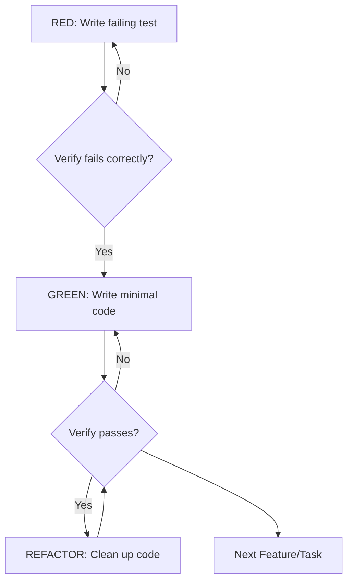
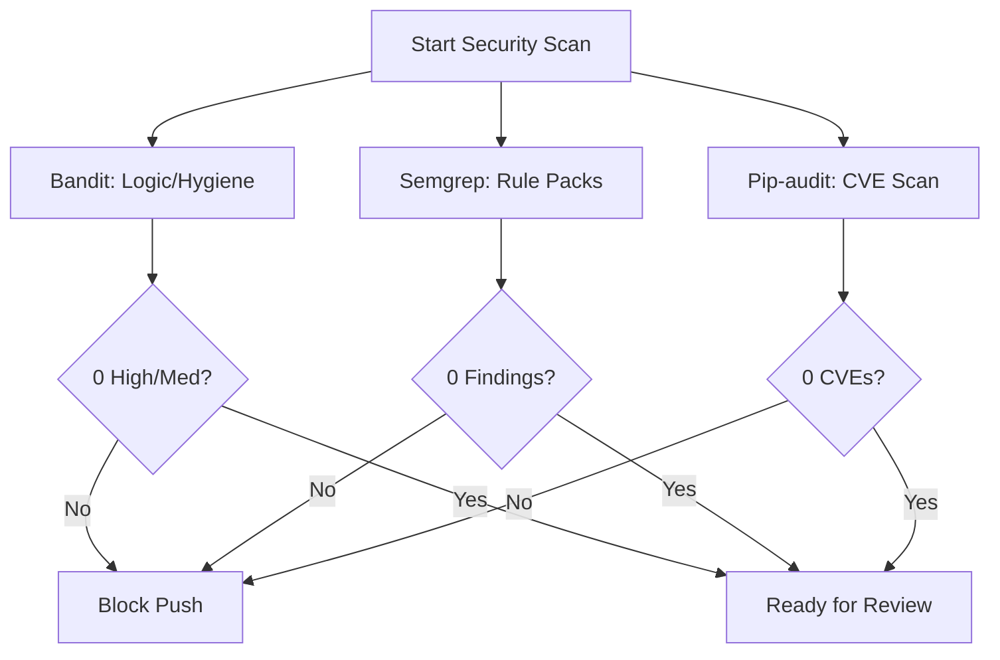

Relevant source files

The following files were used as context for generating this wiki page:

- [AGENTS.md](AGENTS.md)
- [CONTRIBUTING.md](CONTRIBUTING.md)
- [skills/superpowers/skills/test-driven-development/SKILL.md](skills/superpowers/skills/test-driven-development/SKILL.md)
- [skills/superpowers/skills/writing-skills/testing-skills-with-subagents.md](skills/superpowers/skills/writing-skills/testing-skills-with-subagents.md)
- [skills/superpowers/skills/systematic-debugging/SKILL.md](skills/superpowers/skills/systematic-debugging/SKILL.md)

# Testing, Quality, & CI/CD

This module defines the standards and automated gates for maintaining code integrity within the Arena Agent project. It encompasses Test-Driven Development (TDD) protocols, quality ratchets to prevent legacy debt growth, and multi-stage security scans required for all contributions.

The system ensures that every feature or bug fix adheres to a "Definition of Done" (DoD) that includes root-cause verification, deterministic testing, and zero mutation survivors. These practices prevent regressions and maintain a modular architecture through strict boundary enforcement.

Sources: [AGENTS.md:15-30](AGENTS.md#L15-L30), [CONTRIBUTING.md:46-75](CONTRIBUTING.md#L46-L75)

## Test-Driven Development (TDD)

The project enforces an "Iron Law": no production code is written without a failing test first. This protocol ensures that tests verify behavior rather than just implementation and that every edge case is discovered before coding begins.

### The Red-Green-Refactor Cycle

This diagram illustrates the mandatory iterative process for all development work.

The cycle requires developers to watch the test fail (RED) to prove the test actually catches the missing feature or bug. Code implemented without a prior failing test must be deleted.

Sources: [skills/superpowers/skills/test-driven-development/SKILL.md:17-50](skills/superpowers/skills/test-driven-development/SKILL.md#L17-L50)

### Definition of Done (DoD) Standards

| Requirement | Description |
| :--- | :--- |
| **Root-Cause Fix** | Resolve the underlying invariant failure; do not silence errors. |
| **Isolated Parity** | Write deterministic unit tests without unmocked sockets or clocks. |
| **Mutation Testing** | Achieve 0 survivors in `mutmut` sweeps. |
| **Bilateral Sabotage** | Prove that breaking the fix fails tests while healthy code remains green. |
| **Preflight Pass** | All 21 local gates in `scripts/preflight.py` must be green. |

Sources: [AGENTS.md:18-24](AGENTS.md#L18-L24), [skills/arena-bridge/SKILL.md:58-65](skills/arena-bridge/SKILL.md#L58-L65)

## Quality Ratchets and Debt Management

The project uses "ratchets" to prevent the growth of legacy technical debt. CI jobs compare current violation counts against baselines and fail if any count increases.

### Ratchet Mechanism

The quality system employs three primary ratchets:
1. **Lint Ratchet:** Uses `scripts/lint_ratchet.py` to compare Ruff violation counts against `scripts/lint_baseline.json`.
2. **Quality Ratchet:** Uses `scripts/quality_ratchet.py` to track dead code (Vulture) and type errors (Pyrefly) against `scripts/quality_baseline.json`.
3. **JS Lint Ratchet:** Manages debt for JavaScript files in the `chat_extension` and dashboard.

When a change lowers the debt count, the baseline is updated in the same commit using the `--write-baseline` flag.

Sources: [CONTRIBUTING.md:27-44](CONTRIBUTING.md#L27-L44), [AGENTS.md:243-260](AGENTS.md#L243-L260)

### Architecture Boundaries

Modular limits are enforced by automated tests to keep files focused and maintainable:
- **Product Files:** Limited to 1600 lines (enforced by `tests/test_project_modularity.py`).
- **Runtime Modules:** Limited to 600 lines (enforced by `tests/test_architecture_boundaries.py`).

Sources: [AGENTS.md:7-12](AGENTS.md#L7-L12)

## Security Gates

CI enforces three mandatory security gates on every push and Pull Request. These must also be run locally using `make security-scan`.

### Security Gate Details

| Tool | Threshold | Focus Areas |
| :--- | :--- | :--- |
| **Bandit** | 0 High/Medium | Command injection, insecure temp files, logic errors. |
| **Semgrep** | 0 Findings | XSS, secrets leakage, insecure transport, OWASP Top 10. |
| **Pip-audit** | 0 CVEs | Known vulnerabilities in runtime and "full" extra dependencies. |

Sources: [CONTRIBUTING.md:77-105](CONTRIBUTING.md#L77-L105)

## Systematic Debugging

When bugs are encountered, a four-phase systematic approach is required before proposing fixes.

### Debugging Phases

1. **Root Cause Investigation:** Reproduce the issue consistently and gather evidence at component boundaries.
2. **Pattern Analysis:** Find working examples and compare them against the broken implementation.
3. **Hypothesis Testing:** Form a single theory and make the smallest possible change to test it.
4. **Implementation:** Create a failing test case, implement the fix, and verify.

If more than three fix attempts fail, the process requires stopping to question the underlying architecture rather than attempting another patch.

Sources: [skills/superpowers/skills/systematic-debugging/SKILL.md:25-100](skills/superpowers/skills/systematic-debugging/SKILL.md#L25-L100)

## Continuous Integration (CI) Workflow

The CI pipeline runs extensive suites including E2E tests against installed artifacts.

- **Debt Visibility:** A non-blocking job (`debt-visibility`) is red by design if any legacy debt exists, serving as a backlog tracker.
- **E2E-Installed:** A blocking job that builds the wheel, installs it in an isolated environment, and runs tests against the shipped artifact.
- **Preflight:** A local script (`scripts/preflight.py`) that runs all gates that have previously caused CI failures to ensure a high success rate for pushes.

Sources: [AGENTS.md:264-285](AGENTS.md#L264-L285), [AGENTS.md:347-360](AGENTS.md#L347-L360)
