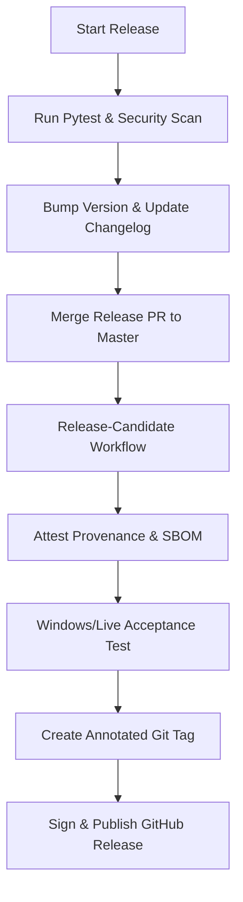
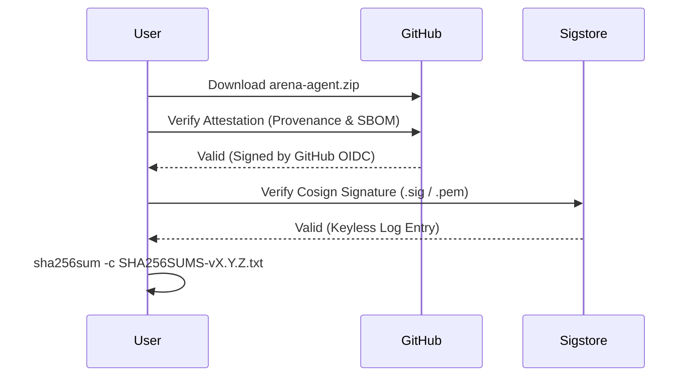

<details>
<summary>Relevant source files</summary>

The following files were used as context for generating this wiki page:

- [RELEASE.md](RELEASE.md)
- [scripts/make\_release\_zip.py](scripts/make_release_zip.py)
- [scripts/pack\_release.py](scripts/pack_release.py)
- [scripts/bootstrap\_android.sh](scripts/bootstrap_android.sh)
- [AGENTS.md](AGENTS.md)
- [CONTRIBUTING.md](CONTRIBUTING.md)
</details>

# Release Process & Auto-Update

The Arena Unified Bridge release process ensures the delivery of secure, deterministic, and verified software artifacts to end users. The system utilizes automated packaging scripts, GitHub Actions for attestation, and a structured update mechanism to maintain integrity across different platforms, including Windows and Android.

This page details the lifecycle of a release, from version bumping and security scanning to artifact packaging and post-publication verification.

## Release Lifecycle Overview

The release process follows a strict sequence of checks to prevent the publication of broken or insecure code. Maintainers must verify local tests, security gates, and build provenance before pushing tags to the repository.



The diagram shows the high-level workflow from local verification to public release publication.
Sources: [RELEASE.md:12-87](RELEASE.md#L12-L87), [AGENTS.md:162-179](AGENTS.md#L162-L179)

## Versioning & Metadata

Versions live in multiple files to ensure consistency across the Python package, the browser extension, and installation scripts.

### Canonical Version Locations
| Component | File Path | Identifier |
| :--- | :--- | :--- |
| Core Bridge | `arena/constants.py` | `VERSION` |
| Python Package | `pyproject.toml` | `version` |
| Git History | Repository Tags | `vX.Y.Z` |
| Browser Extension | `chat_extension/manifest.json` | `version` |
Sources: [RELEASE.md:214-232](RELEASE.md#L214-L232), [CONTRIBUTING.md:118-124](CONTRIBUTING.md#L118-L124)

## Artifact Packaging

The system generates two primary ZIP assets for every bridge release to support both historical pinning and version-agnostic installation.

*  **`arena-agent-vX.Y.Z.zip`**: Used for explicit version pinning.
*  **`arena-agent.zip`**: The version-agnostic alias required by the README quick-start one-liner.

Sources: [RELEASE.md:144-155](RELEASE.md#L144-L155)

### Packaging Rules & Exclusions
The `scripts/make_release_zip.py` script builds the release archive. It includes logic to strictly exclude runtime state and development artifacts to prevent credential leaks.

| Category | Included Items | Excluded Items |
| :--- | :--- | :--- |
| **Logic** | `arena/` package, `unified_bridge.py` | `tests/`, `dev/`, `__pycache__` |
| **State** | `DEPLOYED_PROVENANCE.json` | `token.txt`, `*.log`, `*.jsonl` |
| **Caches** | None | `.ruff_cache`, `.pytest_cache`, `.tox` |
| **Docs** | `README.md`, `CHANGELOG.md` | `.github/`, `.vscode/` |
Sources: [scripts/make_release_zip.py:27-70](scripts/make_release_zip.py#L27-L70), [scripts/pack_release.py:31-48](scripts/pack_release.py#L31-L48)

```python
# Example of exclusion logic for sensitive files
EXCLUDE_FILES = {
    "token.txt", "audit.jsonl", "bridge.log", "requests.jsonl",
    "facts.jsonl", "history.jsonl", "coverage.xml",
}
```

Sources: [scripts/make_release_zip.py:44-50](scripts/make_release_zip.py#L44-L50)

## Security Gates

Release publication is blocked if the security scan is not clean. The project enforces three primary security gates:

1.  **Bandit**: Scans for Python security issues. Must have 0 HIGH and 0 MEDIUM findings.
2.  **Semgrep**: Scans across 9 rule packs (OWASP, secrets, injection). Must have 0 findings.
3.  **Pip-audit**: Checks dependencies for known CVEs. Must have 0 CVEs.

Sources: [CONTRIBUTING.md:73-95](CONTRIBUTING.md#L73-L95), [RELEASE.md:197-200](RELEASE.md#L197-L200)

## Build Provenance & Verification

The release process utilizes GitHub Artifact Attestations to prove that the binaries were built from a specific commit in the official repository.

### Provenance Metadata
Every release ZIP contains a virtual `.arena-release-provenance.json` file. This file includes:
*  `candidateRunId`: The GitHub Actions run ID.
*  `releaseTag`: The version tag (e.g., `v4.169.48`).
*  `sourceCommit`: The full 40-hex Git commit SHA.
*  `repository`: `IvanSkainet/arena-agent`.

Sources: [scripts/make_release_zip.py:165-179](scripts/make_release_zip.py#L165-L179), [RELEASE.md:168-180](RELEASE.md#L168-L180)

### Verification Sequence
Maintainers and automated updaters verify artifacts using the `gh attestation verify` command and Sigstore keyless signatures.



Sources: [RELEASE.md:157-194](RELEASE.md#L157-L194)

## Platform Specifics

### Android Bootstrapping
Android installation utilizes `scripts/bootstrap_android.sh` to automate setup within Termux. This script performs SHA-256 verification against the digest reported by GitHub to prevent corrupted or substituted downloads.
Sources: [scripts/bootstrap_android.sh:65-100](scripts/bootstrap_android.sh#L65-L100)

### Auto-Update Mechanics
The updater combines the immutable release identity with the ZIP SHA-256 and installation timestamp into a local `DEPLOYED_PROVENANCE.json` file.
*  **Backups**: Previous deployments are moved to `backups/deployments/<identity>/` before replacement.
*  **Rollback**: The system supports rollbacks using these retained identified trees.
*  **Authentication**: The `/v1/version` endpoint reports an `authenticated` boolean, which is true only if the local ZIP digest and metadata match the official GitHub Release data.
Sources: [RELEASE.md:182-195](RELEASE.md#L182-L195)

## Summary

The Arena release process integrates automated verification, strict file exclusion patterns, and GitHub-backed attestations to ensure artifact integrity. By enforcing security scans and provenance checks at every stage, the project prevents the distribution of insecure builds and maintains a reliable update path for users across Windows and Android environments.
